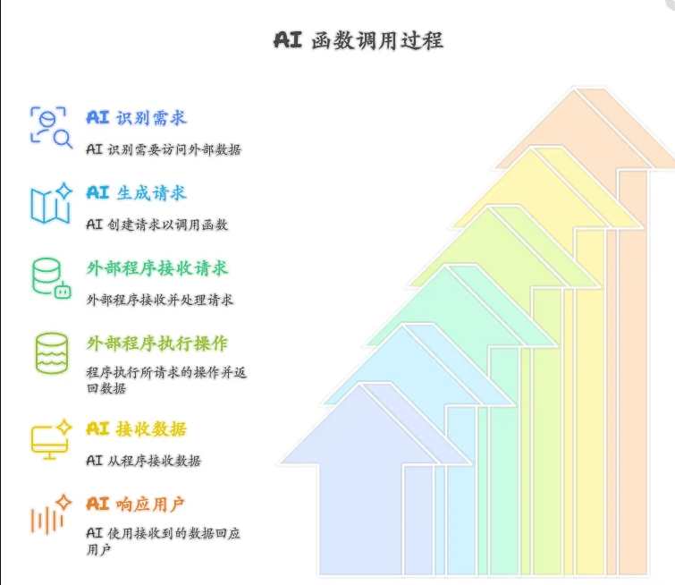
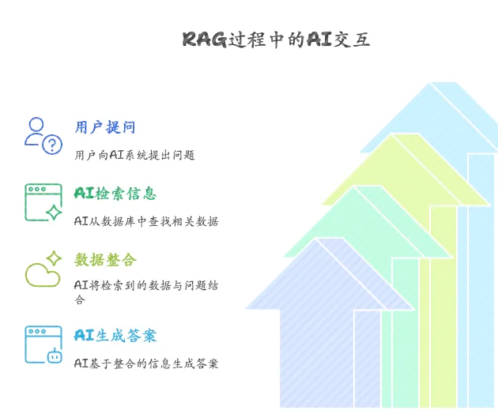
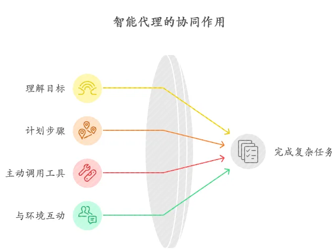
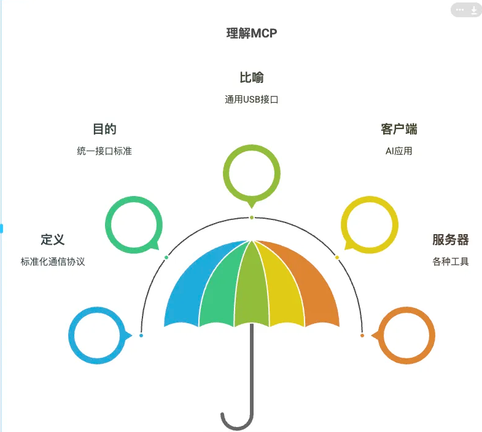

# 秒懂 AI 核心：Agent、RAG、Function Call 与 MCP 全解析

如今大语言模型（LLM）的风头一时无两，它们能写诗、能聊天、能编程，简直无所不能！但你有没有发现，有时候它们也挺“傻白甜”的？比如问它今天的天气，它可能给你一个“根据我的知识库...”的过时答案；让它帮你整理本地文件，它只能表示爱莫能助。

这是因为 LLM 本身像一个博学但与世隔绝的大脑。为了让它真正变得实用、能干，连接现实世界，科技圈祭出了几大“法宝”：Agent（智能体）、RAG（检索增强生成）、Function Call（函数调用），以及一个新晋的潜力股——MCP（模型上下文协议）。

## 🔗 懒人直看版

一图胜千言，我们用一个表格来总结下它们的关系和区别：

| 特性         | MCP (模型上下文协议)                    | RAG (检索增强生成)                             | Agent (智能体)                                | Function Call (函数调用)                 |
| :----------- | --------------------------------------- | ---------------------------------------------- | --------------------------------------------- | ---------------------------------------- |
| **核心思想** | 标准化 AI 与外部数据/工具的**通信协议** | **检索**外部知识 + **增强**提示 + **生成**回答 | LLM 驱动的**自主决策**与**任务执行**系统      | LLM**请求执行**外部预定义函数/工具的能力 |
| **本质**     | **协议/规范**                           | **技术框架/方法**                              | **系统/应用范式**                             | **模型能力/特性**                        |
| **通俗比喻** | 标准化的 USB 接口                       | 写论文前先查资料                               | 能干的私人助理                                | 助理按指令使用 App                       |
| **关系链**   | 可作为 Agent 调用工具的**底层标准**     | 常被 Agent **用作**获取知识的手段              | **核心指挥官**，使用 RAG/Function Call 等工具 | Agent 执行具体动作的**基本手段**         |

**简单来说，它们的关系就像：**

- **Agent (智能体)** 是那个目标导向的**项目经理/大脑**。
- **RAG** 和 **Function Call** 是它工具箱里的**得力工具**：RAG 负责查资料、找依据；Function Call 负责执行具体操作、调用外部 API。
- **MCP** 则致力于提供一个**标准化的接口规范**，让 Agent 能更方便、更统一地接入和使用各种工具（无论是 RAG 功能还是其他 Function Call 实现的工具）。

## **💡 Function Call：给 AI 装上“遥控器”**

- **这是啥？** Function Call 是 LLM 的一项内置“特异功能”。它允许 LLM 在需要的时候，**请求**外部程序帮它做点事。注意，是“请求”，不是“亲自做”。
- **为啥要它？** 因为 LLM 自己查不了实时股价、订不了机票、发不了邮件。有了 Function Call，LLM 就能“指挥”其他工具来完成这些操作。
- **通俗比喻：** 就像你让智能音箱帮你“查下今天北京天气”。音箱（LLM）自己感知不到天气，但它知道要去调用“天气查询”这个 App（预定义的函数/工具）。它生成指令（“查北京天气”），App 执行后把结果（“晴，25 度”）告诉音箱，音箱再用自然语言告诉你。
- **简单例子：** 你问 AI：“AAPL 股价多少？” AI 判断需要查实时数据，于是生成一个“请求”：`{调用函数: "查股价", 参数: {"股票代码": "AAPL"}}`。外部程序收到请求，查询 API，返回结果 `{"价格": 180.50}`。AI 再根据这个结果回答你：“苹果当前股价是 180.50 美元。”

## **🔍 RAG：AI 的“开卷考试”神器**

-  **这是啥？** RAG (Retrieval-Augmented Generation) 是一种让 AI 回答更靠谱的技术框架。简单说，就是在 AI 回答问题 _之前_，先让它去指定的资料库（比如公司内部文档、最新的行业报告）里**查找 (Retrieval)** 相关信息。
- **为啥要它？** 防止 AI 一本正经地“胡说八道”（专业术语叫“幻觉”），让它的回答基于最新的、准确的、特定的事实依据。
- **通俗比喻：** 好比你写论文要引用最新数据。你不会光凭记忆（LLM 的内部知识）瞎写，而是会先去图书馆或数据库**查资料 (检索)**，把找到的关键信息**整合 (增强)进你的论据里，最后才下笔写作 (生成)**。RAG 就是让 AI 也学会这种“先查再答”的好习惯。
- **简单例子：** 你问 AI：“我们公司最新的报销政策是啥？” RAG 系统先去公司内部知识库**检索**“报销政策”文档，找到相关段落。然后把这些段落和你的问题一起“喂”给 AI，AI **参考**着这些最新政策，给你一个准确的回答。

## **🤖 Agent：AI 界的“全能管家”**

- **这是啥？** Agent（智能体）是一个更高级、更自主的 AI 系统。它以 LLM 作为核心“大脑”，不仅能理解你的目标，还能自己**思考、规划步骤**，并**主动调用工具**（比如上面说的 RAG 和 Function Call）来执行任务，与外部环境互动。

- **为啥要它？** 为了完成那些光靠聊天解决不了的复杂任务，比如“帮我规划下周去上海的出差行程，包括订机票酒店，并把日程发给我”。

- **通俗比喻：** Agent 就像一个**超级能干的私人助理**。你给个目标，它自己就能拆解任务、查信息（可能用 RAG 查公司差旅标准，用 Function Call 查航班酒店）、做决策、执行操作（用 Function Call 调用预订 API），最后给你结果。它是有自主“行动力”的。

  **简单例子：** 你让 Agent：“分析一下竞品 X 的最新动态，写个简报。” Agent 会自己规划：① 搜索最新新闻（调用 Function Call）；② 查内部研究报告（调用 RAG）；③ 分析总结信息（LLM 大脑）；④ 生成简报（调用 Function Call）。

## **🔌 MCP：AI 与工具间的“通用插座标准”**

- **这是啥？** MCP (Model Context Protocol) 是 Anthropic 公司（就是搞出 Claude 那个）在 2024 年底提出并开源的一种**标准化通信协议**。它定义了一套规则，让 AI 应用（客户端）能以统一的方式，与各种外部数据源或工具（服务器）进行交互。

- **为啥要它？** 想象一下，如果每个工具都有自己独特的接口，那 Agent 想用多个工具时，岂不是要学 N 种“方言”？MCP 就是想统一这个接口标准，让工具“即插即用”。

- **通俗比喻：** MCP 就像是给 AI 大脑和外部工具之间制定了一个**通用的 USB 接口标准**。无论是本地文件系统、数据库，还是 Slack、GitHub 这些应用，只要它们提供符合 MCP 标准的“服务器”，AI 应用（客户端）就能轻松连接并使用它们的功能，无需为每个工具单独适配。

   **简单例子：** 在支持 MCP 的编辑器里，你可以让 AI“把我 `/docs` 目录最新的 Markdown 文件总结一下，发到 Slack 的 `#general` 频道”。编辑器（MCP 客户端）通过 MCP 协议，与本地的“文件系统 MCP 服务器”和“Slack MCP 服务器”沟通，协调完成整个任务。

- **支持 MCP 的客户端/服务器:**

  - **客户端:** Claude Desktop App, Cursor, Windsurf, Cherry Studio 等 AI 编辑器或应用。
  - **服务器:** Anthropic 官方和社区提供了针对 Google Drive, Slack, GitHub, Git, Postgres, Puppeteer, Milvus (向量数据库), Firecrawl (网页抓取) 等的开源 MCP 服务器实现。开发者也可以根据 MCP 规范自定义服务器。目前，为安全起见，MCP 服务器通常在本地运行。
