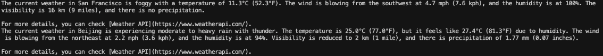
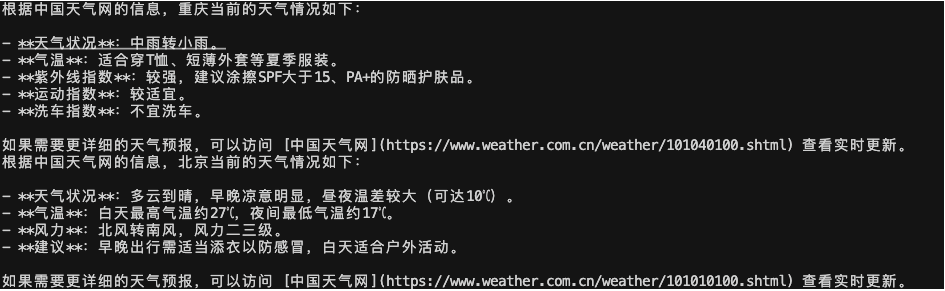

# langChain.js 开发第一个 Agent

## 开始

[LangChain](https://link.juejin.cn/?target=https%3A%2F%2Fjs.langchain.com%2Fdocs%2Fintroduction%2F) 是一个开发 LLM 应用的框架，是目前 LLM 开发最流行的解决方案之一。最早是 Python 开发的，后来也出来 JS 语言的，现在已经更新到 v0.3 版本。
本文将使用 LangChain 开发一个简单的 AI Agent，可使用自然语言来查询天气。再使用 LangGraph 进行自定义流程。

## 开发第一个 Agent

首先创建一个 nodejs 项目，并安装 `langchain` 和 `dotenv` ，后面我们需要使用环境变量。

```shell
pnpm i langchain dotenv
```

### 使用 Tavily 搜索功能

[Tavily](https://link.juejin.cn/?target=https%3A%2F%2Fwww.tavily.com%2F) 是一个搜索引擎，可以让你的 LLM 和 Agent 有联网搜索的能力，例如搜索天气。你需要注册登录并创建一个 API key ，Tavily 可免费使用 1000 次，足够学习使用。把 API key 放在代码库 `.env` 文件中

```js
TAVILY_API_KEY = xxx;
```

安装 `langchain tavily` 插件

```shell
pnpm i @langchain/tavily
```

然后创建一个 `agent.js` 文件，代码如下

```js
import 'dotenv/config';
import { TavilySearch } from '@langchain/tavily';

// 定义 tools
const agentTools = [
  new TavilySearch({
    maxResults: 3, // 最多查询 3 个结果
  }),
];
```

### 选择一个大模型

langChain 集成了有很多 LLM 可供选择 [js.langchain.com/docs/integr…](https://link.juejin.cn?target=https%3A%2F%2Fjs.langchain.com%2Fdocs%2Fintegrations%2Fchat%2F)它默认推荐的是 OpenAI 但是在国内我们没法直接调用它的 API ，所以我当前选择的是 DeepSeek 。注册登录 [DeepSeek](https://platform.deepseek.com/api_keys) 创建一个 API key 并把它放在 `.env` 文件中。（需要进行充值才能调用 api）

```js
DEEPSEEK_API_KEY = xxx;
```

安装 `langChain deepseek` 插件

```shell
pnpm i @langchain/deepseek
```

然后继续写 `agent.js` 代码

```js
import { ChatDeepSeek } from '@langchain/deepseek';

// 定义 llm
const agentModel = new ChatDeepSeek({ model: 'deepseek-chat', temperature: 0 });
```

### 使用 langGraph 创建 Agent

`langGraph` 是基于 `langChain` 的框架，用于构建可控制的 Agent ，是现代开发 Agent 最流行的解决方案之一。

安装 `langGraph` 必要插件

```js
pnpm install @langchain/langgraph @langchain/core
```

然后继续写 `agent.js` 代码

```js
import { MemorySaver } from '@langchain/langgraph';
import { createReactAgent } from '@langchain/langgraph/prebuilt';

// 初始化记忆，保存状态数据
const agentCheckpoint = new MemorySaver();

// 创建 agent
const agent = createReactAgent({
  llm: agentModel, // 使用之前创建的 llm
  tools: agentTools, // 使用之前创建的 tools
  checkpointSaver: agentCheckpoint, // 记忆，保存状态数据
});
```

- 使用 `createReactAgent` 来创建一个 Re-Act Agent 智能体。Re-Act 即 Reason + Act 推理和执行，它可以使用 llm 自主推理并选择调用哪个 tool 获取结果。这也是 Agent 的特点之一。

- `agentCheckpoint` 可以存储近期对话记录，让 llm 有记忆能力。否则你刚说自己叫张三，再问它我的名字，它就忘了。

### 调用 Agent

继续写 `agent.js` 代码，使用 `agent.invoke` 方法调用 agent ，传入 `HumanMessage` 即 prompt 提示词

```ts
import { HumanMessage } from '@langchain/core/messages';

// test1
const agentFinalState = await agent.invoke(
  { messages: [new HumanMessage('what is the current weather in sf')] },
  { configurable: { thread_id: '1' } }
);
console.log(agentFinalState.messages[agentFinalState.messages.length - 1].content);

// test2
const agentNextState = await agent.invoke(
  { messages: [new HumanMessage('what about Beijing')] },
  { configurable: { thread_id: '1' } }
);
console.log(agentNextState.messages[agentNextState.messages.length - 1].content);
```

执行 `node agent.js` 可以看到控制台打印结果，可以查询到 San Francisco 和 Beijing 的天气。



这里的 `{ thread_id: '1' }` 是 Memory 存储记忆的索引， `thread_id` 相同的才是同一个对话记录，才能共享记忆。例如这里第二次调用时 prompt 是 `'what about Beijing'` 并没有问天气，但是 llm 也能根据上一次对话判断出这里是问天气，所以才能给出正确答案。

还可以使用 `agent.stream` 方式流式输出，配合前端可实现打字效果

```js
// streaming
const stream = await agent.stream(
  { messages: [new HumanMessage('what is the current weather in sf')] },
  { configurable: { thread_id: '1' }, streamMode: 'updates' }
);
for await (const step of stream) {
  console.log(JSON.stringify(step));
}
```

以上就是一个最基本的 AI ReAct Agent，核心代码不到 30 行。它包含三个要素：llm + tools + memory ，可以根据自然语言自主推理并调用 tool 获取结果，最后组合为自然语言，返回给用户。

## 自定义 Agent 行为

ReAct Agent 可以自主推理并执行，但如果你想自己控制这个流程呢？ LangGraph 可以让你自定义 Agent 行为。

### 定义 toolNode

继续修改你的 `agent.js`代码。定义一个 toolNode ，并且在创建 model 时绑定 tools 。

```js
import { ToolNode } from '@langchain/langgraph/prebuilt';

// 使用工具节点
const tools = [new TavilySearch({ maxResults: 3 })];
const toolNode = new ToolNode(tools);

// 创建一个模型并赋予它访问工具的能力
const model = new ChatDeepSeek({
  model: 'deepseek-chat',
  temperature: 0,
  apiKey: process.env.DEEPSEEK_API_KEY,
}).bindTools(tools);
```

### 定义节点函数

然后定义一个函数 `shouldContinue` 用于判断 llm 是否要发起一个 tool 调用？

```js
// 定义一个函数 shouldContinue 用于判断 llm 是否要发起一个 tool 调用
function shouldContinue({ messages }) {
  const lastMessage = messages[messages.length - 1];

  // 如果 LLM 调用了工具，则路由到 "tools" 节点
  if (lastMessage.tool_calls?.length) {
    return 'tools';
  }
  // 否则，使用特殊节点 "__end__" 停止（回复用户）
  return '__end__';
}
```

再定义一个函数 `callModel` 用于调用 llm 并返回结果

```js
// 定义一个函数 callModel 用于调用 llm 并返回结果
async function callModel(state) {
  const response = await model.invoke(state.messages);

  // 返回一个列表，因为这将被添加到现有的列表中
  return { messages: [response] };
}
```

### 定义工作流

最后定义工作流 workflow ，并编译为一个 app 。这个 app 可以被触发执行。

```js
// 最后定义工作流 workflow ，并编译为一个 app 。这个 app 可以被触发执行。
const workflow = new StateGraph(MessagesAnnotation)
  .addNode('agent', callModel) // 添加节点 agent ，对应 callModel 函数
  .addEdge('__start__', 'agent') // 添加“边”，流程开始就指向 agent 节点
  .addNode('tools', toolNode) // 添加节点 tools ，对应 toolNode
  .addEdge('tools', 'agent') // 添加边，tools 节点指向 agent 节点
  .addConditionalEdges('agent', shouldContinue); // 添加条件边，根据 shouldContinue 函数里的逻辑，有 tool_calls 返回 'tools' 即指向 tools 节点，否则返回 '__end__' 即流程结束

// 编译工作流
const app = workflow.compile();
```

工作流的定义过程看以上代码的注释，整体的流程图如下：开始，先执行 agent，再执行 shouldContinue 判断，然后要么结束、要么去执行 tools ，tools 再到 agent 。

```
/* workflow diagram
           ┌──────────┐
           │ __start__│
               ↓
          ┌──────────┐
          │  agent   │ ←────────┐
          └────┬─────┘          │
               ↓                │
        ┌───────────  ─┐        │
        │shouldContinue│── tools│
        └────┬───────  ┘        │
             ↓                  ↓
         __end__        ┌──────────┐
                        │  tools   │
                        └──────────┘

*/
```

### 调用工作流

同样可以使用 `invoke` 方法触发工作流，传入 HumanMessage 即用户 prompt 信息

```JS
const finalState = await app.invoke({
  messages: [new HumanMessage('重庆天气怎么样，中文回答')],
})
console.log(finalState.messages[finalState.messages.length - 1].content)

const nextState = await app.invoke({
  // 包含上一次的对话，让 LLM 知道我们正在询问北京天气
  messages: [...finalState.messages, new HumanMessage('北京呢？')],
})
console.log(nextState.messages[nextState.messages.length - 1].content)
```

控制台执行 `node agent.js` 返回结果如下


