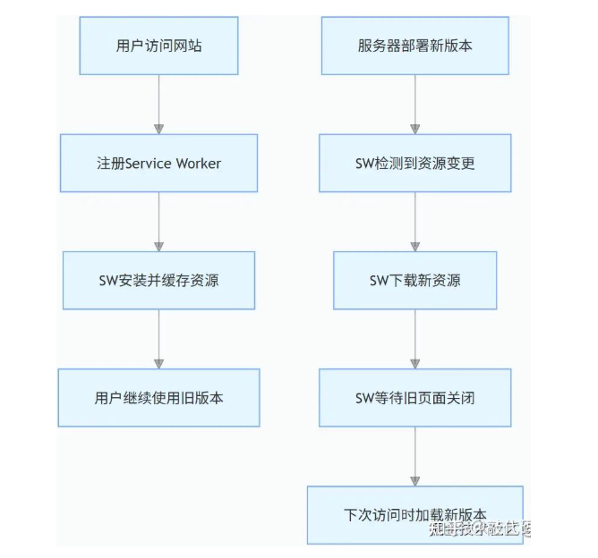

# 前端代码更新通知：如何优雅地提示用户刷新页面

## 一、前端版本检测（hash 对比） + 弹窗提示

**原理**：客户端定时请求一个配置文件（如 meta.json、version.json），与当前本地版本对比，不一致时提示刷新。

### 完整实现示例

```js
// 版本管理模块：version-manager.js
class VersionManager {
  constructor() {
    this.currentVersion = null;
    this.updateCallback = null;
    this.pollingInterval = 300000; // 5分钟轮询一次
    this.isUpdateAvailable = false;
  }

  // 初始化版本检测
  init(versionUrl, onUpdate) {
    this.updateCallback = onUpdate;
    return this.fetchVersion(versionUrl).then((version) => {
      this.currentVersion = version;
      this.startPolling(versionUrl);
      return version;
    });
  }

  // 获取版本信息
  fetchVersion(url) {
    return fetch(url, {
      cache: 'no-cache', // 禁用缓存
      headers: {
        'Cache-Control': 'no-cache, no-store, must-revalidate',
        Pragma: 'no-cache',
        Expires: '0',
      },
    })
      .then((res) => res.json())
      .then((data) => data.version || data.buildTime)
      .catch((err) => {
        console.error('版本获取失败:', err);
        return null;
      });
  }

  // 启动定时轮询
  startPolling(url) {
    setInterval(() => {
      this.fetchVersion(url).then((newVersion) => {
        if (newVersion && this.isNewVersion(newVersion)) {
          this.isUpdateAvailable = true;
          this.promptUserToUpdate();
        }
      });
    }, this.pollingInterval);
  }

  // 版本比较（支持语义化版本或时间戳）
  isNewVersion(newVersion) {
    if (!this.currentVersion) return true;

    // 语义化版本比较示例
    if (this.currentVersion.includes('.')) {
      const current = this.currentVersion.split('.').map(Number);
      const latest = newVersion.split('.').map(Number);
      for (let i = 0; i < current.length; i++) {
        if (latest[i] > current[i]) return true;
        if (latest[i] < current[i]) return false;
      }
      return false;
    }

    // 时间戳比较示例
    return newVersion > this.currentVersion;
  }

  // 提示用户更新
  promptUserToUpdate() {
    if (!this.updateCallback) return;

    // 可自定义提示样式
    const updateConfirm = confirm('检测到新版本，是否立即刷新页面？');
    if (updateConfirm) {
      this.updateCallback();
    }
  }
}

// 在应用中使用
const versionManager = new VersionManager();
versionManager.init('/api/version.json', () => {
  location.reload(); // 刷新页面
});
```

## 二、基于 WebSocket / SSE（实时推送

### 1. [Server-Sent Events](https://zhida.zhihu.com/search?content_id=258980455&content_type=Article&match_order=1&q=Server-Sent+Events&zhida_source=entity) (SSE) 实现

SSE 是 HTML5 提供的单向服务器推送技术，适合更新通知场景：

服务器端（Node.js 示例）

```js
const http = require('http');
const fs = require('fs');
const path = require('path');

const server = http.createServer((req, res) => {
  if (req.url === '/updates' && req.method === 'GET') {
    res.writeHead(200, {
      'Content-Type': 'text/event-stream',
      'Cache-Control': 'no-cache',
      Connection: 'keep-alive',
    });

    res.write(': keep-alive\n\n'); // 心跳包防止连接断开

    // 监听版本变更事件
    let lastVersion = '1.0.0';
    fs.watch(path.join(__dirname, 'version.json'), (event, filename) => {
      if (event === 'change') {
        const newVersion = JSON.parse(fs.readFileSync(path.join(__dirname, 'version.json'))).version;
        if (newVersion !== lastVersion) {
          res.write(`event: update\n`);
          res.write(`data: ${newVersion}\n\n`);
          lastVersion = newVersion;
        }
      }
    });

    // 客户端断开连接处理
    req.on('close', () => {
      console.log('客户端连接关闭');
    });
  } else {
    // 其他请求处理...
  }
});

server.listen(3000, () => {
  console.log('服务器运行在3000端口');
});
```

客户端实现：

```js
class SSEUpdateNotifier {
  constructor() {
    this.sse = null;
    this.currentVersion = null;
  }

  init(versionUrl, sseUrl, onUpdate) {
    return this.fetchVersion(versionUrl).then((version) => {
      this.currentVersion = version;
      this.startListening(sseUrl, onUpdate);
      return version;
    });
  }

  fetchVersion(url) {
    // 同轮询方案中的fetchVersion
  }

  startListening(url, onUpdate) {
    this.sse = new EventSource(url);

    this.sse.onmessage = (event) => {
      if (event.data && this.isNewVersion(event.data)) {
        onUpdate(); // 提示用户更新
      }
    };

    this.sse.onerror = (error) => {
      console.error('SSE连接错误:', error);
      // 错误重连逻辑
      setTimeout(() => {
        this.startListening(url, onUpdate);
      }, 5000);
    };
  }

  isNewVersion(newVersion) {
    // 同轮询方案中的isNewVersion
  }

  close() {
    if (this.sse) {
      this.sse.close();
    }
  }
}

// 使用示例
const notifier = new SSEUpdateNotifier();
notifier.init('/api/version.json', '/updates', () => {
  // 显示更新提示
  const updateModal = document.createElement('div');
  updateModal.innerHTML = `
    <div class="update-modal">
      <h3>发现新版本</h3>
      <p>点击"更新"按钮体验新功能</p>
      <button id="update-now">立即更新</button>
      <button id="update-later">稍后更新</button>
    </div>
  `;
  document.body.appendChild(updateModal);

  document.getElementById('update-now').addEventListener('click', () => {
    location.reload();
    updateModal.remove();
  });

  document.getElementById('update-later').addEventListener('click', () => {
    updateModal.remove();
    // 设置稍后提醒时间（如30分钟后）
    setTimeout(() => {
      notifier.promptUserToUpdate();
    }, 1800000);
  });
});
```

### 2. [WebSocket](https://zhida.zhihu.com/search?content_id=258980455&content_type=Article&match_order=1&q=WebSocket&zhida_source=entity) 实现

WebSocket 提供双向通信，适合复杂更新场景：

客户端 WebSocket 实现

```js
class WebSocketUpdateNotifier {
  constructor() {
    this.ws = null;
    this.currentVersion = null;
    this.reconnectAttempts = 0;
    this.maxReconnects = 10;
  }

  init(versionUrl, wsUrl, onUpdate) {
    this.onUpdate = onUpdate;
    return this.fetchVersion(versionUrl).then((version) => {
      this.currentVersion = version;
      this.connectToWebSocket(wsUrl);
      return version;
    });
  }

  fetchVersion(url) {
    // 同轮询方案
  }

  connectToWebSocket(url) {
    this.ws = new WebSocket(url);

    this.ws.onopen = () => {
      console.log('WebSocket连接已建立');
      this.reconnectAttempts = 0;
      // 发送当前版本号
      this.ws.send(
        JSON.stringify({
          type: 'version',
          data: this.currentVersion,
        })
      );
    };

    this.ws.onmessage = (event) => {
      const message = JSON.parse(event.data);
      if (message.type === 'update' && this.isNewVersion(message.data)) {
        this.onUpdate();
      }
    };

    this.ws.onclose = (event) => {
      console.log('WebSocket连接关闭:', event);
      if (this.reconnectAttempts < this.maxReconnects) {
        this.reconnectAttempts++;
        setTimeout(() => {
          this.connectToWebSocket(url);
        }, 2000 * this.reconnectAttempts); // 指数退避重连
      }
    };

    this.ws.onerror = (error) => {
      console.error('WebSocket错误:', error);
    };
  }

  // 其他方法同SSE实现...
}
```

## 三、高级策略：[Service Worker](https://zhida.zhihu.com/search?content_id=258980455&content_type=Article&match_order=1&q=Service+Worker&zhida_source=entity) 实现离线更新

### 1. Service Worker 优势

- 后台自动更新，不阻塞用户操作
- 可实现平滑过渡（如下次打开时更新）
- 完全控制资源缓存，适合 PWA 应用

### 2. 实现流程



### 3. 核心代码实现

```js
// service-worker.js
const CACHE_NAME = 'my-app-v1';
const VERSION_FILE = '/api/version.json';

self.addEventListener('install', (event) => {
  event.waitUntil(
    fetch(VERSION_FILE)
      .then((res) => res.json())
      .then((data) => {
        const currentVersion = data.version || data.buildTime;
        return caches.open(CACHE_NAME + '-' + currentVersion).then((cache) => {
          // 缓存应用资源
          return cache.addAll([
            '/',
            '/index.html',
            '/app.js',
            '/styles.css',
            // 其他资源...
          ]);
        });
      })
  );
});

self.addEventListener('activate', (event) => {
  event.waitUntil(
    caches.keys().then((cacheNames) => {
      return Promise.all(
        cacheNames
          .filter((cacheName) => {
            return (
              cacheName.startsWith(CACHE_NAME) && cacheName !== CACHE_NAME + '-' + self.registration.scope + '/version'
            );
          })
          .map((cacheName) => {
            return caches.delete(cacheName);
          })
      );
    })
  );
});

self.addEventListener('fetch', (event) => {
  event.respondWith(
    caches.match(event.request).then((response) => {
      return response || fetch(event.request);
    })
  );
});

// 主应用中的更新提示
if ('serviceWorker' in navigator) {
  window.addEventListener('load', () => {
    navigator.serviceWorker
      .register('/service-worker.js')
      .then((registration) => {
        // 监听新SW可用事件
        registration.onupdatefound = () => {
          const installingWorker = registration.installing;
          if (installingWorker) {
            installingWorker.onstatechange = () => {
              if (installingWorker.state === 'installed') {
                // 提示用户更新
                if (navigator.serviceWorker.controller) {
                  const updateConfirm = confirm('发现新版本，刷新后生效？');
                  if (updateConfirm) {
                    location.reload();
                  }
                }
              }
            };
          }
        };
      })
      .catch((error) => {
        console.error('ServiceWorker注册失败:', error);
      });
  });
}
```
