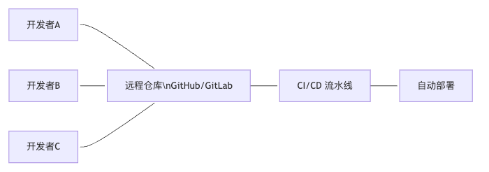

# Git 使用指南

## 一、Git 是什么？为什么它这么重要？

### 1. Git 的"前世今生"

Git 是由 Linux 之父 Linus Torvalds 在 2005 年开发的一个分布式版本控制系统。它的名字来源于"Global Information Tracker"，寓意着全球信息追踪器。



### 2. Git 的核心作用

**1. 版本控制**

- 记录代码的每一次变更
- 支持版本回滚和分支管理
- 提供完整的变更历史

**2. 团队协作**

- 多人同时开发不同功能
- 代码合并和冲突解决
- 代码审查和讨论

**3. 项目管理**

- 功能分支管理
- 发布版本控制
- 自动化部署集成

## 二、前端开发中的 Git 应用场景

### 1 日常开发流程

这是前端开发者最常用的场景。从功能开发到代码提交，从分支管理到版本发布。

```js
# 典型的 Git 工作流
feature-branch → develop → main → production
```

### 2. 团队协作

多人同时开发不同功能，需要有效的分支管理和代码合并策略。


### 3. 版本发布

管理不同版本的代码，支持热修复和版本回滚。

## 三、前端开发者必掌握的 Git 技巧

### 1. 基础操作：让代码管理井井有条

#### 1.1 高效的提交策略

```shell
# 查看当前状态
git status

# 添加文件到暂存区
git add .                    # 添加所有文件
git add src/components/      # 添加特定目录
git add -p                   # 交互式添加，可以选择部分内容

# 提交代码
git commit -m "feat: 添加用户登录功能"
git commit -m "fix: 修复按钮点击事件"
git commit -m "docs: 更新 README 文档"
```

**提交信息规范：**

```shell
# 约定式提交格式
feat: 新功能
fix: 修复bug
docs: 文档更新
style: 代码格式调整
refactor: 代码重构
test: 测试相关
chore: 构建过程或辅助工具的变动
```

#### 1.2 分支管理策略

```shell
# 创建并切换到新分支
git checkout -b feature/user-login

# 查看所有分支
git branch -a

# 切换分支
git checkout develop

# 合并分支
git merge feature/user-login

# 删除分支
git branch -d feature/user-login
```

**分支命名规范**

```shell
feature/功能名称    # 新功能分支
bugfix/问题描述     # 修复分支
hotfix/紧急修复     # 热修复分支
release/版本号      # 发布分支
```

### 2. 高级操作：让开发效率飞起来

#### 2.1 暂存和恢复

```shell
# 暂存当前工作
git stash

# 暂存并添加描述
git stash push -m "正在开发登录功能，临时保存"

# 查看暂存列表
git stash list

# 恢复暂存
git stash pop        # 恢复并删除
git stash apply      # 恢复但不删除

# 删除暂存
git stash drop stash@{0}
```

#### 2.2 撤销和回滚

```shell
# 撤销工作区的修改
git checkout -- filename

# 撤销暂存区的修改
git reset HEAD filename

# 撤销提交（保留修改）
git reset --soft HEAD~1

# 撤销提交（删除修改）
git reset --hard HEAD~1

# 回滚到指定提交
git revert <commit-hash>
```

**撤销策略对比：**


### 3. 冲突解决：让合并不再头疼

#### 3.1 冲突检测和解决

```shell
# 合并分支时发生冲突
git merge feature/user-login

# 查看冲突文件
git status

# 手动解决冲突后
git add .
git commit -m "resolve: 解决合并冲突"
```

**冲突解决流程：**


#### 3.2 使用图形化工具

```shell
# 使用 VS Code 解决冲突
code .

# 使用 GitKraken 等图形化工具
# 可视化显示冲突，点击选择保留内容
```

### 4. 版本管理：让发布流程更规范

#### 4.1 标签管理

```shell
# 创建标签
git tag v1.0.0

# 创建带注释的标签
git tag -a v1.0.0 -m "发布版本 1.0.0"

# 推送标签到远程
git push origin v1.0.0

# 推送所有标签
git push origin --tags

# 查看所有标签
git tag -l
```

#### 4.2 版本回滚

```shell
# 查看提交历史
git log --oneline

# 回滚到指定版本
git reset --hard <commit-hash>

# 创建回滚提交（推荐）
git revert <commit-hash>

# 强制推送到远程（谨慎使用）
git push --force-with-lease origin main
```

### 5. 团队协作：让代码审查更高效

#### 5.1 Pull Request 流程

```shell
# 1. 创建功能分支
git checkout -b feature/new-feature

# 2. 开发并提交
git add .
git commit -m "feat: 添加新功能"

# 3. 推送到远程
git push origin feature/new-feature

# 4. 在 GitHub/GitLab 创建 Pull Request
# 5. 代码审查通过后合并
```

#### 5.2 代码审查技巧

```shell
# 查看特定提交的变更
git show <commit-hash>

# 查看两个提交之间的差异
git diff <commit1> <commit2>

# 查看某个文件的变更历史
git log -p filename

# 查看某个作者的提交
git log --author="username"
```

### 6. 自动化集成：让部署更智能

#### 6.1 Git Hooks

```shell
# 在 .git/hooks/ 目录下创建钩子脚本
# pre-commit: 提交前检查
# post-commit: 提交后操作
# pre-push: 推送前检查
```

**示例：pre-commit 钩子**

```shell
#!/bin/sh
# 运行 ESLint 检查
npm run lint

# 运行测试
npm test

# 检查代码格式
npm run format:check
```

#### 6.2 CI/CD 集成

```shell
# .github/workflows/deploy.yml
name:DeploytoProduction
on:
push:
    branches: [main]
jobs:
deploy:
    runs-on:ubuntu-latest
    steps:
      -uses:actions/checkout@v2
      -name:Installdependencies
        run:npminstall
      -name:Runtests
        run:npmtest
      -name:Buildproject
        run:npmrunbuild
      -name:Deploytoserver
        run:|
          # 部署脚本
```

## 四、实战案例：完整的前端项目 Git 工作流

### 1. Git Flow 工作流

```shell
# 主分支结构
main          # 生产环境代码
develop       # 开发环境代码
feature/*     # 功能分支
release/*     # 发布分支
hotfix/*      # 热修复分支
```

**Git Flow 流程图：**


### 2. 前端项目 Git 配置

#### 2.1 .gitignore 配置

```shell
# 依赖文件
node_modules/
npm-debug.log*
yarn-debug.log*
yarn-error.log*

# 构建输出
dist/
build/
.next/
out/

# 环境变量
.env
.env.local
.env.development.local
.env.test.local
.env.production.local

# 编辑器文件
.vscode/
.idea/
*.swp
*.swo

# 操作系统文件
.DS_Store
Thumbs.db

# 日志文件
*.log
logs/

# 临时文件
*.tmp
*.temp
```

#### 2.2 Git 别名配置

```shell
# 在 ~/.gitconfig 中添加别名
[alias]
    st = status
    co = checkout
    br = branch
    ci = commit
    ca = commit -a
    unstage = reset HEAD --
    last = log -1 HEAD
    visual = !gitk
    lg = log --oneline --graph --decorate
    amend = commit --amend
    undo = reset --soft HEAD~1
```

### 3. 团队协作规范

#### 3.1 提交信息模板

```shell
# .gitmessage 模板
# 提交类型: 简短描述
#
# 详细描述（可选）
#
# 影响范围（可选）
# - 功能A
# - 功能B
#
# 关联问题（可选）
# Fixes #123
```

#### 3.2 分支保护规则

```shell
# GitHub 分支保护配置
branches:
-name:main
    protection:
      required_pull_request_reviews:
        required_approving_review_count:2
      required_status_checks:
        strict:true
        contexts:
          -"ci/build"
          -"ci/test"
      enforce_admins:true
      restrictions:
        users: []
        teams: []
```

## 五、常见问题与解决方案

### 1. 提交历史混乱

**问题原因：** 提交信息不规范，历史难以理解
**解决方案：**

```shell
# 使用交互式 rebase 整理提交历史
git rebase -i HEAD~5

# 合并多个提交
git reset --soft HEAD~3
git commit -m "feat: 完整的用户登录功能"
```

### 2. 分支冲突频繁

**问题原因：** 分支策略不当，多人同时修改同一文件
**解决方案：**

```shell
# 定期同步主分支
git checkout develop
git pull origin develop
git checkout feature-branch
git rebase develop

# 使用功能开关避免冲突
# 在代码中使用 feature flags
```

### 5.3 误删文件或分支

**问题原因：** 操作失误，重要数据丢失
**解决方案：**

```shell
# 恢复误删的文件
git checkout HEAD -- filename

# 恢复误删的分支
git reflog
git checkout -b feature-branch <commit-hash>

# 恢复误删的提交
git reflog
git cherry-pick <commit-hash>
```
