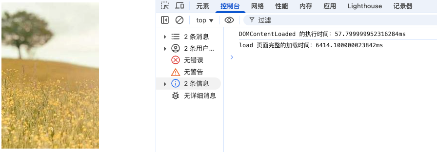
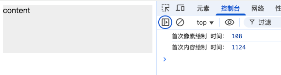
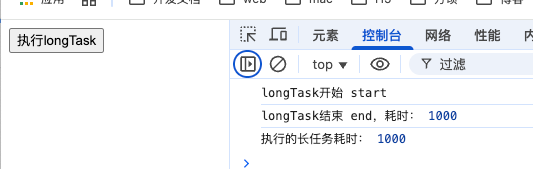
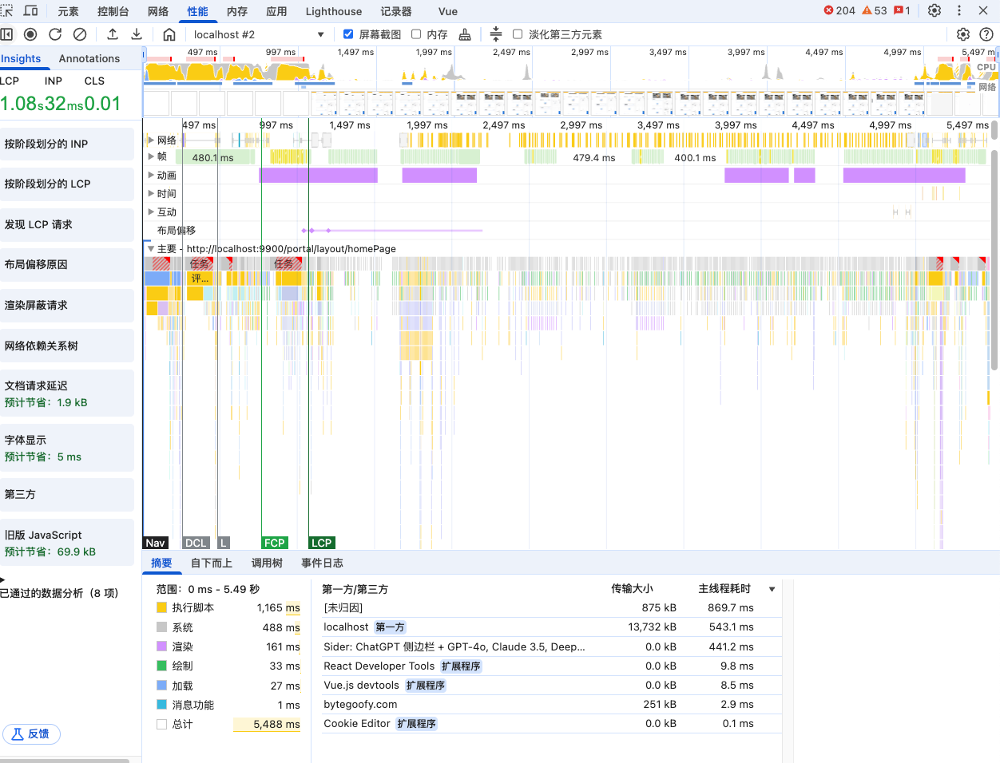
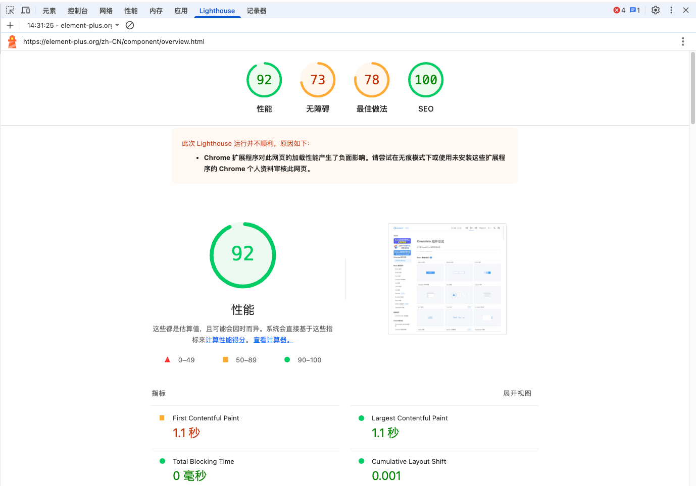

# 如何衡量前端性能

要做前端性能优化，首要工作是**分析和衡量**页面内容，找出网站中需要优化的部分，对症下药。

衡量性能的方式有以下几种：

1. 加载时间
2. 性能指标
3. 长任务卡顿
4. 浏览器 Performance 选项卡

### 1、加载时间

浏览器 `PerformanceNavigationTiming` 对象提供了关于页面加载性能各种计时的详细信息。（`对应旧版本的 performance.timing 对象`）比如可以分析 **DOM 树构建完成的时间（`DOMContentLoaded`） 和 页面完整的加载时间（`load`）**。

如下示例，在 DOM 树中增加一个 `` 标签来渲染图片，其中：

- `DOMContentLoaded`，是一个 DOM 事件，当浏览器完成 HTML 文档的解析，构建完成 DOM 树后触发，但不包含图片、CSS、JavaScript 等外部资源的加载。
- `onLoad`，是一个 JS 事件，它在页面的所有资源（包括 HTML、CSS、图片、JavaScript 等）完全加载完成后触发。

```html
<!DOCTYPE html>
<html lang="en">
  <head>
    <meta charset="UTF-8" />
  </head>
  <body>
    

    <script>
      window.addEventListener('load', () => {
        // 新版浏览器 API：PerformanceNavigationTiming 提供了关于页面加载性能的详细信息，替代旧的 performance.timing
        if (performance.getEntriesByType) {
          const perfEntries = performance.getEntriesByType('navigation');
          if (perfEntries.length > 0) {
            const navigationEntry = perfEntries[0];
            const { domContentLoadedEventStart, loadEventStart, fetchStart } = navigationEntry;

            const DOMContentLoadedTime = domContentLoadedEventStart - fetchStart;
            console.log(`DOMContentLoaded 的执行时间：${DOMContentLoadedTime}ms`);

            const loadTime = loadEventStart - fetchStart;
            console.log(`load 页面完整的加载时间：${loadTime}ms`);
          }
        }
        // 旧版浏览器降级使用 performance.timing
        else {
          const { fetchStart, domContentLoadedEventStart, loadEventStart } = performance.timing;

          const DOMContentLoadedTime = domContentLoadedEventStart - fetchStart;
          console.log(`DOMContentLoaded 的执行时间：${DOMContentLoadedTime}ms`);

          const loadTime = loadEventStart - fetchStart;
          console.log(`load 页面完整的加载时间：${loadTime}ms`);
        }
      });
    </script>
  </body>
</html>
```

统计加载时间结果参考：



PS：页面加载性能详细信息参考资料：[PerformanceNavigationTiming](https://link.juejin.cn/?target=https%3A%2F%2Fdeveloper.mozilla.org%2Fzh-CN%2Fdocs%2FWeb%2FAPI%2FPerformanceNavigationTiming)

### 2、性能指标

分析以用户为中心的性能指标，包含 **FP（首次像素绘制）、FCP（首次内容绘制）、FMP（首次有意义内容绘制）、LCP（页面中最大可见 图片或者文本块 加载时间）等**。

一般在 **客户端渲染单页面应用** 中，为了优化**首屏渲染白屏时间**，会重点关注 **FCP（首次内容绘制）** 性能指标。该绘制时长越短，说明白屏时间越少，用户打开网站的使用体验就越好。

> 说明：**FCP 首次内容绘制** 是指用户在页面中看到了有效内容。比如在 React 框架中，初始时会有一个空 id=root div 元素，此时不会计算 FCP，只有等 id=root 经过 ReactDOM render 以后，页面呈现了文本等有效内容，这时会计算出 FCP。

JS 可以通过 `PerformanceObserver` 观察 `event type paint` 来获取 FCP 指标。如下示例，初始放置一个空 div，在 1s 以后给 div 中添加有效内容（模拟框架渲染），FCP 指标会在这时生成。

```html
<!DOCTYPE html>
<html lang="en">
  <head>
    <meta charset="UTF-8" />
    <style>
      /* 设置背景图，生成 FP 指标 */
      #root {
        height: 100px;
        background: #eee;
      }
    </style>
  </head>
  <body>
    <div id="root"></div>
    <script>
      // 模拟框架渲染，1s 后在页面呈现有效内容
      setTimeout(() => {
        root.innerHTML = 'content';
      }, 1000);

      window.onload = function () {
        const observer = new PerformanceObserver(function (entryList) {
          const perfEntries = entryList.getEntries();
          for (const perfEntry of perfEntries) {
            if (perfEntry.name === 'first-paint') {
              const FP = perfEntry;
              console.log('首次像素绘制 时间：', FP?.startTime); // 674ms（div 设有背景图，会在元素渲染时生成 FP 指标）
            } else if (perfEntry.name === 'first-contentful-paint') {
              const FCP = perfEntry;
              console.log('首次内容绘制 时间：', FCP?.startTime); // 1174ms
              observer.disconnect(); // 断开观察，不再观察了
            }
          }
        });

        // 观察 paint 相关性能指标
        observer.observe({ entryTypes: ['paint'] });
      };
    </script>
  </body>
</html>
```



相关参考资料：
[Paint Timing：监控内容绘制](https://link.juejin.cn/?target=https%3A%2F%2Fw3c.github.io%2Fpaint-timing%2F)
[LCP：监视屏幕上触发的元素的最大绘制](https://link.juejin.cn/?target=https%3A%2F%2Fw3c.github.io%2Flargest-contentful-paint%2F)
[FMP：首次有意义绘制指标介绍](https://link.juejin.cn/?target=https%3A%2F%2Fdocs.google.com%2Fdocument%2Fd%2F1BR94tJdZLsin5poeet0XoTW60M0SjvOJQttKT-JK8HI%2Fview%23heading%3Dh.tdqghbi9ia5d)

### 3、页面卡顿

当一段代码的执行占用主线程时间过长时，用户在页面上的交互就会出现卡顿，我们可以通过监控这类长任务，针对性地进行优化。

如下示例，点击按钮执行一个 1000ms 长任务，我们可以使用 `PerformanceObserver` 观察 `event type longtask` 并设置阈值。

```html
<!DOCTYPE html>
<html lang="en">
  <head>
    <meta charset="UTF-8" />
  </head>
  <body>
    <button id="longTaskBtn">执行longTask</button>

    <script>
      // 默认长任务
      const longTaskBtn = document.getElementById('longTaskBtn');
      function longTask() {
        const start = Date.now();
        console.log('longTask开始 start');
        while (Date.now() < 1000 + start) {}
        console.log('longTask结束 end，耗时：', Date.now() - start);
      }
      longTaskBtn.addEventListener('click', longTask);
    </script>

    <script>
      // 观察长任务
      new PerformanceObserver((list) => {
        list.getEntries().forEach((entry) => {
          // 设定卡顿阈值：执行时长大于 500 ms
          if (entry.duration > 500) {
            console.log('执行的长任务耗时：', entry.duration);
          }
        });
      }).observe({ entryTypes: ['longtask'] });
    </script>
  </body>
</html>
```



### 4、浏览器 Performance 选项卡

除了上述通过代码进行度量性能外，还可以在 **浏览器控制台 - Performance 选项卡** 中查看和分析页面性能。其中包含 **FCP 性能指标、页面内容绘制 的耗时统计** 等。



### 5、Lighthouse 监测性能问题

`Lighthouse`生成的是一个报告，会给你的页面跑出一个分数来。 分别是页面性能（`performance`）、`Progressive`（渐进式 Web 应用）、`Accessibility`（可访问性）、`Best  Practices`（最佳实践）、`SEO` 五项指标的跑分。甚至针对我们的性能问题给出了可行的建议、以及每一项优化操作预期会帮我们节省的时间。这份报告的可操作性是很强的——我们只需要对着 LightHouse 给出的建议，一条一条地去尝试，就可以看到自己的页面，在一秒一秒地变快。



相关参考资料：
[web 性能优化（Lighthouse 和 performance）：从实际项目入手，如何监测性能问题、如何解决。](https://juejin.cn/post/6965744691979485197?searchId=202508221432273F8083535FDBE72A201D)
