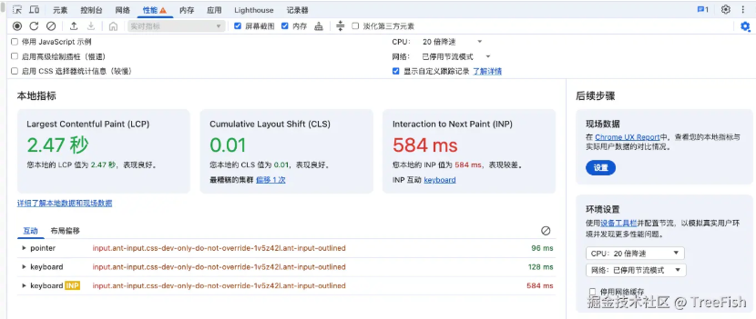
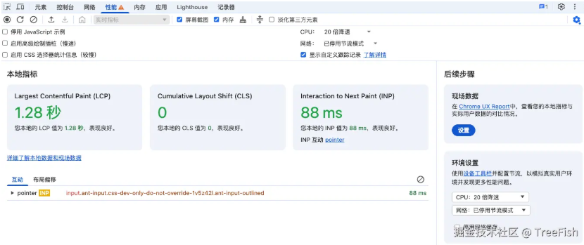

# 数据驱动

## 一、useState

`useState` 是一个 React Hook，允许函数组件在内部管理状态。

组件通常需要根据交互更改屏幕上显示的内容，例如点击某个按钮更改值，或者输入文本框中的内容，这些值被称为状态值也就是(state)

### 1. **使用方法**

`useState` 接收一个参数，即状态的初始值，然后返回一个数组，其中包含两个元素：

1.  该状态变量 当前的 `state`，最初设置为你提供的 初始化 `state`。
2.  set 函数，它允许你在响应交互时将 `state` 更改为任何其他值。

```ts
const [state, setState] = useState(initialState); // state 是状态变量，useState 是修改器
```

### 2. **注意事项**

`useState` 是一个 Hook，因此你只能在 `组件的顶层` 或自己的 `Hook` 中调用它。你不能在循环或条件语句中调用它。

在严格模式中，React 将 `两次调用初始化函数`，以 帮你找到意外的不纯性。这只是开发时的行为，不影响生产

### 3. **用法**

#### **基本数据类型**

```ts
// 基本数据类型
const [count, setCount] = useState(0); //数字 布尔值 null undefined 都可以直接赋值 一样的
const [str, setStr] = useState('aaa'); //
const updateData = () => {
  setCount(count + 1); // 直接传值
  setStr((pre) => pre + 'c'); // 函数式更新（推荐用于依赖上一次状态的情况）
};
```

#### **数组**

在 React 中你需要将数组视为只读的，不可以直接修改原数组，例如：不可以调用 `arr.push()` `arr.pop()` 等方法。

下面是常见数组操作的参考表。当你操作 React state 中的数组时，你需要避免使用左列的方法，而首选右列的方法：

| 避免使用 (会改变原始数组)           | 推荐使用 (会返回一个新数组）       |
| :---------------------------------- | :--------------------------------- |
| 添加元素 push，unshift              | concat，\[...arr] 展开语法（例子） |
| 删除元素 pop，shift，splice         | filter，slice（例子）              |
| 替换元素 splice，arr\[i] = ... 赋值 | map（例子）                        |
| 排序 reverse，sort                  | 先将数组复制一份（例子）           |

```ts
const [arr, setArr] = useState([1, 2, 3]); // 数组
const updateArray = () => {
  // 在React中你需要将数组视为只读的，不可以直接修改原数组，例如：不可以调用 arr.push() arr.pop() 等方法。
  // 添加元素：避免使用push，unshift   推荐使用concat，[...arr] 展开语法
  // arr.push(4); // 这样写视图不会更新，
  setArr([...arr, 4]);

  // 删除元素：避免使用pop，shift，splice  推荐使用filter，[...arr] 展开语法
  setArr(arr.filter((item) => item !== 2));

  // 替换元素：避免使用 splice，arr[i] = ... 赋值，  推荐使用map
  setArr(arr.map((item) => (item === 2 ? 9 : item)));

  // 排序、旋转等：避免使用 sort，reverse  推荐先将数组复制一份
  const nextArr = [...arr];
  nextArr.sort((a, b) => b - a);
  setArr(nextArr);

  // 指定位置插入元素
  let startIndex = 0;
  let endIndex = 2;
  setArr([...arr.slice(startIndex, endIndex), 2.5, ...arr.slice(endIndex)]);
};
```

#### **对象**

useState 可以接受一个函数，可以在函数里面编写逻辑，初始化值，注意这个只会执行一次，更新的时候就不会执行了。

在使用 setObject 的时候，可以使用 Object.assign 合并对象 或者 ... 合并对象，不能单独赋值，不然会覆盖原始对象。

```tsx
let [obj, setObj] = useState(() => {
  return {
    name: '张三',
    age: 18,
  };
});
// useState可以接受一个函数，可以在函数里面编写逻辑，初始化值，注意这个只会执行一次，更新的时候就不会执行了。
const updateObj = () => {
  // 在使用setObject的时候，可以使用Object.assign合并对象 或者 ... 合并对象，不能单独赋值，不然会覆盖原始对象。
  // 不要像下面这样改变一个对象：
  // setObj({
  //   name: '张三',
  // });
  setObj({
    ...obj,
    name: '李四',
  });
  //setObject(Object.assign({}, obj, { age: 26 })) 第二种写法
};
```

#### **函数**

React 只在初次渲染时保存初始状态，后续渲染时将其忽略。

```tsx
function TodoList() {
  const [todos, setTodos] = useState(createInitialTodos());
  // ...
```

尽管 `createInitialTodos()` 的结果仅用于初始渲染，但你仍然在每次渲染时调用此函数。如果它创建大数组或执行昂贵的计算，这可能会浪费资源。

为了解决这个问题，你可以将它 **作为初始化函数传递给** `useState`：

```tsx
function TodoList() {
  const [todos, setTodos] = useState(createInitialTodos);
  // ...
```

请注意，你传递的是 `createInitialTodos` **函数本身**，而不是 `createInitialTodos()` 调用该函数的结果。如果将函数传递给 `useState`，React 仅在初始化期间调用它。

React 在开发模式下可能会调用你的 [初始化函数](https://react.docschina.org/reference/react/useState#my-initializer-or-updater-function-runs-twice) 两次，以验证它们是否是 [纯函数](https://react.docschina.org/learn/keeping-components-pure)。

### 4. 更新机制

#### **异步机制**

useState set 函数是异步更新的

```tsx
const [index, setIndex] = useState(0);
const heandleClick = () => {
  setIndex(1); // 异步代码
  console.log(index); // 此时会打印0，因为是同步代码
};
```

此时 index 应该打印 1，但是还是 0，因为我们正常编写的代码是同步的，所以会先执行，而 set 函数是异步的所以后执行，这么做是为了性能优化，因为我们要的是结果而不是过程。

#### **内部机制**

当我们多次以相同的操作更新状态时，React 会进行比较，如果值相同，则会屏蔽后续的更新行为。自带`防抖`的功能，防止频繁的更新。

```tsx
import { useState } from 'react';
function App() {
  let [index, setIndex] = useState(0);
  const heandleClick = () => {
    setIndex(index + 1); //1
    setIndex(index + 1); //1
    setIndex(index + 1); //1
    console.log(index, 'index');
  };
  return (
    <>
      <h1>Index:{index}</h1>
      <button onClick={heandleClick}>更改值</button>
    </>
  );
}
export default App;
```

结果是 1 并不是 3，因为`setIndex(index + 1)`的值是一样的，后续操作被屏蔽掉了，阻止了更新。

为了解决这个问题，你可以向`setIndex` 传递一个更新函数，而不是一个状态。

```tsx
import { useState } from 'react';
function App() {
  let [index, setIndex] = useState(0);
  // 按照惯例，通常将待定状态参数命名为状态变量名称的第一个字母，例如 prevIndex 或者其更清楚的名称。
  const heandleClick = () => {
    setIndex((prevIndex) => prevIndex + 1); //1
    setIndex((prevIndex) => prevIndex + 1); //2
    setIndex((prevIndex) => prevIndex + 1); //3
  };
  return (
    <>
      <h1>Index:{index}</h1>
      <button onClick={heandleClick}>更改值</button>
    </>
  );
}
export default App;
```

1.  index => index + 1 将接收 0 作为待定状态，并返回 1 作为下一个状态。
2.  index => index + 1 将接收 1 作为待定状态，并返回 2 作为下一个状态。
3.  index => index + 1 将接收 2 作为待定状态，并返回 3 作为下一个状态。

现在没有其他排队的更新，因此 React 最终将存储 3 作为当前状态。

## 二、useReducer

`useReducer` 是一个 React Hook，它允许你向组件里面添加一个 [reducer](https://react.docschina.org/learn/extracting-state-logic-into-a-reducer)。

### 1. 使用方法

```tsx
const [state, dispatch] = useReducer(reducer, initialArg, init?)
```

**参数：**

1.  `reducer` 是一个处理函数，用于更新状态, reducer 里面包含了两个参数，第一个参数是 `state`，第二个参数是 `action`。`reducer` 会返回一个新的 `state`。
2.  `initialArg` 是 `state` 的初始值。
3.  `init` 是一个可选的函数，用于初始化 `state`，如果编写了 init 函数，则默认值使用 init 函数的返回值，否则使用`initialArg`。

**返回值：**

useReducer 返回一个由两个值组成的数组：

- 当前的 state：初次渲染时，它是 init(initialArg) 或 initialArg （如果没有 init 函数）。

- dispatch 函数：用于更新 state 并触发组件的重新渲染。

```tsx
import { useReducer } from 'react';
//根据旧状态进行处理 oldState，处理完成之后返回新状态 newState
//reducer 只有被dispatch的时候才会被调用 刚进入页面的时候是不会执行的
//oldState 任然是只读的
function reducer(oldState, action) {
  // ...
  return newState;
}

function MyComponent() {
  const [state, dispatch] = useReducer(reducer, { age: 42,name:'张三' });
  // ...
```

### 2. 计数器案例

初始状态 (initialState):

```tsx
// initialArg 是 state 的初始值。
const initialState = { count: 0, name: '张三' };
type Stage = typeof initialState;
```

初始化函数 init：

```tsx
// init 是一个可选的函数，用于初始化 state，如果编写了init函数，则默认值使用init函数的返回值，否则使用initialArg。
const init = () => {
  initialState.count = 10; // 调用初始方法，设置count初始值为0
  return initialState;
};
```

reducer 函数:

```tsx
interface Action {
  type: 'increment' | 'decrement';
}
// reducer 是一个处理函数，用于更新状态, reducer 里面包含了两个参数，第一个参数是 state，第二个参数是 action。reducer 会返回一个新的 state。
const reducer = (stage: Stage, action: Action) => {
  switch (action.type) {
    case 'add':
      return { ...stage, count: stage.count++ };
    case 'sub':
      return { ...stage, count: stage.count-- };
    default:
      throw new Error(); //抛出错误处理未预期的action类型
  }
};
```

- reducer 是一个用来根据不同的 action 来更新状态的纯函数。
- 它接收当前状态 (state) 和一个动作对象 (action)，根据 action.type 来决定如何更新 state。
- 如果 action.type 是 'increment'，则 count 增加 1；如果是 'decrement'，则 count 减少 1。
- 如果 action.type 不匹配任何已定义的情况，则抛出一个错误。 App 组件:

```tsx
const App = () => {
  const [stage, dispatch] = useReducer(reducer, initialState, init);
  return (
    <>
      <div>
        <button onClick={() => dispatch({ type: 'increment' })}>+</button>
        <button onClick={() => dispatch({ type: 'decrement' })}>-</button>
        <span>{stage.count}</span>
        <span>{stage.name}</span>
      </div>
    </>
  );
};

export default App;
```

- 当点击 "-" 按钮时，调用 dispatch({ type: 'decrement' })，使 count 减少。
- 当点击 "+" 按钮时，调用 dispatch({ type: 'increment' })，使 count 增加。

## 三、useSyncExternalStore

useSyncExternalStore 是 React 18 引入的一个 Hook，用于从外部存储（例如状态管理库、浏览器 API 等）获取状态并在组件中同步显示。这对于需要跟踪外部状态的应用非常有用。

### 1. 场景

1.  订阅外部 store 例如(redux,Zustand`德语`)
2.  订阅浏览器 API 例如(online,storage,location)等
3.  抽离逻辑，编写自定义 hooks
4.  服务端渲染支持

### 2. 用法

```tsx
const res = useSyncExternalStore(subscribe, getSnapshot, getServerSnapshot?)
```

- subscribe：用来订阅数据源的变化，接收一个回调函数，在数据源更新时调用该回调函数。
- getSnapshot：获取当前数据源的快照（当前状态）。
- getServerSnapshot?：在服务器端渲染时用来获取数据源的快照。

返回值：该 res 的当前快照，可以在你的渲染逻辑中使用

```tsx
const subscribe = (callback: () => void) => {
  // 订阅
  callback();
  return () => {
    // 取消订阅
  };
};

const getSnapshot = () => {
  return data;
};

const res = useSyncExternalStore(subscribe, getSnapshot);
```

### 3. 案例

#### **订阅浏览器 Api 实现自定义 hook(useStorage)**

我们实现一个 useStorage Hook，用于订阅 localStorage 数据。这样做的好处是，我们可以确保组件在 localStorage 数据发生变化时，自动更新同步。

实现代码

我们将创建一个 useStorage Hook，能够存储数据到 localStorage，并在不同浏览器标签页之间同步这些状态。此 Hook 接收一个键值参数用于存储数据的键名，还可以接收一个默认值用于在无数据时的初始化。

在 hooks/useStorage.ts 中定义 useStorage Hook：

```ts
import { useSyncExternalStore } from 'react';
/**
 *
 * @param key 存储到localStorage 的key
 * @param defaultValue 默认值
 */

export const useStorage = (key: any, defaultValue: any) => {
  const subscribe = (callback: () => void) => {
    // 订阅storage事件
    window.addEventListener('storage', callback);
    return () => {
      // 取消订阅storage事件
      window.removeEventListener('storage', callback);
    };
  };
  //从localStorage中获取数据 如果读不到返回默认值
  const getSnapshot = () => {
    return localStorage.getItem(key) ? JSON.parse(localStorage.getItem(key) as string) : defaultValue;
  };
  //修改数据
  const setStore = (value: any) => {
    localStorage.setItem(key, JSON.stringify(value));
    window.dispatchEvent(new StorageEvent('storage')); //手动触发storage事件
  };
  //返回数据
  const res = useSyncExternalStore(subscribe, getSnapshot);

  return [res, setStore];
};
```

在 App.tsx 中，我们可以直接使用 useStorage，来实现一个简单的计数器。值会存储在 localStorage 中，并且在刷新或其他标签页修改数据时自动更新。

```jsx
import { useStorage } from '../hooks/useStorage';
export const App = () => {
  const [count, setVal] = useStorage('count', 1);
  return (
    <>
      <div>
        <button onClick={() => setVal(count + 1)}>加一</button>
        <button onClick={() => setVal(count - 1)}>减一</button>
        <span>{count}</span>
      </div>
    </>
  );
};

export default App;
```

效果演示

- 值的持久化：点击按钮增加 val，页面刷新后依然会保留最新值。

- 跨标签页同步：在多个标签页打开该应用时，任意一个标签页修改 val，其他标签页会实时更新，保持同步状态。

#### **订阅 history 实现路由跳转**

实现一个简易的 useHistory Hook，获取浏览器 url 信息 + 参数

```ts
import { useSyncExternalStore } from 'react';

//history  api实现push,replace页面跳转，监听history变化
export const useHistory = () => {
  const subscribe = (callback: () => void) => {
    // 订阅浏览器api 监听history变化
    // history底层：popstate
    // hash底层： hashchange
    window.addEventListener('popstate', callback);
    window.addEventListener('hashchange', callback);
    return () => {
      // 取消订阅storage事件
      window.removeEventListener('popstate', callback);
      window.removeEventListener('hashchange', callback);
    };
    // popstate只能监听浏览器前进后退按钮的点击事件，不能监听pushState，replaceState的变化，需要手动触发
  };

  const getSnapshot = () => {
    return [window.location.href];
  };

  const push = (url: string) => {
    window.history.pushState(null, '', url);
    window.dispatchEvent(new PopStateEvent('popstate')); //手动触发storage事件
  };

  const replace = (url: string) => {
    window.history.replaceState(null, '', url);
    window.dispatchEvent(new PopStateEvent('popstate')); //手动触发storage事件
  };

  const res = useSyncExternalStore(subscribe, getSnapshot);

  return [res, push, replace] as const; // 将数组字面量转换为 只读元组 类型
};
```

使用 useHistory Hook

让我们在组件中使用这个 useHistory Hook，实现基本的前进、后退操作以及程序化导航。

```tsx
import { useHistory } from '../hooks/useHistory';
export const App = () => {
  const [history, push, replace] = useHistory();
  return (
    <>
      <div>
        <button onClick={() => push('/AA')}>跳转</button>
        <button onClick={() => replace('/CCC')}>替换</button>
        <span>{history}</span>
      </div>
    </>
  );
};

export default App;
```

效果演示

- history：这是 useHistory 返回的当前路径值。每次 URL 变化时，useSyncExternalStore 会自动触发更新，使 history 始终保持最新路径。
- push 和 replace：点击“跳转”按钮调用 push("/AA")，会将 /AA 推入历史记录；点击“替换”按钮调用 replace("/CCC")，则会将当前路径替换为 /CCC。

### 4. 注意事项

如果 `getSnapshot` 返回值不同于上一次，React 会重新渲染组件。这就是为什么，如果总是返回一个不同的值，会进入到一个无限循环，并产生这个报错。

```ts
Uncaught (in promise) Error: Maximum update depth exceeded. This can happen when a component repeatedly calls setState inside componentWillUpdate or componentDidUpdate. React limits the number of nested updates to prevent infinite loops.
```

```ts
function getSnapshot() {
  return myStore.todos; //object
}
```

这种写法每次返回了对象的引用，即使这个对象没有改变，React 也会重新渲染组件。

如果你的 store 数据是可变的，`getSnapshot` 函数应当返回一个它的不可变快照。这意味着 确实 需要创建新对象，但不是每次调用都如此。而是应当保存最后一次计算得到的快照，并且在 store 中的数据不变的情况下，返回与上一次相同的快照。如何决定可变数据发生了改变则取决于你的可变 store。

```ts
function getSnapshot() {
  if (myStore.todos !== lastTodos) {
    // 只有在 todos 真的发生变化时，才更新快照
    lastSnapshot = { todos: myStore.todos.slice() };
    lastTodos = myStore.todos;
  }
  return lastSnapshot;
}
```

## 四、useTransition

`useTransition` 是 React 18 中引入的一个 Hook，用于管理 UI 中的过渡状态，特别是在处理长时间运行的状态更新时。它允许你将某些更新标记为“过渡”状态，这样 React 可以优先处理更重要的更新，比如用户输入，同时延迟处理过渡更新。

### 1. 用法

```ts
const [isPending, startTransition] = useTransition();
```

### 2. 参数

`useTransition` 不需要任何参数

### 3. 返回值

`useTransition` 返回一个数组,包含两个元素

1.  `isPending`(boolean)，告诉你是否存在待处理的 transition。
2.  `startTransition`(function) 函数，你可以使用此方法将状态更新标记为 transition。

### 4. 例子

使用`mockjs`模拟数据

```sh
npm install mockjs
```

mockjs 文档地址：<https://github.com/nuysoft/Mock/wiki/Getting-Started>

开发自定义 vite mock 插件

```ts
import mockjs from 'mockjs';
import url from 'node:url';
import type { Plugin } from 'vite';
export const viteMockServer = (): Plugin => {
  return {
    name: 'vite-mock-server',
    //使用vite插件的钩子函数
    configureServer(server) {
      server.middlewares.use('/api/list', async (req: any, res) => {
        const parsedUrl = url.parse(req.originalUrl, true);
        //获取url参数 true表示返回对象 {keyWord: 'xx'}
        const query = parsedUrl.query;
        res.setHeader('Content-Type', 'application/json');
        const data = mockjs.mock({
          //返回1000条数据
          'list|1000': [
            {
              'id|+1': 1, //id自增
              name: query.keyWord, //name为url参数中的keyWord
              address: '@county(true)', //address为随机地址
            },
          ],
        });
        //返回数据
        res.end(JSON.stringify(data));
      });
    },
  };
};
```

在 vite.config.ts 中使用

```ts
import { defineConfig } from 'vite';
import react from '@vitejs/plugin-react-swc';
import { viteMockServer } from './src/plugins/mock';
export default defineConfig({
  plugins: [react(), viteMockServer()],
});
```

创建了一个简单的输入框和一个列表，用于展示基于输入关键词的结果。以下是组件的主要部分：

> Input, Flex, List 来源`antd` <https://ant.design/components/input/>

```sh
npm install antd
```

```tsx
import { useTransition, useState } from 'react';
import { Input, Flex, List } from 'antd';
interface Item {
  id: number;
  name: string;
  address: string;
}
const App = () => {
  const [inputValue, setInputValue] = useState('');
  const [isPending, startTransition] = useTransition(); // 开始过渡
  const [list, setList] = useState<Item[]>([]);
  const handleInputChange = (e: React.ChangeEvent<HTMLInputElement>) => {
    const value = e.target.value;
    setInputValue(value);
    fetch(`/api/list?keyWord=${value}`)
      .then((res) => res.json())
      .then((data) => {
        const res = data?.list ?? [];
        // 使用过渡 useTransition
        startTransition(() => {
          setList([...res]);
        });
        //不使用过渡 useTransition
        //setList([...res])
      });
  };
  return (
    <>
      <Flex>
        <Input
          value={inputValue}
          onChange={handleInputChange} // 实时更新
          placeholder="请输入姓名"
        />
      </Flex>
      {isPending && <div>loading...</div>}
      <List
        dataSource={list}
        renderItem={(item) => (
          <List.Item>
            <List.Item.Meta title={item.name} description={item.address} />
          </List.Item>
        )}
      />
    </>
  );
};

export default App;
```

1.  输入框和状态管理 使用 useState Hook 管理输入框的值和结果列表。 每次输入框的内容变化时，handleInputChange 函数会被触发，它会获取用户输入的值，并进行 API 请求。
2.  API 请求 在 handleInputChange 中，输入的值会作为查询参数发送到 /api/list API。API 返回的数据用于更新结果列表。 为了优化用户体验，我们将结果更新放在 startTransition 函数中，这样 React 可以在处理更新时保持输入框的响应性。
3.  使用 useTransition useTransition 返回一个布尔值 isPending，指示过渡任务是否仍在进行中。 当用户输入时，如果正在加载数据，我们会显示一个简单的“loading...”提示，以告知用户当前操作仍在进行。
4.  列表渲染 使用 List 组件展示返回的结果，列表项显示每个结果的 name 和 address。

**效果测试：**

不使用 useTransition 效果：


使用 useTransition 效果：



### 注意事项

startTransition 必须是同步的

错误做法

```ts
startTransition(() => {
  // ❌ 在调用 startTransition 后更新状态
  setTimeout(() => {
    setPage('/about');
  }, 1000);
});
```

正确做法

```ts
setTimeout(() => {
  startTransition(() => {
    // ✅ 在调用 startTransition 中更新状态
    setPage('/about');
  });
}, 1000);
```

**async await** 错误做法

```ts
startTransition(async () => {
  await someAsyncFunction();
  // ❌ 在调用 startTransition 后更新状态
  setPage('/about');
});
```

正确做法

```ts
await someAsyncFunction();
startTransition(() => {
  // ✅ 在调用 startTransition 中更新状态
  setPage('/about');
});
```

### 原理剖析

useTransition 的核心原理是将一部分状态更新处理为低优先级任务，这样可以将关键的高优先级任务先执行，而低优先级的过渡更新则会稍微延迟处理。这在渲染大量数据、进行复杂运算或处理长时间任务时特别有效。React 通过调度机制来管理优先级：

1.  高优先级更新：直接影响用户体验的任务，比如表单输入、按钮点击等。
2.  低优先级更新：相对不影响交互的过渡性任务，比如大量数据渲染、动画等，这些任务可以延迟执行。

```txt
+-----------------------+
|         App           |
|                       |
|  +--------------+     |
|  |    Input     |     |
|  +--------------+     |
|                       |
|  +--------------+     |
|  |   Display    |     |
|  +--------------+     |
+-----------------------+

用户输入
    |
    v
[高优先级更新] ---> [调度器] ---> [React 更新组件]
    |
    +---> [低优先级过渡更新] --> [调度器] --> [等待处理]
```

## 五、useDeferredValue

useDeferredValue 用于延迟某些状态的更新，直到主渲染任务完成。这对于高频更新的内容（如输入框、滚动等）非常有用，可以让 UI 更加流畅，避免由于频繁更新而导致的性能问题。

### 1. 关联问题：useTransition 和 useDeferredValue 的区别

`useTransition` 和 `useDeferredValue` 都涉及延迟更新，但它们关注的重点和用途略有不同：

- useTransition 主要关注点是`状态的过渡`。它允许开发者控制某个更新的延迟更新，还提供了过渡标识，让开发者能够添加过渡反馈。
- useDeferredValue 主要关注点是`单个值`的延迟更新。它允许你把特定状态的更新标记为低优先级。

### 2. 用法

```ts
const deferredValue = useDeferredValue(value);
```

**参数**

- value: 延迟更新的值(支持任意类型)

**返回值**

- deferredValue: 延迟更新的值,在初始渲染期间，返回的延迟值将与您提供的值相同

**注意事项**

当 `useDeferredValue` 接收到与之前不同的值（使用 Object.is 进行比较）时，除了当前渲染（此时它仍然使用旧值），它还会安排一个后台重新渲染。这个后台重新渲染是可以被中断的，如果 value 有新的更新，React 会从头开始重新启动后台渲染。举个例子，如果用户在输入框中的输入速度比接收延迟值的图表重新渲染的速度快，那么图表只会在用户停止输入后重新渲染。

### 3. 案例:延迟搜索数据的更新

```tsx
import React, { useState, useTransition, useDeferredValue } from 'react';
import { Input, List } from 'antd';
import mockjs from 'mockjs';
interface Item {
  name: number;
  address: string;
}
export const App = () => {
  const [val, setVal] = useState('');
  const [list] = useState<Item[]>(() => {
    // 使用 Mock.js 生成模拟数据
    return mockjs.mock({
      'list|10000': [
        {
          'id|+1': 1,
          name: '@natural',
          address: '@county(true)',
        },
      ],
    }).list;
  });
  const deferredQuery = useDeferredValue(val);
  const isStale = deferredQuery !== val; // 检查是否为延迟状态
  const findItem = () => {
    //过滤列表，仅在 deferredQuery 更新时触发
    return list.filter((item) => item.name.toString().includes(deferredQuery));
  };
  return (
    <div>
      <Input value={val} onChange={(e) => setVal(e.target.value)} />
      <List
        style={{ opacity: isStale ? '0.2' : '1', transition: 'all 1s' }}
        renderItem={(item) => (
          <List.Item>
            <List.Item.Meta title={item.name} description={item.address} />
          </List.Item>
        )}
        dataSource={findItem()}
      ></List>
    </div>
  );
};

export default App;
```

使用 useDeferredValue 后，输入框中的搜索内容不会立即触发列表过滤，避免频繁的渲染。输入停止片刻后(看起来像节流)，列表会自动更新为符合条件的数据，确保了较流畅的交互体验。

### 4. 陷阱

- `useDeferredValue` 并不是防抖,防抖是需要一个固定的延迟时间，譬如 1 秒后再处理某些行为，但是 useDeferredValue 并不是一个固定的延迟，它会根据用户设备的情况进行延迟，当设备情况好，那么延迟几乎是无感知的

> \[!CAUTION]
>
> 本文内容参考 [小满大佬](https://juejin.cn/post/7410313831271776256)
