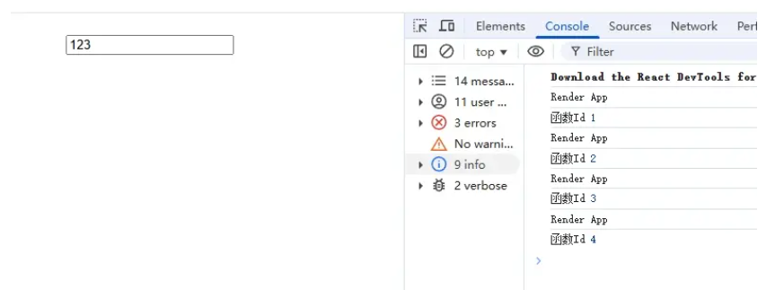
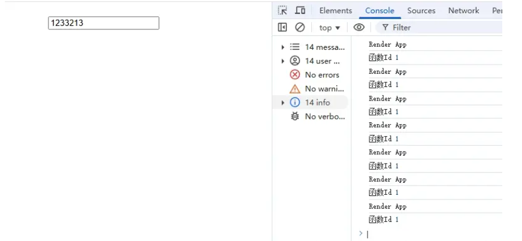
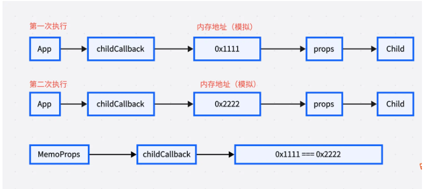
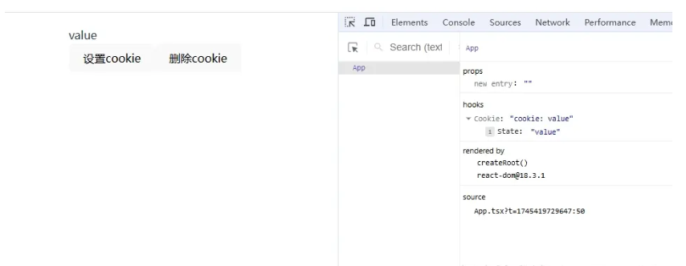

# 状态派生

## 一、useMemo

`useMemo` 是 React 提供的一个性能优化 Hook。它的主要功能是避免在每次渲染时执行复杂的计算和对象重建。通过记忆上一次的计算结果，仅当依赖项变化时才会重新计算，提高了性能，有点类似于 Vue 的`computed`。

### 1.React.memo

`React.memo` 是一个 React API，用于优化性能。它通过记忆上一次的渲染结果，仅当 props 发生变化时才会重新渲染, 避免重新渲染。

#### 用法

使用 `React.memo` 包裹组件`[一般用于子组件]`，可以避免组件重新渲染。

```tsx
import React, { memo } from 'react';
const MyComponent = React.memo(({ prop1, prop2 }) => {
  // 组件逻辑
});
const App = () => {
  return <MyComponent prop1="value1" prop2="value2" />;
};
```

#### React.memo 案例

首先明确 React 组件的渲染条件：

1.  组件的 props 发生变化
2.  组件的 state 发生变化
3.  useContext 发生变化

我们来看下面这个例子，这个例子没有使用 `memo` 进行缓存，所以每次父组件的 state 发生变化，子组件都会重新渲染。

> 而我们的子组件只用到了 user 的信息，但是父组件每次 search 发生变化，子组件也会重新渲染, 这样就就造成了没必要的渲染所以我们使用 `memo` 缓存。

```tsx
import React, { useMemo, useState } from 'react';
interface User {
   name: string;
   age: number;
   email: string;
}
interface CardProps {
   user: User;
}
const Card = function ({ user }: CardProps) {
const Card = React.memo(function ({ user }: CardProps) {
   console.log('Card render'); // 每次父组件的 state 发生变化，子组件都会重新渲染
   const styles = {
      backgroundColor: 'lightblue',
      padding: '20px',
      borderRadius: '10px',
      margin: '10px'
   }
   return <div style={styles}>
      <h1>{user.name}</h1>
      <p>{user.age}</p>
      <p>{user.email}</p>
   </div>
}
})
function App() {
   const [users, setUsers] = useState<User>({
      name: '张三',
      age: 18,
      email: 'zhangsan@example.com'
   });
   const [search, setSearch] = useState('');
   return (
      <div>
         <h1>父组件</h1>
         <input value={search} onChange={(e) => setSearch(e.target.value)} />
         <Card user={users} />
      </div>
   );
}

export default App;
```

当我们使用 `memo` 缓存后，只有 user 发生变化时，子组件才会重新渲染, 而 search 发生变化时，子组件不会重新渲染。

```tsx
import React, { useMemo, useState } from 'react';
interface User {
  name: string;
  age: number;
  email: string;
}
interface CardProps {
  user: User;
}
const Card = React.memo(function ({ user }: CardProps) {
  // 只有 user 发生变化时，子组件才会重新渲染
  console.log('Card render');
  const styles = {
    backgroundColor: 'lightblue',
    padding: '20px',
    borderRadius: '10px',
    margin: '10px',
  };
  return (
    <div style={styles}>
      <h1>{user.name}</h1>
      <p>{user.age}</p>
      <p>{user.email}</p>
    </div>
  );
});
function App() {
  const [users, setUsers] = useState<User>({
    name: '张三',
    age: 18,
    email: 'zhangsan@example.com',
  });
  const [search, setSearch] = useState('');
  return (
    <div>
      <h1>父组件</h1>
      <input value={search} onChange={(e) => setSearch(e.target.value)} />
      <div>
        <button
          onClick={() =>
            setUsers({
              name: '李四',
              age: Math.random() * 100,
              email: 'lisi@example.com',
            })
          }
        >
          更新user
        </button>
      </div>
      <Card user={users} />
    </div>
  );
}

export default App;
```

#### React.memo 总结

1.  **使用场景**：

    - 当子组件接收的 props 不经常变化时

    - 当组件重新渲染的开销较大时

    - 当需要避免不必要的渲染时

2.  **优点**：

    - 通过记忆化避免不必要的重新渲染
    - 提高应用性能
    - 减少资源消耗

3.  **注意事项**：

    - 不要过度使用，只在确实需要优化的组件上使用
    - 对于简单的组件，使用 `memo` 的开销可能比重新渲染还大
    - 如果 props 经常变化， `memo` 的效果会大打折扣

### 2.useMemo 用法

#### 参数

入参

- 回调函数:Function：返回需要缓存的值
- 依赖项:Array：依赖项发生变化时，回调函数会重新执行`(执行时机跟useEffect类似)`

返回值

- 返回值：返回需要缓存的值`(返回之后就不是函数了)`

#### useMemo 案例

> 我们来看下面这个例子，这个例子没有使用 `useMemo` 进行缓存，所以每次 search 发生变化， `total` 都会重新计算，这样就造成了没必要的计算所以我们可以使用 `useMemo` 缓存，因为我们的 `total` 跟 `search` 没有关系，那么如果计算的逻辑比较复杂，就造成了性能问题。

```tsx
import React, { useMemo, useState } from 'react';

function App() {
  const [search, setSearch] = useState('');
  const [goods, setGoods] = useState([
    { id: 1, name: '苹果', price: 10, count: 1 },
    { id: 2, name: '香蕉', price: 20, count: 1 },
    { id: 3, name: '橘子', price: 30, count: 1 },
  ]);
  const handleAdd = (id: number) => {
    setGoods(goods.map((item) => (item.id === id ? { ...item, count: item.count + 1 } : item)));
  };
  const handleSub = (id: number) => {
    setGoods(goods.map((item) => (item.id === id ? { ...item, count: item.count - 1 } : item)));
  };
  const total = () => {
    console.log('total'); // 此时只要input发生了改变都会进入到这个函数，影响性能
    //例如很复杂的计算逻辑
    return goods.reduce((total, item) => total + item.price * item.count, 0);
  };
  return (
    <div>
      <h1>父组件</h1>
      <input type="text" value={search} onChange={(e) => setSearch(e.target.value)} />
      <table border={1} cellPadding={5} cellSpacing={0}>
        <thead>
          <tr>
            <th>商品名称</th>
            <th>商品价格</th>
            <th>商品数量</th>
          </tr>
        </thead>
        <tbody>
          {goods.map((item) => (
            <tr key={item.id}>
              <td>{item.name}</td>
              <td>{item.price * item.count}</td>
              <td>
                <button onClick={() => handleAdd(item.id)}>+</button>
                <span>{item.count}</span>
                <button onClick={() => handleSub(item.id)}>-</button>
              </td>
            </tr>
          ))}
        </tbody>
      </table>
      <h2>总价：{total()}</h2>
    </div>
  );
}

export default App;
```

> 当我们使用 `useMemo` 缓存后，只有 goods 发生变化时， `total` 才会重新计算, 而 search 发生变化时， `total` 不会重新计算

```tsx
import React, { useMemo, useState } from 'react';

function App() {
  const [search, setSearch] = useState('');
  const [goods, setGoods] = useState([
    { id: 1, name: '苹果', price: 10, count: 1 },
    { id: 2, name: '香蕉', price: 20, count: 1 },
    { id: 3, name: '橘子', price: 30, count: 1 },
  ]);
  const handleAdd = (id: number) => {
    setGoods(goods.map((item) => (item.id === id ? { ...item, count: item.count + 1 } : item)));
  };
  const handleSub = (id: number) => {
    setGoods(goods.map((item) => (item.id === id ? { ...item, count: item.count - 1 } : item)));
  };
  const total = useMemo(() => {
    // 只有当goods改变才会进入到这个函数
    console.log('total');
    return goods.reduce((total, item) => total + item.price * item.count, 0);
  }, [goods]);
  return (
    <div>
      <h1>父组件</h1>
      <input type="text" value={search} onChange={(e) => setSearch(e.target.value)} />
      <table border={1} cellPadding={5} cellSpacing={0}>
        <thead>
          <tr>
            <th>商品名称</th>
            <th>商品价格</th>
            <th>商品数量</th>
          </tr>
        </thead>
        <tbody>
          {goods.map((item) => (
            <tr key={item.id}>
              <td>{item.name}</td>
              <td>{item.price * item.count}</td>
              <td>
                <button onClick={() => handleAdd(item.id)}>+</button>
                <span>{item.count}</span>
                <button onClick={() => handleSub(item.id)}>-</button>
              </td>
            </tr>
          ))}
        </tbody>
      </table>
      <h2>总价：{total}</h2>
    </div>
  );
}

export default App;
```

#### useMemo 执行时机(依赖项)

1.  如果依赖项是个空数组，那么 `useMemo` 的回调函数会执行一次
2.  指定依赖项，当依赖项发生变化时， `useMemo` 的回调函数会执行
3.  不指定依赖项，不推荐这么用，因为每次渲染和更新都会执行

#### useMemo 总结

1.  **使用场景**：
    - 当需要缓存复杂计算结果时
    - 当需要避免不必要的重新计算时
    - 当计算逻辑复杂且耗时时
2.  **优点**：
    - 通过记忆化避免不必要的重新计算
    - 提高应用性能
    - 减少资源消耗
3.  **注意事项**：
    - 不要过度使用，只在确实需要优化的组件上使用
    - 如果依赖项经常变化，useMemo 的效果会大打折扣
    - 如果计算逻辑简单，使用 useMemo 的开销可能比重新计算还大

## 三、useCallback

useCallback 用于优化性能，返回一个记忆化的回调函数，可以减少不必要的重新渲染，也就是说它是用于缓存组件内的函数，避免函数的重复创建。

### 1.为什么需要 useCallback

在 React 中，函数组件的重新渲染会导致组件内的函数被重新创建，这可能会导致性能问题。useCallback 通过缓存函数，可以减少不必要的重新渲染，提高性能。

### 2.用法

```tsx
const memoizedCallback = useCallback(() => {
  doSomething(a, b);
}, [a, b]);
```

### 3.参数

**入参**

- callback：回调函数
- deps：依赖项数组，当依赖项发生变化时，回调函数会被重新创建，跟 useEffect 一样。

**返回值**

- 返回一个记忆化的**回调函数**，可以减少函数的创建次数，提高性能。

**和 useMemo 的区别**

- `useMemo` 用于 **缓存计算结果**，避免在每次渲染时重复计算。
- `useCallback` 用于 **缓存函数**，避免在组件重新渲染时创建新的函数实例（函数引用不变）。

### 4.案例 1

来看这个实例：

- 我们创建了一个 WeakMap(用 Map 也行)，用于存储回调函数，并记录回调函数的创建次数。
- 在组件重新渲染时，changeSearch 函数会被重新创建，我们这边会进行验证，如果函数被重新创建了数量会+1，如果没有重新创建，数量默认是 1。

```tsx
import { useCallback, useState } from 'react';
const functionMap = new WeakMap();
let counter = 1;
const App: React.FC = () => {
  console.log('Render App');
  const [search, setSearch] = useState('');
  const changeSearch = (e: React.ChangeEvent<HTMLInputElement>) => {
    setSearch(e.target.value);
  };
  if (!functionMap.has(changeSearch)) {
    functionMap.set(changeSearch, counter++);
  }
  console.log('函数Id', functionMap.get(changeSearch));
  return (
    <>
      <input type="text" value={search} onChange={changeSearch} />
    </>
  );
};
export default App;
```

我们更改输入框的值，可以看到函数 Id 在增加，说明函数被重新创建了。



为什么是 4 呢，因为默认是 1，然后输入框更改了 3 次，所以是 4，那么这样好吗？我们使用 useCallback 来优化一下。

> 只需要在 changeSearch 函数上使用 useCallback，就可以优化性能。

```tsx
const changeSearch = useCallback((e: React.ChangeEvent<HTMLInputElement>) => {
  setSearch(e.target.value);
}, []);
```



### 5.案例 2

应用于子组件：

- 我们创建了一个 Child 子组件，并使用 React.memo 进行优化，memo 在上一章讲过了，他会检测 props 是否发生变化，如果发生变化，就会重新渲染子组件。
- 我们创建了一个 childCallback 函数，传递给子组件，然后我们输入框更改值，发现子组件居然重新渲染了，但是我们并没有更改 props，这是为什么呢？
- 这是因为输入框的值发生变化，App 就会重新渲染，然后 childCallback 函数就会被重新创建，然后传递给子组件，子组件会判断这个函数是否发生变化，但是每次创建的函数内存地址都不一样，所以子组件会重新渲染。

```tsx
import React, { useCallback, useState } from 'react';
const Child = React.memo(({ user, callback }: { user: { name: string; age: number }; callback: () => void }) => {
  console.log('Render Child');
  const styles = {
    color: 'red',
    fontSize: '20px',
  };
  return (
    <div style={styles}>
      <div>{user.name}</div>
      <div>{user.age}</div>
      <button onClick={callback}>callback</button>
    </div>
  );
});

const App: React.FC = () => {
  const [search, setSearch] = useState('');
  const [user, setUser] = useState({
    name: 'John',
    age: 20,
  });
  const childCallback = () => {
    console.log('callback 执行了');
  };
  return (
    <>
      <input type="text" value={search} onChange={(e) => setSearch(e.target.value)} />
      <Child callback={childCallback} user={user} />
    </>
  );
};

export default App;
```

因为 App 重新渲染了，所以 childCallback 函数会被重新创建，然后传递给子组件，子组件会判断这个函数是否发生变化，但是每次创建的函数内存地址都不一样，所以子组件会重新渲染。



> 只需要在 childCallback 函数上使用 useCallback，就可以优化性能。

```tsx
const childCallback = useCallback(() => {
  console.log('callback 执行了');
}, []);
```

### 6.总结

useCallback 的使用需要有所节制，不要盲目地对每个方法应用 useCallback，这样做可能会导致不必要的性能损失。useCallback 本身也需要一定的性能开销。

useCallback 并不是为了阻止函数的重新创建，而是通过依赖项来决定是否返回新的函数或旧的函数，从而在依赖项不变的情况下确保函数的地址不变。

## 三、useDebugValue

`useDebugValue` 是一个专为开发者调试自定义 Hook 而设计的 React Hook。它允许你在 React 开发者工具中为自定义 Hook 添加自定义的调试值。

### 1.用法

```ts
const debugValue = useDebugValue(value);
```

### 2.参数说明

**入参**

- `value`: 要在 React DevTools 中显示的值

- ```ts
  formatter?
  ```

  : (可选) 格式化函数

  - 作用：自定义值的显示格式
  - 调用时机：仅在 React DevTools 打开时才会调用，可以进行复杂的格式化操作
  - 参数：接收 value 作为参数
  - 返回：返回格式化后的显示值

### 3.返回值

- 无返回值（void）

### 4.获取 React DevTools

**1.Chrome 商店安装**

1.  访问 [React Developer Tools](https://chromewebstore.google.com/detail/react-developer-tools/fmkadmapgofadopljbjfkapdkoienihi?hl=zh-cn)
2.  点击"添加至 Chrome"即可安装

> 离线安装步骤
>
> 1.  打开 Chrome 浏览器，点击右上角三个点 → 更多工具 → 扩展程序
> 2.  开启右上角的"开发者模式"
> 3.  将下载的 .crx 文件直接拖拽到扩展程序页面
> 4.  在弹出的确认框中点击"添加扩展程序"

### 5.实战案例：自定义 useCookie Hook

下面通过实现一个 `useCookie` Hook 来展示 `useDebugValue` 的实际应用。这个 Hook 提供了完整的 cookie 操作功能，并通过 `useDebugValue` 来增强调试体验。

```tsx
import React, { useState, useDebugValue } from 'react';

/**
 * 自定义 Hook，用于管理浏览器的 cookie。
 * @param {string} name - cookie 的名称。
 * @param {string} [initialValue=''] - cookie 的初始值，默认为空字符串。
 * @returns {[string, (value: string, options?: any) => void, () => void]} - 返回一个数组，包含当前 cookie 的值、更新 cookie 的函数和删除 cookie 的函数。
 */
const useCookie = (name: string, initialValue: string = '') => {
  const getCookie = () => {
    // 使用正则表达式匹配 cookie 字符串中指定名称的值
    const match = document.cookie.match(new RegExp(`(^| )${name}=([^;]*)(;|$)`));
    return match ? match[2] : initialValue;
  };
  const [cookie, setCookie] = useState(getCookie());

  /**
   * 更新指定名称的 cookie 值。
   * @param {string} value - 要设置的新的 cookie 值。
   * @param {any} [options] - 可选的 cookie 选项，如过期时间、路径等。
   */
  const updateCookie = (value: string, options?: any) => {
    // 设置新的 cookie 值
    document.cookie = `${name}=${value};${options}`;
    // 更新状态中的 cookie 值
    setCookie(value);
  };

  /**
   * 删除指定名称的 cookie。
   */
  const deleteCookie = () => {
    // 通过设置过期时间为过去的时间来删除 cookie
    document.cookie = `${name}=;expires=Thu, 01 Jan 1970 00:00:00 GMT`;
    // 将状态中的 cookie 值重置为初始值
    setCookie(initialValue);
  };

  /**
   * 使用 useDebugValue Hook 在 React DevTools 中显示调试信息。
   * 这里将 cookie 的值格式化为 "cookie: {value}" 的形式。
   */
  useDebugValue(cookie, (value) => {
    return `cookie: ${value}`;
  });
  return [cookie, updateCookie, deleteCookie] as const;
};

/**
 * 主应用组件，演示如何使用 useCookie Hook 管理 cookie。
 * @returns {JSX.Element} - 返回一个包含显示 cookie 值和操作按钮的 JSX 元素。
 */
const App: React.FC = () => {
  const [cookie, updateCookie, deleteCookie] = useCookie('key', 'value');

  return (
    <div>
      <div>{cookie}</div>
      <button
        onClick={() => {
          updateCookie('update-value');
        }}
      >
        设置cookie
      </button>
      <button
        onClick={() => {
          deleteCookie();
        }}
      >
        删除cookie
      </button>
    </div>
  );
};

export default App;
```

#### Hook 功能说明

1.  **getCookie**: 获取指定名称的 cookie 值
2.  **updateCookie**: 更新或创建新的 cookie
3.  **deleteCookie**: 删除指定的 cookie

#### useDebugValue 的应用

在这个例子中，我们使用 `useDebugValue` 来显示当前 cookie 的值：

```tsx
useDebugValue(cookie, (value) => `cookie: ${value}`);
```

#### 调试效果展示

在 React DevTools 中的显示效果：



### 6.使用建议

1.  仅在自定义 Hook 中使用 `useDebugValue`
2.  对于简单的值，可以省略 formatter 函数
3.  当格式化值的计算比较昂贵时，建议使用 formatter 函数，因为它只在开发者工具打开时才会执行

## 四、useId

useId 是 React 18 新增的一个 Hook，用于生成稳定的唯一标识符，主要用于解决 SSR 场景下的 ID 不一致问题，或者需要为组件生成唯一 ID 的场景。

### 1.使用场景

- 为组件生成唯一 ID
- 解决 SSR 场景下的 ID 不一致问题
- 无障碍交互唯一 ID

### 2.用法

```ts
const id = useId();
// 返回值: :r0: 多次调用值递增
```

### 3.参数说明

**入参**

- 无入参

### 4.返回值

- 唯一标识符 例如`:r0:`

### 5.案例

#### 为组件生成唯一 ID

比如表单元素，label 需要和 input 绑定，如果使用 id 属性，需要手动生成唯一 ID，使用 useId 可以自动生成唯一 ID，这就非常方便。

```tsx
/**
 * App 组件，创建一个带标签的输入框，使用 useId 生成唯一的 ID 以关联标签和输入框。
 * @returns {JSX.Element} 返回一个包含标签和输入框的 JSX 元素。
 */
export const App = () => {
  // 使用 useId 钩子生成一个唯一的 ID，用于关联标签和输入框
  const id = useId();
  return (
    <>
      {/* 使用生成的唯一 ID 关联标签和输入框，提升可访问性 */}
      <label htmlFor={id}>Name</label>
      {/* 为输入框设置唯一的 ID，与标签关联 */}
      <input id={id} type="text" />
    </>
  );
};
```

#### 解决 SSR 场景下的 ID 不一致问题

在服务端渲染（SSR）场景下，组件会在服务端和客户端分别渲染一次。如果使用随机生成的 ID，可能会导致两端渲染结果不一致，引发 hydration 错误。useId 可以确保生成确定性的 ID。

```tsx
// 一个常见的 SSR 场景：带有工具提示的导航栏组件
const NavItem = ({ text, tooltip }) => {
  // ❌ 错误做法：使用随机值或递增值
  const randomId = `tooltip-${Math.random()}`;
  // 在 SSR 时服务端可能生成 tooltip-0.123
  // 在客户端可能生成 tooltip-0.456
  // 导致 hydration 不匹配

  return (
    <li>
      <a aria-describedby={randomId} href="#">
        {text}
      </a>
      <div id={randomId} role="tooltip">
        {tooltip}
      </div>
    </li>
  );
};

// ✅ 正确做法：使用 useId
const NavItemWithId = ({ text, tooltip }) => {
  const id = useId();
  const tooltipId = `${id}-tooltip`;

  return (
    <li>
      <a href="#" aria-describedby={tooltipId} className="nav-link">
        {text}
      </a>
      <div id={tooltipId} role="tooltip" className="tooltip">
        {tooltip}
      </div>
    </li>
  );
};

// 使用示例
const Navigation = () => {
  return (
    <nav>
      <ul>
        <NavItemWithId text="首页" tooltip="返回首页" />
        <NavItemWithId text="设置" tooltip="系统设置" />
        <NavItemWithId text="个人中心" tooltip="查看个人信息" />
      </ul>
    </nav>
  );
};
```

#### 无障碍交互唯一 ID

`aria-describedby` 是一个 **ARIA** 属性，用于为元素提供额外的描述性文本。它通过引用其他元素的 ID 来关联描述内容，帮助屏幕阅读器为用户提供更详细的信息。

当视障用户使用屏幕阅读器浏览网页时：

1.  读到输入框时会先读出输入框的标签
2.  然后会读出通过 `aria-describedby` 关联的描述文本
3.  用户就能知道这个输入框需要输入什么内容，有什么要求

```tsx
export const App = () => {
  const id = useId();
  return (
    <div>
      <input type="text" aria-describedby={id} />
      <p id={id}>请输入有效的电子邮件地址，例如：xiaoman@example.com</p>
    </div>
  );
};
```

### 6.总结

**基本介绍**

useId 是 React 18 引入的新 Hook，用于生成稳定且唯一的标识符

**使用特点**

- 无需传入参数
- 返回确定性的唯一字符串（如`:r0:`）
- 同一组件多次调用会生成递增的 ID
- 适合在需要稳定 ID 的场景下使用，而不是用于视觉或样式目的

**最佳实践**

- 当需要多个相关 ID 时，应该使用同一个 useId 调用，并添加后缀
- 不要用于列表渲染的 key 属性
- 优先用于可访问性和 SSR 场景

> \[!CAUTION]
>
> 本文内容参考[小满大佬](https://juejin.cn/post/7410313831271776256)
