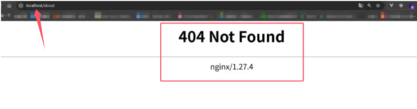
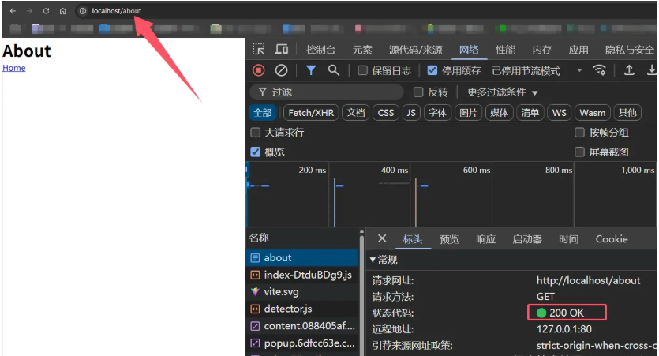
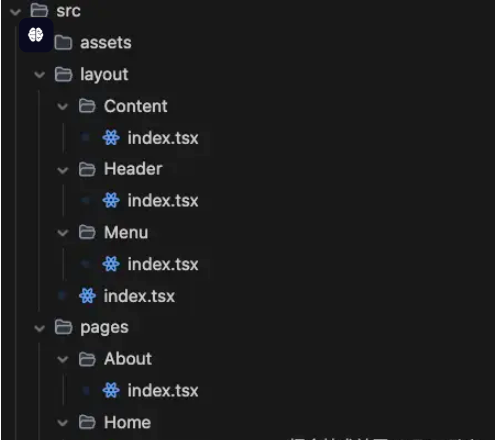
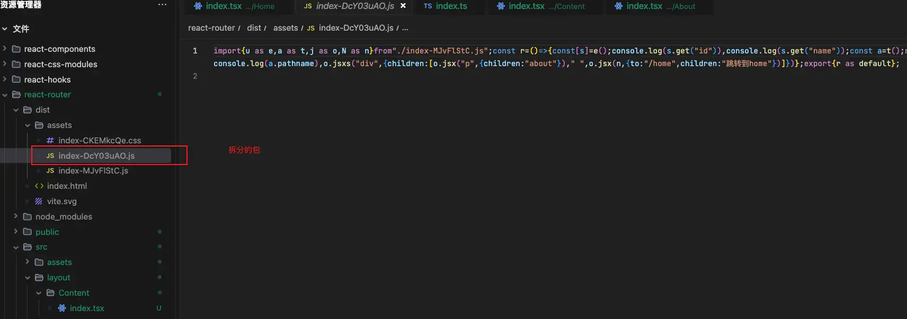

# React-Router V7

官方文档:<https://reactrouter.com/home>

## 一、安装

react-router 在最新版本`V7`中，设计了三种模式

- 框架模式

框架模式就是使用，React-router 提供的脚手架模板去安装，安装完成后会自带路由功能。

```sh
npx create-react-router@latest my-react-router-app # 创建项目
cd my-react-router-app # 进入项目
npm i # 安装依赖
npm run dev # 启动项目
```

- 数据模式

数据模式就是，我们可以使用自己的模板去创建`React`项目，比如使用`vite` `webpack` 等，然后自己安装`React-router`。

```sh
npm i react-router #V7不在需要 react-router-dom
```

```tsx
export const router = createBrowserRouter([
  {
    path: '/',
    Component: Home,
  },
  {
    path: '/about',
    Component: About,
  },
]);
```

- 声明模式

声明模式，也可以用自己的模板创建`React`项目，然后自己安装`React-router`。

```sh
npm i react-router #V7不在需要 react-router-dom
```

```tsx
import React from 'react';
import ReactDOM from 'react-dom/client';
import { BrowserRouter, Routes, Route } from 'react-router';
import App from './app';
import About from '../about';
const root = document.getElementById('root');

ReactDOM.createRoot(root).render(
  <BrowserRouter>
    <Routes>
      <Route path="/" element={<App />} />
      <Route path="about" element={<About />} />
    </Routes>
  </BrowserRouter>
);
```

> 数据模式和声明模式的区别，数据模式可以享用`React-router`所有的功能，包括数据处理。而声明模式只能享用`React-router`的一部分功能，比如路由跳转。
>
> 如果做一个小项目可以使用`声明模式`，如果要做企业级项目可以使用`数据模式`。

### 1.基本使用

- src/router/index.ts

pages 目录创建两个组件，Home 和 About

新建目录`router`，在目录中新建文件`index.ts`，在文件中引入`React-router`，然后使用`createBrowserRouter`创建路由。

```tsx
import { createBrowserRouter } from 'react-router';
import Home from '../pages/Home';
import About from '../pages/About';

const router = createBrowserRouter([
  {
    path: '/',
    Component: Home,
  },
  {
    path: '/about',
    Component: About,
  },
]);

export default router;
```

- src/App.tsx

在`App.tsx`文件中引入路由，然后使用`RouterProvider`包裹`App`组件。

```tsx
import React from 'react';
import { RouterProvider } from 'react-router';
import router from './router';
const App: React.FC = () => {
  return (
    <>
      <RouterProvider router={router} />
    </>
  );
};

export default App;
```

### 2.路由跳转

在`Home`组件中使用`NavLink`组件跳转到`About`组件。

```tsx
import { NavLink } from 'react-router';
const Home: React.FC = () => {
  return (
    <div>
      <NavLink to="/about">About</NavLink>
    </div>
  );
};

export default Home;
```

在`About`组件中使用`Link`组件跳转到`Home`组件。

```tsx
import { NavLink } from 'react-router';
const About: React.FC = () => {
  return (
    <div>
      <NavLink to="/">Home</NavLink>
    </div>
  );
};

export default About;
```

## 二、路由模式

在 React RouterV7 中，是拥有不同的路由模式，路由模式的选择将直接影响你的整个项目。React Router 提供了四种核心路由创建函数： `createBrowserRouter`、`createHashRouter`、`createMemoryRouter` 和 `createStaticRouter`

## 1.createBrowserRouter(推荐)

### 核心特点

- 使用 HTML5 的 history API (pushState, replaceState, popState)
- 浏览器 URL 比较纯净 (/search, /about, /user/123)
- 需要服务器端支持(nginx, apache,等)否则会刷新 404

### 使用场景

- 大多数现代浏览器环境
- 需要服务器端支持
- 需要 URL 美观

## 2.createHashRouter

### 核心特点

- 使用 URL 的 hash 部分(#/search, #/about, #/user/123)
- 不需要服务器端支持
- 刷新页面不会丢失

### 使用场景

- 静态站点托管例如(github pages, netlify, vercel)
- 不需要服务器端支持

## 3.createMemoryRouter

### 核心特点

- 使用内存中的路由表
- 刷新页面会丢失状态
- 切换页面路由不显示 URL

### 使用场景

- 非浏览器环境例如(React Native, Electron)
- 单元测试或者组件测试(Jest, Vitest)

## 4.createStaticRouter

### 核心特点

- 专为服务端渲染（SSR）设计
- 在服务器端匹配请求路径，生成静态 HTML
- 需与客户端路由器（如 createBrowserRouter）配合使用

### 使用场景

- 服务端渲染应用（如 Next.js 的兼容方案）
- 需要 SEO 优化的页面

## 5.解决刷新 404 问题

当使用`createBrowserRouter`时，如果刷新页面会丢失状态，这是因为浏览器默认会去请求服务器上的资源，如果服务器上没有资源，就会返回 404。 要解决这个问题就需要在服务器配置一个回退路由，当请求的资源不存在时，返回`index.html`。



### Nginx(推荐)

下载地址：[Nginx](https://nginx.org/en/download.html)

```sh
location / {
  try_files $uri $uri/ /index.html;
}
```



### Apache

```sh
<IfModule mod_negotiation.c>
  Options -MultiViews
</IfModule>

<IfModule mod_rewrite.c>
  RewriteEngine On
  RewriteBase /
  RewriteRule ^index\.html$ - [L]
  RewriteCond %{REQUEST_FILENAME} !-f
  RewriteCond %{REQUEST_FILENAME} !-d
  RewriteRule . /index.html [L]
</IfModule>
```

### Vercel

```json
{
  "rewrites": [{ "source": "/:path*", "destination": "/index.html" }]
}
```

### Nodejs

```js
const http = require('http');
const fs = require('fs');
const httpPort = 80;

http
  .createServer((req, res) => {
    fs.readFile('index.html', 'utf-8', (err, content) => {
      if (err) {
        console.log('We cannot open "index.html" file.');
      }

      res.writeHead(200, {
        'Content-Type': 'text/html; charset=utf-8',
      });

      res.end(content);
    });
  })
  .listen(httpPort, () => {
    console.log('Server listening on: http://localhost:%s', httpPort);
  });
```

## 三、路由

React-Router V7 的路由种类是非常多的，有`嵌套路由` `布局路由` `索引路由` `前缀路由` `动态路由`，大致上是分为这五种

### 1.Layout

我们在演示上面几种路由之前，先对界面进行一个布局，方便我们后续的演示,UI 组件我们使用`antd`。

```sh
npm install antd
npm install @ant-design/icons
```

我们创建一个`layout`文件夹，在文件夹中创建一个`Content` `Header` `Menu` 文件夹，在文件夹中创建一个`index.tsx`文件，文件内容如下：



- src/layout/Menu/index.tsx `菜单页面`

``` tsx
import { Menu as AntdMenu } from 'antd';
import { AppstoreOutlined } from '@ant-design/icons';
import type { MenuProps } from 'antd'
import { useNavigate } from 'react-router';
export default function Menu() {
    const navigate = useNavigate();//编程式导航
    const handleClick: MenuProps['onClick'] = (info) => {
         navigate(info.key) // 点击菜单项时，导航到对应的页面
    };
    const menuItems = [
        {
            key: '/home',
            label: 'Home',
            icon: <AppstoreOutlined />,
        },
        {
            key: '/about',
            label: 'About',
            icon: <AppstoreOutlined />,
        },
    ];
    return <AntdMenu onClick={handleClick} style={{ height: '100vh' }} items={menuItems} />;
}
```

- src/layout/Header/index.tsx `头部页面`

```tsx
import { Breadcrumb } from 'antd';

export default function Header() {
  return (
    <Breadcrumb
      items={[
        {
          title: 'Home',
        },
        {
          title: 'List',
        },
        {
          title: 'App',
        },
      ]}
    />
  );
}
```

- src/layout/Content/index.tsx `内容页面`

```tsx
import { Outlet } from 'react-router';
export default function Content() {
  return <Outlet />;
}
```

- src/layout/index.tsx `布局页面实现串联`

```tsx
import Header from './Header';
import Menu from './Menu';
import Content from './Content';
import { Layout as AntdLayout } from 'antd';
export default function Layout() {
  return (
    <AntdLayout>
      <AntdLayout.Sider>
        <Menu />
      </AntdLayout.Sider>
      <AntdLayout>
        <Header />
        <AntdLayout.Content>
          <Content />
        </AntdLayout.Content>
      </AntdLayout>
    </AntdLayout>
  );
}
```

### 2.嵌套路由

嵌套路由就是父路由中嵌套子路由`children`，子路由可以继承父路由的布局，也可以有自己的布局。

注意事项：

- 父路由的 path 是 `index`开始，所以访问子路由的时候需要加上父路由的 path 例如 `/index/home` `/index/about`
- 子路由不需要增加`/`了直接写子路由的 path 即可
- 子路由默认是不显示的，需要父路由通过 `Outlet` 组件来显示子路由 outlet 就是类似于 Vue 的`<router-view>`展示子路由的一个容器
- 子路由的层级可以无限嵌套，但是要注意的是，一般实际工作中就是 2-3 层

```tsx
const router = createBrowserRouter([
  {
    path: '/index',
    Component: Layout, // 父路由
    children: [
      {
        path: 'home',
        Component: Home, // 子路由
      },
      {
        path: 'about',
        Component: About, // 子路由
      },
    ],
  },
]);

import { Outlet } from 'react-router';
function Content() {
  return <Outlet />;
}
```

### 3.布局路由

布局路由是一种特殊的嵌套路由，父路由可以省略 `path`，这样不会向 URL 添加额外的路径段：

```ts
const router = createBrowserRouter([
  {
    // path: '/index', //省略
    Component: Layout,
    children: [
      {
        path: 'home',
        Component: Home,
      },
      {
        path: 'about',
        Component: About,
      },
    ],
  },
]);
```

### 4.索引路由

索引路由使用 `index: true` 来定义，作为父路由的默认子路由：

```ts
{ index: true, Component: Home }
```

索引路由在其父级的 URL 处呈现到其父级的 Outlet 中

```ts
const router = createBrowserRouter([
  {
    path: '/',
    Component: Layout,
    children: [
      {
        index: true,
        // path: 'home',
        Component: Home,
      },
      {
        path: 'about',
        Component: About,
      },
    ],
  },
]);
```

### 5.前缀路由

前缀路由只设置 `path` 而不设置 `Component`，用于给一组路由添加统一的路径前缀：

```tsx
const router = createBrowserRouter([
  {
    path: '/project',
    //Component: Layout, //省略
    children: [
      {
        path: 'home',
        Component: Home,
      },
      {
        path: 'about',
        Component: About,
      },
    ],
  },
]);
```

### 6.动态路由

动态路由通过 `:参数名` 语法来定义动态段：

访问规则如下 `http://localhost:3000/home/123`

```tsx
const router = createBrowserRouter([
  {
    path: '/',
    Component: Layout,
    children: [
      {
        path: 'home/:id',
        Component: Home,
      },
      {
        path: 'about',
        Component: About,
      },
    ],
  },
]);

//在组件中获取参数
import { useParams } from 'react-router';

function Card() {
  let params = useParams();
  console.log(params.id);
}
```

## 四、参数传递

React-router 一共有三种方式进行参数传递，参数传递指的是在路由跳转时，将参数传递给目标路由。

### 1.Query 方式

Query 的方式就是使用 ? 来传递参数，例如：

```sh
#多个参数用 & 连接
/user?name=Aiolimp&age=18
```

跳转方式：

```tsx
<NavLink  to="/about?id=123">About</NavLink> //1. NavLink 跳转
<Link to="/about?id=123">About</Link> //2. Link 跳转
import { useNavigate } from 'react-router'
const navigate = useNavigate()
navigate('/about?id=123') //3. useNavigate 跳转
```

获取参数：

useSearchParams 用法查看[useSearchParams](https://message163.github.io/react-docs/router/hooks/useSearchParams.html)

```tsx
//1. 获取参数
import { useSearchParams } from 'react-router';
const [searchParams, setSearchParams] = useSearchParams();
console.log(searchParams.get('id')); //获取id参数

//2. 获取参数
import { useLocation } from 'react-router';
const { search } = useLocation();
console.log(search); //获取search参数 ?id=123
```

### 2.Params 方式

Params 的方式就是使用 :\[name] 来传递参数，例如：

```bash
/user/:id
```

跳转方式：

```tsx
<NavLink to="/user/123">User</NavLink> //1. NavLink 跳转
<Link to="/user/123">User</Link> //2. Link 跳转
import { useNavigate } from 'react-router'
const navigate = useNavigate()
navigate('/user/123') //3. useNavigate 跳转
```

获取参数：

useParams 用法查看[useParams](https://message163.github.io/react-docs/router/hooks/useParams.html)

```tsx
import { useParams } from 'react-router';
const { id } = useParams();
console.log(id); //获取id参数
```

### 3.State 方式

state 在 URL 中不显示，但是可以传递参数，例如：

```sh
/user
```

跳转方式：

```tsx
<Link to="/user" state={{ name: 'Aiolimp', age: 18 }}>User</Link> //1. Link 跳转
<NavLink to="/user" state={{ name: 'Aiolimp', age: 18 }}>User</NavLink> //2. NavLink 跳转
import { useNavigate } from 'react-router'
const navigate = useNavigate()
navigate('/user', { state: { name: 'Aiolimp', age: 18 } }) //3. useNavigate 跳转
```

获取参数：

useLocation 用法查看[useLocation](https://message163.github.io/react-docs/router/hooks/useLocation.html)

```tsx
import { useLocation } from 'react-router';
const { state } = useLocation();
console.log(state); //获取state参数
console.log(state.name); //获取name参数
console.log(state.age); //获取age参数
```

## 4.useLocation 和 useSearchParams 区别

### useLocation

- **作用**：拿到**完整的当前路由地址信息**。
- **返回**：一个 location 对象，里面有：
  - **pathname**：比如 /home
  - **search**：比如 ?id=123
  - **hash**：比如 #section2
  - **state**：跳转时传的自定义数据
  - **key**：内部用的唯一 key

适合用来知道 “我现在在哪个页面” 和 “地址栏参数整体长什么样”。

```tsx
import { useLocation } from 'react-router';

function MyComponent() {
  const location = useLocation();
  console.log(location.pathname); // 比如 /about
  console.log(location.search); // 比如 ?name=jack
  return <div>当前路径是: {location.pathname}</div>;
}
```

### useSearchParams

- **作用**：专门**读写 URL 里的 ?xxx=yyy 查询参数**。
- **返回**：
- \[searchParams, setSearchParams]
- searchParams 是一个类似 URLSearchParams 的对象
- setSearchParams 可以用来修改 URL 查询参数

适合用来 **获取/修改** URL 的 ? 参数（比如分页、搜索关键字等）。

```tsx
import { useSearchParams } from 'react-router';

function MyComponent() {
  const [searchParams, setSearchParams] = useSearchParams();

  const name = searchParams.get('name'); // 读参数
  const age = searchParams.get('age');

  const changeName = () => {
    setSearchParams({ name: 'John', age: '30' }); // 改参数
  };

  return (
    <div>
      <div>名字：{name}</div>
      <div>年龄：{age}</div>
      <button onClick={changeName}>改名字</button>
    </div>
  );
}
```

## 5.总结

React Router 提供了三种参数传递方式，各有特点：

### 1.Params 方式 (`/user/:id`)

- 适用于：传递必要的路径参数（如 ID）
- 特点：符合 RESTful 规范，刷新不丢失
- 限制：只能传字符串，参数显示在 URL 中

### 2. Query 方式 (`/user?name=Aiolimp`)

- 适用于：传递可选的查询参数
- 特点：灵活多变，支持多参数
- 限制：URL 可能较长，参数公开可见

### 3. State 方式

- 适用于：传递复杂数据结构
- 特点：支持任意类型数据，参数不显示在 URL
- 限制：刷新可能丢失，不利于分享

选择建议：必要参数用 Params，筛选条件用 Query，临时数据用 State。

## 五、懒加载

### 1.什么是懒加载

懒加载是一种优化技术，用于延迟加载组件，直到需要时才加载。这样可以减少初始加载时间，提高页面性能。

### 2.懒加载的实现

通过在路由对象中使用 `lazy` 属性来实现懒加载。

```ts
import { createBrowserRouter } from 'react-router';
const sleep = (ms: number) => new Promise((resolve) => setTimeout(resolve, ms)); // 模拟异步请求
const router = createBrowserRouter([
  {
    Component: Layout, // 使用布局组件作为父级
    children: [
      {
        path: 'home',
        Component: Home,
      },
      {
        path: 'about',
        lazy: async () => {
          await sleep(2000); // 模拟异步请求
          const Component = await import('../pages/About'); // 异步导入组件
          console.log(Component);
          return {
            Component: Component.default,
          }; // 返回加载完成组件
        },
      },
    ],
  },
]);
```

当切换到 `about` 路由时，才会进行加载

> 如果配置了 `loader` 则每次都会进入`loading`状态，如果没有配置 `loader` 则只执行一次。

### 3.体验优化

例如 `about` 是一个懒加载的组件，在切换到 `about` 路由时，展示的还是上一个路由的组件，直到懒加载的组件加载完成，才会展示新的组件，这样用户会感觉页面卡顿，用户体验不好。

#### 使用状态优化 useNavigation

- src/layout/Content/index.tsx

**navigation.state**

- **idle**- 空闲状态，表示没有正在进行的导航
- **loading** - 加载状态，表示正在加载路由数据或组件
- **submitting** - 提交状态，表示正在提交表单数据

```tsx
import { Outlet, useNavigation } from 'react-router';
import { Alert, Spin } from 'antd';
export default function Content() {
  const navigation = useNavigation();
  console.log(navigation.state);
  const isLoading = navigation.state === 'loading';
  return (
    <div>
      {isLoading ? (
        <Spin size="large" tip="loading...">
          <Alert description="AAA" message="加载中" type="info" />
        </Spin>
      ) : (
        <Outlet />
      )}
    </div>
  );
}
```

### 5.性能优化

使用懒加载打包后，会把懒加载的组件打包成一个独立的文件，从而减小主包的大小。



> \[!CAUTION]
>
> 本文内容参考[小满大佬](https://juejin.cn/post/7410313831271776256)
