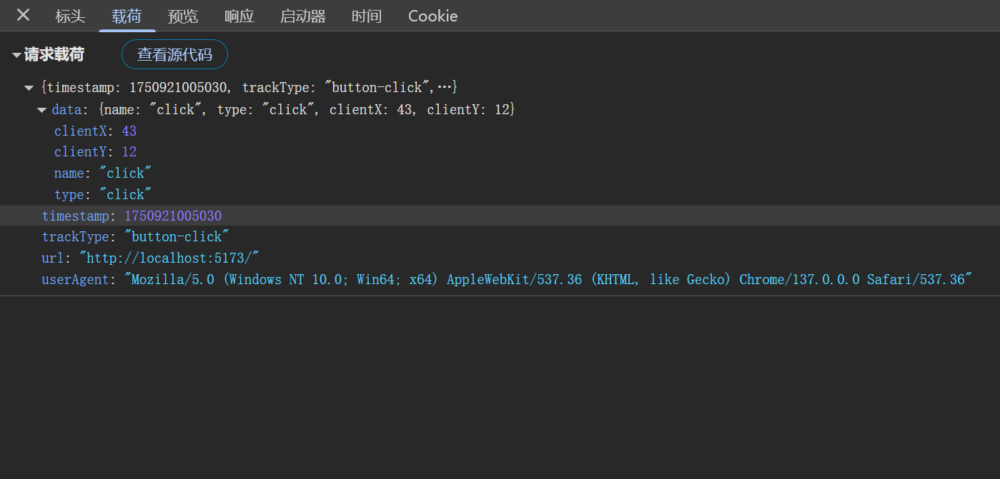

# React HOC 高阶组件

## 什么是高阶组件？

高阶组件就是一个组件，它接受另一个组件作为参数，并返回一个新的组件，（如果你学过 Vue 的话，跟 Vue 中的二次封装组件有点类似）新的组件可以复用旧组件的逻辑，并可以添加新的功能。常用于类组件中，虽然目前都是 hooks 写法会缩小 HOC 的使用场景，但还是有部分场景会用到

## 入门级用法

**注意点**

- HOC 不会修改传入的组件，而是使用组合的方式，通过将原组件包裹在一个容器组件中来实现功能扩展
- 注意避免多层嵌套，一般 HOC 的嵌套层级不要超过 3 层
- HOC 的命名规范：`with`开头，如`withLoading`、`withAuth`等

**代码示例**

我们以一个权限判断的例子来入门 HOC，并且可以灵活的复用这个逻辑。

```jsx
enum Role {
  ADMIN = 'admin',
  USER = 'user',
}
const withAuthorization = (role: Role) => (Component: React.FC) => {
  // 判断是否具有权限的函数
  const isAuthorized = (role: Role) => {
    return role === Role.ADMIN;
  }
  return (props: any) => {
    // 判断是否具有权限
    if (isAuthorized(role)) {
      //把props透传给组件
      return <Component {...props} />
    } else {
      // 没有权限则返回一个提示
      return <div>抱歉，您没有权限访问该页面</div>
    }
  }
}

const AdminPage = withAuthorization(Role.ADMIN)(() => {
  return <div>管理员页面</div> //有权限输出
})

const UserPage = withAuthorization(Role.USER)(() => {
  return <div>用户页面</div> //没有权限不输出
})
```

## 进阶用法

封装一个通用的 HOC，实现埋点统计，比如点击事件，页面挂载，页面卸载等。

封装一个埋点服务可以根据自己的业务自行扩展

1. `trackType`表示发送埋点的组件类型
2. `data`表示发送的数据
3. `eventData`表示需要统计的用户行为数据
4. `navigator.sendBeacon`是浏览器提供的一种安全可靠的异步数据传输方式，适合发送少量数据，比如埋点数据,并且浏览器关闭时，数据也会发送，不会阻塞页面加载

```jsx
const trackService = {
  sendEvent: <T,>(trackType: string, data: T = null as T) => {
    const eventData = {
      timestamp: Date.now(), // 时间戳
      trackType, // 事件类型
      data, // 事件数据
      userAgent: navigator.userAgent, // 用户代理
      url: window.location.href, // 当前URL
    }
    //发送数据
    navigator.sendBeacon(
      'http://localhost:5173',
      JSON.stringify(eventData)
    )
  }
}
```

实现 HOC 高阶组件,通过 useEffect 统计组件挂载和卸载，并且封装一个 trackEvent 方法，传递给子组件，子组件可以自行调用，统计用户行为。

```tsx
const withTrack = (Component: React.ComponentType<any>, trackType: string) => {
  return (props: any) => {
    useEffect(() => {
      //发送数据 组件挂载
      trackService.sendEvent(`${trackType}-MOUNT`);
      return () => {
        //发送数据 组件卸载
        trackService.sendEvent(`${trackType}-UNMOUNT`);
      };
    }, []);

    //处理事件
    const trackEvent = (eventType: string, data: any) => {
      trackService.sendEvent(`${trackType}-${eventType}`, data);
    };

    return <Component {...props} trackEvent={trackEvent} />;
  };
};
```

使用 HOC 高阶组件,注册了一个 button 按钮，并传递了 trackEvent 方法，子组件可以自行调用，统计用户行为。

```tsx
const Button = ({ trackEvent }) => {
  // 点击事件
  const handleClick = (e: React.MouseEvent<HTMLButtonElement>) => {
    trackEvent(e.type, {
      name: e.type,
      type: e.type,
      clientX: e.clientX,
      clientY: e.clientY,
    });
  };

  return <button onClick={handleClick}>我是按钮</button>;
};
// 使用HOC高阶组件
const TrackButton = withTrack(Button, 'button');
// 使用组件
const App = () => {
  return (
    <div>
      <TrackButton />
    </div>
  );
};

export default App;
```

上报的数据格式预览(可以根据自己的业务自行扩展或者修改


