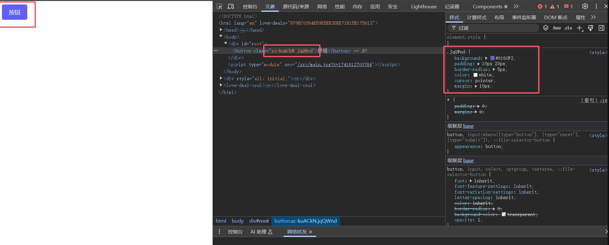
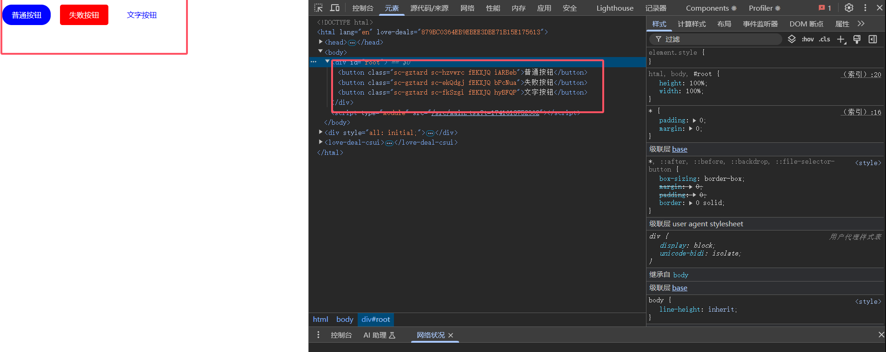
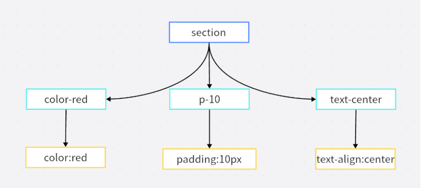
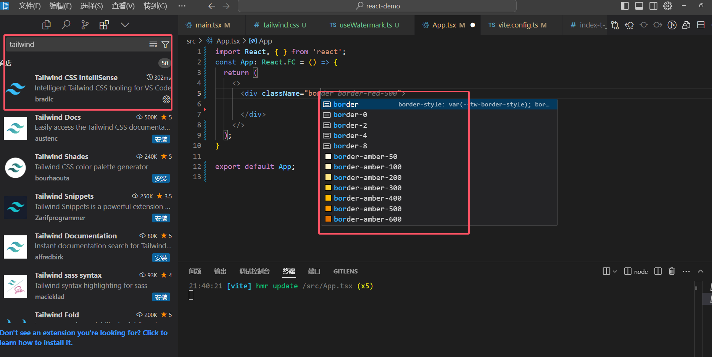

# React 中 CSS 使用方法

## 一、css modules

### 1. 什么是 css modules

因为 `React` 没有 Vue 的 Scoped，但是 React 又是 SPA(单页面应用)，所以需要一种方式来解决 css 的样式冲突问题，也就是把每个组件的样式做成单独的作用域，实现样式隔离，而 css modules 就是一种解决方案，但是我们需要借助一些工具来实现，比如`webpack`，`postcss`，`css-loader`，`vite`等。

### 2. 如何在 Vite 中使用 css modules

css modules，可以配合各种 css 预处理去使用，例如`less`，`sass`，`stylus`等。

```sh
npm install less -D # 安装less 任选其一
npm install sass -D # 安装sass 任选其一
npm install stylus -D # 安装stylus 任选其一
```

> 在 Vite 中 css Modules 是开箱即用的，只需要把文件名设置为`xxx.module.[css|less|sass|stylus]`，就可以使用 css modules 了

- src/components/Button/index.module.scss

```scss
.button {
  color: red;
}
```

- src/components/Button/index.tsx

```tsx
//使用方法，直接引入即可
import styles from './index.module.scss';

export default function Button() {
  return <button className={styles.button}>按钮</button>;
}
```

- 编译结果, 可以看到`button`类名被编译成了`button_pmkzx_6`，这就是 css modules 的实现原理，通过在类名前添加一个唯一的哈希值，来实现样式隔离。

```html
<button class="button_pmkzx_6">按钮</button>
```

### 3.修改 css modules 规则

- 在 vite.config.ts 中配置 css modules 的规则

```ts
export default defineConfig({
  css: {
    modules: {
      localsConvention: 'dashes', // 修改css modules的类名规则 可以改成驼峰命名 或者 xxx-xxx命名等
      generateScopedName: '[name]__[local]___[hash:base64:5]', // 修改css modules的类名规则 name 是文件名 local 是类名 hash 是hash值
    },
  },
});
```

#### 设置为`(localsConvention:camelCaseOnly)`

> \[!WARNING]
>
> camelCase 和 camelCaseOnly 区别在于，camelCase 会把非驼峰的命名转为驼峰，并保留之前的类名，而 camelCaseOnly 只会把非驼峰的命名转为驼峰，并删除之前的类名。

- src/components/Button/index.module.scss

```scss
.button-red {
  color: red;
}
```

- src/components/Button/index.tsx

> 设置为驼峰之后，使用的时候需要使用驼峰命名，例如`buttonRed`，而不是`button-red`。

```tsx
import styles from './index.module.scss';

export default function Button() {
  return <button className={styles.buttonRed}>按钮</button>;
}
```

#### 设置为`(localsConvention:dashesOnly)`会将所有-的类名转化为驼峰，并且原始的类名会被删除

> \[!WARNING]
>
> dashes 和 dashesOnly 区别在于，dashes 会保留原始的类名，而 dashesOnly 会删除原始的类名。

- src/components/Button/index.module.scss

```scss
.button-red {
  color: red;
}
```

- src/components/Button/index.tsx

> 设置为原始命名之后，使用的时候需要使用驼峰命名，例如`buttonRed`，而不是`button-red`。

```tsx
import styles from './index.module.scss';

export default function Button() {
  return <button className={styles.buttonRed}>按钮</button>;
}
```

> \[!CAUTION]
>
> 如果想同时支持驼峰命名和`-`连接的命名，可以设置为`localsConvention:[camelCase|dashes]`，这样就可以同时支持驼峰命名和`-`连接的命名。

#### 修改 css modules 的类名规则

- 在 vite.config.ts 中配置 css modules 的规则

```ts
export default defineConfig({
  css: {
    modules: {
        generateScopedName: '[local]_[hash:base64:5]' // 只保留类名和哈希值
        // 或者
        generateScopedName: '[hash:base64:8]' // 只使用哈希值
        // 或者
        generateScopedName: '[name]_[local]' // 只使用文件名和类名，没有哈希
        // 或者
        generateScopedName: '[local]--[hash:base64:4]' // 自定义分隔符
    },
  },
});
```

编译结果

```html
<button class="button_pmkzx_6">类名 + 哈希值</button>
<button class="pmkzx_6">哈希值</button>
<button class="index-module_button">文件名 + 类名</button>
<button class="button--pmkzx_6">类名 + 分隔符 + 哈希值</button>
```

### 4. 维持类名

在样式文件中的某些样式，不希望被编译成 css modules，可以设置为`global`

```scss
解释 .app {
  background: red;
  width: 200px;
  height: 200px;
  :global(.button) {
    background: blue;
    width: 100px;
    height: 100px;
  }
}
```

```tsx
//在使用的时候，就可以直接使用原始的类名 button
import styles from './index.module.scss';
const App: React.FC = () => {
  return (
    <>
      <div className={styles.app}>
        <button className="button">按钮</button>
      </div>
    </>
  );
};
```

## 二、css-in-js

`css-in-js` 是将 CSS 代码 跟 JS 代码 混合在一起，通过 JS 来动态的生成 CSS 样式，但是这样的话与我们的认知是背道而驰的，正常应该是 CSS JS HTML 分离的，但是由于 CSS 缺乏作用域，所以形成了 `css-in-js` 这种写法，注意 `css-in-js` 并不是一种技术，而是一种思想。

### 1. 优缺点

#### 优点

- 可以让 CSS 拥有独立的作用域，阻止 CSS 泄露到组件外部，防止冲突。
- 可以动态的生成 CSS 样式，根据组件的状态来动态的生成 CSS 样式。
- CSS-in-JS 可以方便地实现主题切换功能，只需更改主题变量即可改变整个应用的样式。

#### 缺点

- css-in-js 是基于运行时，所以会损耗一些性能(电脑性能高可以忽略)
- 调试困难，CSS-in-JS 的样式难以调试，因为它们是动态生成的，而不是在 CSS 文件中定义的。

### 2. styled-components

#### 安装

```sh
npm install styled-components
```

#### 创建一个 `Button` 组件

```tsx
import styled from 'styled-components';

const Button = styled.button`
  background: red;
  color: white;
  border: 2px solid skyblue;
`;
function App() {
  return (
    <>
      <Button>我是按钮</Button>
    </>
  );
}

export default App;
```


我们可以看到，`Button` 组件的类名是通过`js`随机生成的的，这样就避免了类名冲突的问题。

#### 更多用法

**继承**

```tsx
import styled from 'styled-components';

const Button = styled.button`
  background: red;
  color: white;
  border: 2px solid skyblue;
`;
// 继承上面的样式，然后再添加新的样式
const BlueButton = styled(Button)`
  background: blue;
`;
function App() {
  return (
    <>
      <Button>我是按钮</Button>
      <BlueButton>我是蓝色按钮</BlueButton>
    </>
  );
}

export default App;
```



**属性**

我们可以通过 `attrs` 来给组件添加属性，比如 `defaultValue`，然后通过 `props` 来获取属性值。

```tsx
import React from 'react';
import styled from 'styled-components';
interface DivComponentProps {
  defaultValue: string;
}
// 通过 .attrs 方法设置默认属性和类型
const InputComponent = styled.input.attrs<DivComponentProps>((props) => ({
  type: 'text',
  defaultValue: props.defaultValue, // 从 props 中获取默认值
}))`
  border: 1px solid skyblue;
  margin: 20px;
`;

const App: React.FC = () => {
  const defaultValue = '张三';
  return (
    <>
      {/* 渲染带样式的输入框组件并传入默认值 */}
      <InputComponent defaultValue={defaultValue}></InputComponent>
    </>
  );
};

export default App;
```

**全局样式**

我们可以通过 `createGlobalStyle` 来创建全局样式, 然后放到 `App` 组件中。

```tsx
import React from 'react';
import styled, { createGlobalStyle } from 'styled-components';
// 通过createGlobalStyle设置全局样式，一般放在一个单独的文件里
const GlobalStyle = createGlobalStyle`
  body {
    background-color: #f0f0f0;
  },
  * {
    margin: 0;
    padding: 0;
    box-sizing: border-box;
  }
  ul,ol{
      list-style: none;
  }
`;
const App: React.FC = () => {
  return (
    <>
      <GlobalStyle />
    </>
  );
};

export default App;
```

**动画**

我们可以通过 `keyframes` 来创建动画。

```tsx
import React from 'react';
import styled, { createGlobalStyle, keyframes } from 'styled-components';

const move = keyframes`
  0%{
    transform: translateX(0);
  }
  100%{
    transform: translateX(100px);
  }
`;
const Box = styled.div`
  width: 100px;
  height: 100px;
  background-color: red;
  animation: ${move} 1s linear infinite;
`;
const App: React.FC = () => {
  return (
    <>
      <Box></Box>
    </>
  );
};

export default App;
```

### 3. 原理剖析

这个技术叫`标签模板`， 是 ES6 新增的特性，它可以紧跟在函数后面，该函数将被用来调用这个字符串模板

调用完成之后,这个函数的第一个参数是模板字符串的静态字符串,从第二个参数开始,是模板字符串中变量值,也就是\${}里面的值

- `strArr：['\n  color:red;\n  width:', 'px;\n  height:', 'px;\n', raw: Array(3)] `
- `args：[30, 50]`

```tsx
const div = function (strArr: TemplateStringsArray, ...args: any[]) {
  return strArr.reduce((result, str, i) => {
    return result + str + (args[i] || '');
  }, '');
};

const a = div`
  color:red;
  width:${30}px;
  height:${50}px;
`;
console.log(a);
//  输出结果
//  color:red;
//  width:30px;
//  height:50px;
```

# 三、原子化 css

### 1. 什么是原子化 css

原子化 CSS 是一种现代 CSS 开发方法，它将 CSS 样式拆分成最小的、单一功能的类。比如一个类只负责设置颜色，另一个类只负责设置边距。这种方式让样式更容易维护和复用，能提高开发效率，减少代码冗余。通过组合这些小型样式类，我们可以构建出复杂的界面组件。

### 2.原子化 css 基本概念

原子化 css 是一种 css 的编程范式，它将 css 的样式拆分成最小的单元，每个单元都是一个独立的 css 类，通过这些独立的 css 类来构建整个页面的样式，简单举个例子：

> 其核心思想就是无需重复定义样式，只需定义一次，然后通过组合这些小型样式类，来构建出复杂的界面组件。

```html
解释

<style>
  .color-red {
    color: red;
  }
  .text-center {
    text-align: center;
  }
  .p-10 {
    padding: 10px;
  }
</style>
<section class="bg-red text-center p-10">原子化 css</section>
```



### 3.TailWind Css

[TailWind Css 官网](https://tailwindcss.com/)

TailWind 是原子化 css 的一种实现方式，它内置了许多细粒度的 class 类，这些细粒度的 class 类可以组合使用，来构建出复杂的界面组件。

### 4. 如何使用 TailWind Css 4.0.1 最新版

- vite 项目

```sh
npm install tailwindcss @tailwindcss/vite
```

**1. vite.config.ts**

引入 `tailwindcss` 插件，然后配置 `tailwindcss` 插件

```ts
import { defineConfig } from 'vite';
import react from '@vitejs/plugin-react-swc';
import tailwindcss from '@tailwindcss/vite';
export default defineConfig({
  plugins: [react(), tailwindcss()],
});
```

**2.src/tailwind.css (新建一个文件) 引入 `tailwindcss` 的样式**

```css
@import 'tailwindcss';
```

**3.src/main.tsx**

引入 `tailwindcss` 的样式

```tsx
import './tailwind.css';
```

**4.src/App.tsx 试用 `tailwindcss` 的样式**

```tsx
<section class="bg-red text-center p-10">原子化 css</section>
```

**5.打开 Vscode 或者 Cursor,安装 `TailWind Css` 插件,这样编写代码的时候，会自动提示 `tailwindcss` 的样式**



### 5. 进阶用法@apply

上述代码中，类名用了很多都是堆在一起的，这样看起来很不美观，我们可以使用 `tailwindcss` 的 `@apply` 来解决这个问题。

- src/tailwind.css

```css
@import 'tailwindcss';

.text-bg {
  @apply bg-amber-300 w-100 h-100  text-center justify-center;
}
```

- src/App.tsx

效果是一样的，但是看起来更美观了

```tsx
<div className="text-bg">使用原子化CSS</div>
```

更多用法请参考 [tailwindcss 自定义样式](https://tailwindcss.com/docs/adding-custom-styles)

> \[!CAUTION]
>
> 本文内容参考[小满大佬](https://juejin.cn/post/7410313831271776256)
