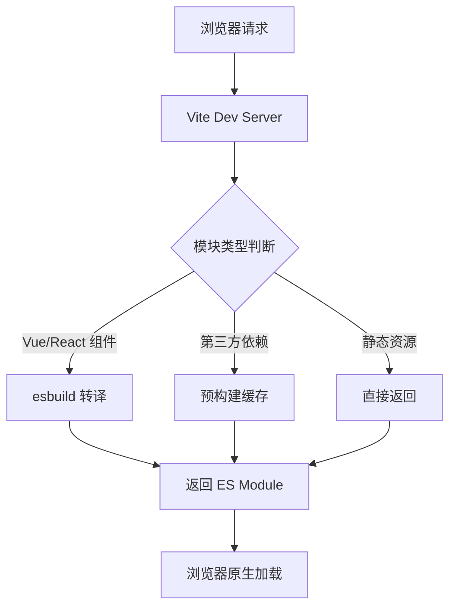

# Vite 为什么快！

## 简介

Vite 是由 Vue.js 作者尤雨溪开发的新一代前端构建工具，其最显著的特点就是**极快的开发体验**。相比传统的构建工具如 webpack，Vite 在开发模式下可以实现毫秒级的模块热更新，大大提升了开发效率。

## Vite 快的核心原因

### 1. **基于 ES Modules 的开发服务器**

#### 传统构建工具的问题

```
传统方式（如 webpack）：
入口文件 → 解析依赖 → 打包所有模块 → 生成 bundle → 启动开发服务器
(需要等待整个应用打包完成，时间随项目规模线性增长)
```

#### Vite 的解决方案

```
Vite 方式：
启动开发服务器 → 按需编译模块 → 利用浏览器原生 ES Modules
(几乎瞬间启动，只编译当前访问的模块)
```

### 2. **按需编译（On-demand Compilation）**

Vite 只在浏览器请求时才编译对应的模块，而不是预先打包整个应用。

```javascript
// 浏览器请求 /src/main.js
// Vite 才会编译 main.js 及其直接依赖
import { createApp } from 'vue';
import App from './App.vue';

// 只有当 App.vue 被实际使用时才会被编译
createApp(App).mount('#app');
```

### 3. **依赖预构建（Dependency Pre-bundling）**

#### 为什么需要预构建？

- **CommonJS 转 ES Module**：很多 npm 包仍使用 CommonJS 格式
- **减少 HTTP 请求**：避免深层依赖导致的请求瀑布
- **性能优化**：使用 esbuild 进行超快速预构建

```javascript
// vite.config.js 中的预构建配置
export default {
  optimizeDeps: {
    include: ['vue', 'vue-router'],
    exclude: ['your-es-module-package'],
  },
};
```

#### 预构建流程

```
1. 扫描入口文件的依赖
2. 使用 esbuild 将 CommonJS/UMD 转换为 ES Module
3. 缓存在 node_modules/.vite/ 目录
4. 后续直接使用缓存，无需重复构建
```

## 技术架构深度解析

### 1. **开发环境架构**



### 2. **esbuild 的威力**

#### 性能对比

```
构建速度对比（编译 TypeScript）：
- tsc (TypeScript Compiler): ~30-50s
- webpack + ts-loader: ~20-30s
- webpack + esbuild-loader: ~2-3s
- esbuild: ~0.1-0.5s
```

#### esbuild 的优势

- **Go 语言编写**：编译型语言的性能优势
- **并行处理**：充分利用多核 CPU
- **内存效率**：减少重复解析和内存分配
- **原生支持**：TypeScript、JSX 等开箱即用

### 3. **模块热更新（HMR）机制**

#### 传统 HMR 的问题

```
webpack HMR：
文件修改 → 重新构建模块及其依赖 → 推送更新 → 浏览器更新
(更新时间随依赖复杂度增加)
```

#### Vite HMR 的优化

```
Vite HMR：
文件修改 → 仅重新编译当前模块 → WebSocket 推送 → 精确更新
(几乎恒定的更新时间，毫秒级响应)
```

```javascript
// Vite HMR API 示例
if (import.meta.hot) {
  import.meta.hot.accept('./component.vue', (newModule) => {
    // 精确更新特定组件
    updateComponent(newModule.default);
  });
}
```

## 生产环境构建

### **Rollup 打包优化**

虽然开发时使用 ES Modules，但生产环境仍需要打包：

```javascript
// vite.config.js 生产环境配置
export default {
  build: {
    rollupOptions: {
      output: {
        manualChunks: {
          vendor: ['vue', 'vue-router'],
          utils: ['lodash', 'dayjs'],
        },
      },
    },
  },
};
```

### **为什么生产环境不用 ES Modules？**

- **兼容性**：需要支持老版本浏览器
- **网络性能**：减少 HTTP 请求数量
- **代码分割**：更好的缓存策略
- **Tree Shaking**：移除未使用的代码

## 与传统构建工具对比

### **启动时间对比**

| 项目规模              | webpack  | Vite   |
| --------------------- | -------- | ------ |
| 小型项目 (50 个模块)  | 3-5 秒   | 0.3 秒 |
| 中型项目 (500 个模块) | 10-15 秒 | 0.5 秒 |
| 大型项目 (1000+模块)  | 30-60 秒 | 0.8 秒 |

### **热更新时间对比**

| 项目规模 | webpack | Vite      |
| -------- | ------- | --------- |
| 小型项目 | 1-2 秒  | 50-100ms  |
| 中型项目 | 3-5 秒  | 100-200ms |
| 大型项目 | 5-10 秒 | 150-300ms |

## 具体技术实现

### 1. **模块解析机制**

```javascript
// Vite 的模块解析过程
export function resolveModule(id, importer) {
  // 1. 检查是否为预构建依赖
  if (isOptimizedDep(id)) {
    return getOptimizedDepPath(id);
  }

  // 2. 相对路径解析
  if (id.startsWith('./') || id.startsWith('../')) {
    return resolveRelative(id, importer);
  }

  // 3. Node modules 解析
  return resolveNodeModule(id);
}
```

### 2. **文件转换流程**

```javascript
// Vite 插件转换示例
export function vuePlugin() {
  return {
    name: 'vue',
    transform(code, id) {
      if (id.endsWith('.vue')) {
        // 使用 esbuild 快速转换 Vue SFC
        return transformVueSFC(code, id);
      }
    },
  };
}
```

### 3. **缓存策略**

```javascript
// Vite 的多层缓存机制
const cacheStrategy = {
  // 1. 内存缓存：已转换的模块
  memoryCache: new Map(),

  // 2. 文件缓存：预构建依赖
  fileCache: 'node_modules/.vite/',

  // 3. HTTP 缓存：浏览器缓存头
  httpCache: {
    'Cache-Control': 'max-age=31536000,immutable',
  },
};
```

## 实际性能优化案例

### **大型项目优化前后对比**

```javascript
// 优化前的项目启动
// webpack.config.js
module.exports = {
  entry: './src/main.js',
  // 需要配置复杂的 loader 和 plugin
  module: {
    rules: [
      { test: /\.vue$/, use: 'vue-loader' },
      { test: /\.ts$/, use: 'ts-loader' },
      // ... 更多配置
    ],
  },
  // 启动时间：45秒，HMR：3-5秒
};

// 优化后的 Vite 配置
// vite.config.js
export default {
  plugins: [vue()], // 简单配置
  // 启动时间：0.8秒，HMR：100ms
};
```

### **依赖预构建优化**

```javascript
// 针对特定依赖的优化配置
export default {
  optimizeDeps: {
    // 包含需要预构建的依赖
    include: ['vue', 'vue-router', 'pinia', 'element-plus', 'lodash-es'],
    // 排除已经是 ES Module 的包
    exclude: ['your-esm-package'],
    // 强制预构建某些依赖
    force: true,
  },
};
```

## 注意事项和限制

### **浏览器兼容性要求**

Vite 开发模式需要浏览器支持：

- **ES Modules**（Chrome 61+, Firefox 60+, Safari 11+）
- **Dynamic Imports**
- **import.meta**

### **第三方库兼容性**

```javascript
// 某些库可能需要特殊处理
export default {
  define: {
    // 为某些库提供全局变量
    global: 'globalThis',
  },
  optimizeDeps: {
    include: [
      // 预构建 CommonJS 依赖
      'legacy-commonjs-package',
    ],
  },
};
```

## 未来发展趋势

### **新技术集成**

1. **SWC 替代 esbuild**：更快的 Rust 编译器
2. **HTTP/3 支持**：更快的网络传输
3. **Web Workers**：并行编译优化
4. **WebAssembly**：核心功能的原生性能

### **生态系统完善**

- 更多框架支持（React、Svelte、Solid.js）
- 企业级功能增强
- 工具链集成优化

## 总结

Vite 的快速主要得益于以下几个关键技术：

### **开发阶段**

1. **ES Modules** - 利用浏览器原生模块加载
2. **按需编译** - 只编译当前需要的模块
3. **esbuild** - 超快的 Go 编译器
4. **智能缓存** - 多层缓存策略
5. **精确 HMR** - 毫秒级热更新

### **构建阶段**

1. **Rollup** - 高效的生产环境打包
2. **Tree Shaking** - 自动移除未使用代码
3. **代码分割** - 优化加载性能

### **核心优势**

- **开发体验** - 近乎瞬时的启动和更新
- **简单配置** - 开箱即用的现代化工具
- **生态兼容** - 丰富的插件生态系统
- **未来导向** - 基于现代浏览器特性

Vite 代表了前端构建工具的发展方向，通过充分利用现代浏览器能力和高性能编译器，为开发者提供了前所未有的快速开发体验。
