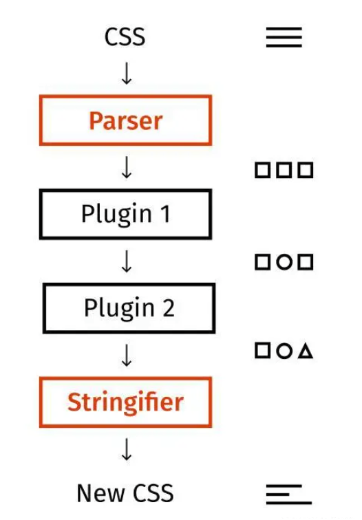

# postcss 插件

postcss 是 css 的 transpiler（转换编译器，简称转译器），它对于 css 就像 babel 对于 js 一样，能够做 css 代码的分析和转换。它本质上是一个用于**处理 CSS 的工具链**，本身不直接处理 CSS，而是通过「插件」来完成各种功能，比如自动添加浏览器前缀、压缩 CSS、使用未来 CSS 语法等。

## 一、postcss 的原理

postcss 是 css 到 css 的转译器，它也和 babel 一样，分为 parse、transform、generate 3 个阶段。各种转换插件都是工作在 transform 阶段，基于 AST 做分析和转换。



1. **解析 CSS** 为 AST（抽象语法树）
2. **插件按顺序处理 AST**
3. **重新生成 CSS**

## 二、常见 PostCSS 插件

### 1.postcss-preset-env

**postcss-preset-env** 主要就是让开发者可以使用最新的的 CSS 语法，同时为了兼容会自动的将这些最新的 CSS 语法转换为旧版本浏览器能够支持的代码。

**主要作用：**

1. 让你能够使用最新的 _CSS_ 语法，如：_CSS Grid_（网格布局）、_CSS Variables_（变量）等。
2. 自动为你的 _CSS_ 代码添加浏览器厂商前缀，如：-_webkit_-、-_moz_- 等。
3. 根据你的浏览器兼容性需求，将 _CSS_ 代码转换为旧版浏览器兼容的语法。
4. 优化 _CSS_ 代码，如：合并规则、删除重复的代码等。

假设现在我们书写如下的 CSS 代码：

```css
.a {
  color: red;

  &.b {
    color: green;
    transform: translate(100px);
  }

  & > .b {
    color: blue;
  }

  &:hover {
    color: #000;
  }
}
```

这个 CSS 代码使用到了嵌套，这是原本只能在 CSS 预处理器里面才能使用的语法，目前官方已经在考虑原生支持了。

但是现在会涉及到一个问题，如果我们目前直接书写嵌套的语法，那么很多浏览器是不支持的，但是我又想使用最新的语法，我们就可以使用 postcss-preset-env 这个插件对最新的 CSS 语法进行降级处理。

首先第一步需要安装：

```sh
pnpm add postcss-preset-env -D
```

该插件提供了一个配置选项：

- _stage_：设置要使用的 _CSS_ 特性的阶段，默认值为 _2_（_0-4_）。数字越小，包含的 _CSS_ 草案特性越多，但稳定性可能较低。
- _browsers_：设置目标浏览器范围，如：'_last 2 versions_' 或 '> _1_%'。
- _autoprefixer_：设置自动添加浏览器厂商前缀的配置，如：{ _grid_: _true_ }。
- _preserve_：是否保留原始 _CSS_ 代码，默认为 _false_。如果设置为 _true_，则会在转换后的代码后面保留原始代码，以便新浏览器优先使用新语法。

```js
// postcss 配置主要其实就是做插件的配置

module.exports = {
  plugins: [
    require('postcss-preset-env')({
      stage: 2,
    }),
  ],
};
```

之后编译生成的 CSS 代码如下：

```css
.a {
  color: red;
}
.a.b {
  color: green;
  -webkit-transform: translate(100px);
  -ms-transform: translate(100px);
  transform: translate(100px);
}
.a > .b {
  color: blue;
}
.a:hover {
  color: #000;
}
```

### 2.postcss-import

该插件主要用于处理 CSS 文件中 @import 规则。在原生的 CSS 中，存在 @import，可以引入其他的 CSS 文件，但是在引入的时候会存在一个问题，就是客户端在解析 CSS 文件时，发现有 @import 就会发送 HTTP 请求去获取对应的 CSS 文件。

使用 postcss-import：

- 将多个 CSS 文件合并为一个文件
- 避免了浏览器对 @import 规则的额外请求，因为减少了 HTTP 请求，所以提高了性能

```sh
pnpm add postcss-import -D
```

安装完成后，在配置文件中进行一个简单的配置：

```js
// postcss 配置主要其实就是做插件的配置

module.exports = {
  plugins: [
    require('postcss-import'),
    require('postcss-preset-env')({
      stage: 2,
    }),
  ],
};
```

最终编译后的 CSS 结果如下：

```css
.box1 {
  background-color: red;
}
.box2 {
  background-color: blue;
}
.a {
  color: red;
}
.a.b {
  color: green;
  -webkit-transform: translate(100px);
  -ms-transform: translate(100px);
  transform: translate(100px);
}
.a > .b {
  color: blue;
}
.a:hover {
  color: #000;
}
```

另外该插件也提供了一些配置项：

- _path_：设置查找 _CSS_ 文件的路径，默认为当前文件夹。
- _plugins_：允许你指定在处理被 @_import_ 引入的 _CSS_ 文件时使用的其他 _PostCSS_ 插件。这些插件将在 _postcss-import_ 合并文件之前对被引入的文件进行处理，之后再进行文件的合并

例如：

```js
module.exports = {
  plugins: [
    require('postcss-import')({
      path: ['src/css'],
      plugins: [postcssNested()],
    }),
    // 其他插件...
  ],
};
```

在上面的配置中，插件会在 src/css 目录下面去查找被引入的文件，另外文件在被合并到 index.css 之前，会被 postcssNested 这个插件先处理一遍，然后才会被合并到 index.css 里面。

你可以在 [github.com/postcss/pos…](https://link.juejin.cn?target=https%3A%2F%2Fgithub.com%2Fpostcss%2Fpostcss-import) 这里看到 postcss-import 所支持的所有配置项。

### 3.purgecss

该插件专门用于移除没有使用到的 CSS 样式的工具，相当于是 CSS 版本的 tree shaking（树摇），它会找到你文件中实际使用的 CSS 类名，并且移除没有使用到的样式，这样可以有效的减少 CSS 文件的大小，提升传输速度。

官网地址：[purgecss.com/](https://link.juejin.cn?target=https%3A%2F%2Fpurgecss.com%2F)

首先安装该插件：

```sh
pnpm add @fullhuman/postcss-purgecss -D
```

接下来我们在 src 下面创建一个 index.html，书写如下的代码：

```html
<head>
  <meta charset="UTF-8" />
  <meta name="viewport" content="width=device-width, initial-scale=1.0" />
  <title>Document</title>
  <link rel="stylesheet" href="./index.css" />
</head>
<body>
  <div class="container">
    <div class="box1"></div>
  </div>
</body>
```

该 html 只用到了少量的 CSS 样式类。

目前我们的 index.css 代码如下：

```css
@import 'a.css';
@import 'b.css';

.a {
  color: red;

  &.b {
    color: green;
    transform: translate(100px);
  }

  & > .b {
    color: blue;
  }

  &:hover {
    color: #000;
  }
}

.container {
  font-size: 20px;
}

p {
  color: red;
}
```

接下来我在 postcss.config.js 配置文件中引入 @fullhuman/postcss-purgecss 这个插件，具体的配置如下：

```js
// postcss 配置主要其实就是做插件的配置

module.exports = {
  plugins: [
    require('postcss-import')({
      path: ['src/css'],
    }),
    require('postcss-preset-env')({
      stage: 2,
    }),
    require('@fullhuman/postcss-purgecss')({
      content: ['./src/**/*.html'],
    }),
  ],
};
```

我们引入 @fullhuman/postcss-purgecss 这个插件后，还做了 content 这个配置项目的相关配置，该配置项表示我具体的参照文件。也就是说，CSS 样式类有没有用上需要有一个具体的参照文件。

最终编译出来的结果如下：

```css
.box1 {
  background-color: red;
}
.container {
  font-size: 20px;
}
```

@fullhuman/postcss-purgecss 这个插件除了 content 这个配置项，还有一个配置项也非常的常用：

- safelist：可以指定一个字符串的值，或者指定一个正则表达式，该配置项目所对应的值（CSS 样式规则）始终保留，即便在参照文件中没有使用到也需要保留

```js
const purgecss = require('@fullhuman/postcss-purgecss');

module.exports = {
  plugins: [
    // 其他插件...
    purgecss({
      content: ['./src/**/*.html', './src/**/*.js'],
      safelist: [/^active-/],
    }),
  ],
};
```

safelist 所对应的值的含义为：匹配 active- 开头的类名，这些类名即便在项目文件中没有使用到，但是也不要删除。
