# Vue3 内置组件详解

## 一、transition 动画组件

`Vue` 提供了 `transition` 的封装组件，在下列情形中，可以给任何元素和组件添加进入/离开过渡:

- 由 `v-if` 所触发的切换
- 由 `v-show` 所触发的切换
- 由特殊元素 `<component>` 切换的动态组件
- 改变特殊的 `key` 属性

自定义 `transition` 过度效果，需要对`transition`组件的 name`属性`自定义。并在`css`中写入对应的样式

### 1. CSS 过渡 class

在进入/离开的过渡中，会有 6 个 `class` 切换。

1. `v-enter-from`：进入动画的起始状态。在元素插入之前添加，在元素插入完成后的下一帧移除。
2. `v-enter-active`：进入动画的生效状态。应用于整个进入动画阶段。在元素被插入之前添加，在过渡或动画完成之后移除。这个 class 可以被用来定义进入动画的持续时间、延迟与速度曲线类型。
3. `v-enter-to`：进入动画的结束状态。在元素插入完成后的下一帧被添加 (也就是 `v-enter-from` 被移除的同时)，在过渡或动画完成之后移除。
4. `v-leave-from`：离开动画的起始状态。在离开过渡效果被触发时立即添加，在一帧后被移除。
5. `v-leave-active`：离开动画的生效状态。应用于整个离开动画阶段。在离开过渡效果被触发时立即添加，在过渡或动画完成之后移除。这个 class 可以被用来定义离开动画的持续时间、延迟与速度曲线类型。
6. `v-leave-to`：离开动画的结束状态。在一个离开动画被触发后的下一帧被添加 (也就是 `v-leave-from` 被移除的同时)，在过渡或动画完成之后移除。

**示例**：

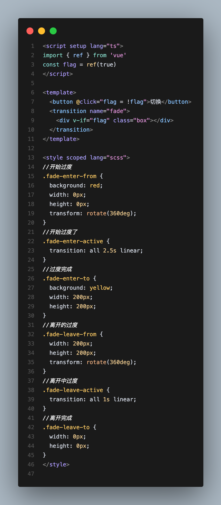

### 2. 自定义过渡 class 类名

可以向 `<Transition>` 传递以下的 props 来指定自定义的过渡 class：

- `enter-from-class`
- `enter-active-class`
- `enter-to-class`
- `leave-from-class`
- `leave-active-class`
- `leave-to-class`

自定义过度时间单位毫秒,也可以分别指定进入和离开的持续时间：

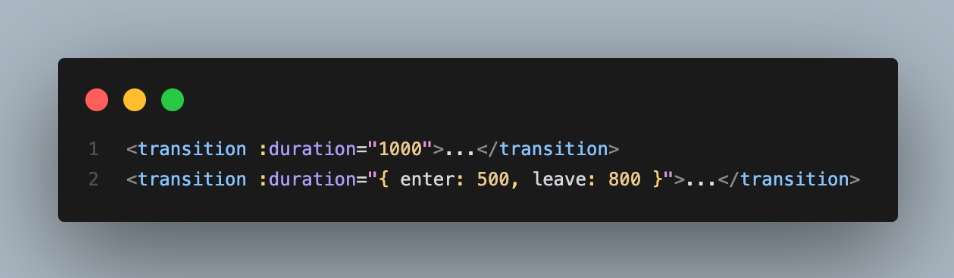

通过自定义`class` 结合`css`动画库`animate css`

安装库 `npm install animate.css`

引入 `import 'animate.css'`

[官方文档](https://animate.style/)

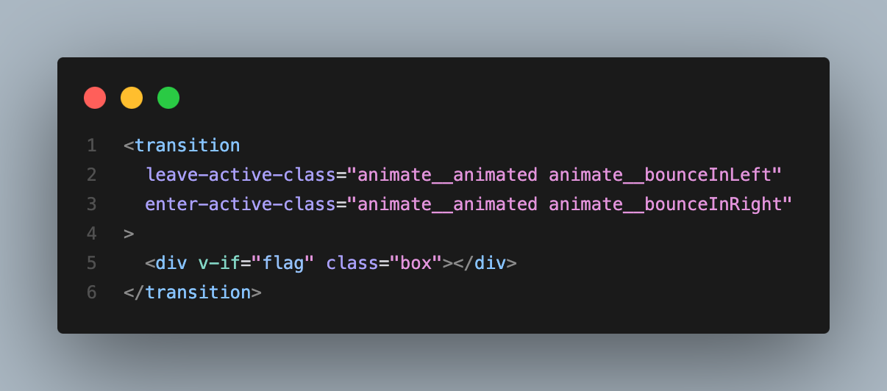

### 3. transition 生命周期

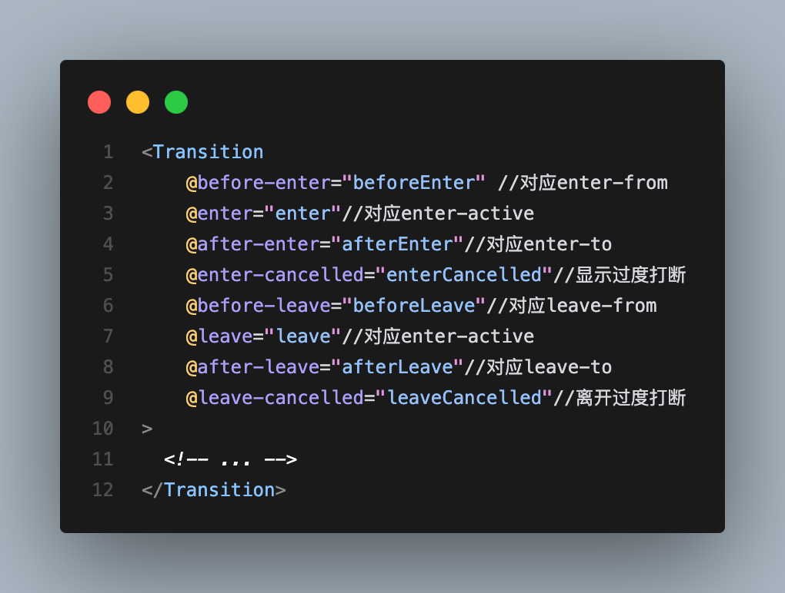

当只用 JavaScript 过渡的时候，在 **`enter` 和 `leave` 钩子中必须使用 `done` 进行回调**

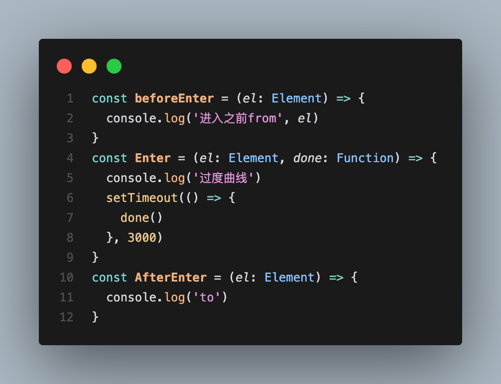

### 4.appear

通过这个属性可以设置初始节点过度 就是页面加载完成就开始动画，对应三个状态

```js
appear-active-class=""
appear-from-class=""
appear-to-class=""
appear
```

## 二、transition-group 过渡列表

在 Vue 中，`<transition-group>` 是一个专门用于**列表过渡动画**的内置组件。它的作用是：当一个列表中的元素添加、移除或重新排序时，能够提供平滑的动画效果。

`<TransitionGroup>` 支持和 `<Transition>` 基本相同的 props、CSS 过渡 class 和 JavaScript 钩子监听器，但有以下几点区别：

- 默认情况下，它不会渲染一个容器元素。但你可以通过传入 `tag` prop 来指定一个元素作为容器元素来渲染。
- [过渡模式](https://cn.vuejs.org/guide/built-ins/transition.html#transition-modes)在这里不可用，因为我们不再是在互斥的元素之间进行切换。
- 列表中的每个元素都**必须**有一个独一无二的 `key` attribute。
- CSS 过渡 class 会被应用在列表内的元素上，**而不是**容器元素上。

### 1. 基本语法

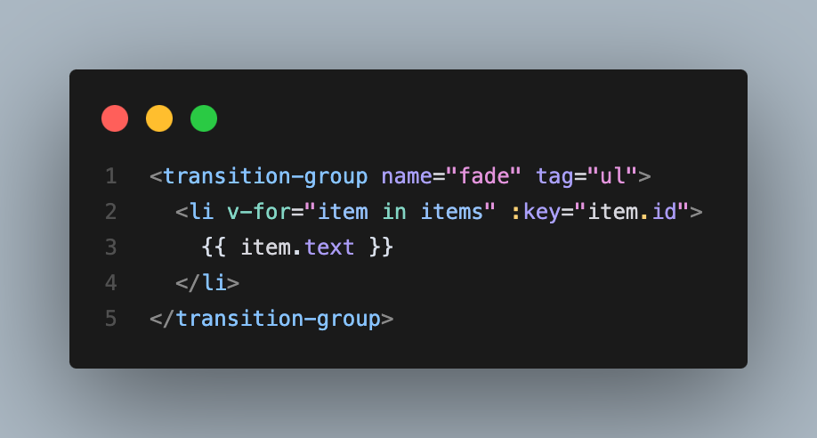

**必须项：**

- key：每个子元素必须设置唯一 key（Vue 用来追踪 DOM 节点）。
- tag：默认是 span，通常改为适配语义结构的元素，如 ul、div 等。
- name：CSS 过渡的前缀，最终生成 .fade-enter-active 等类名。

### 2. 元素移动动画（特殊于 transition-group）

除了 `enter/leave` 动画外，`<transition-group>` 还提供「**移动动画**」的支持。

只要 `v-for` 中的元素位置发生变化（如排序），就会自动添加一个类：

- `.v-move`：只在位置变化时应用
- 配合 `transition` 或 `animation` 属性使用

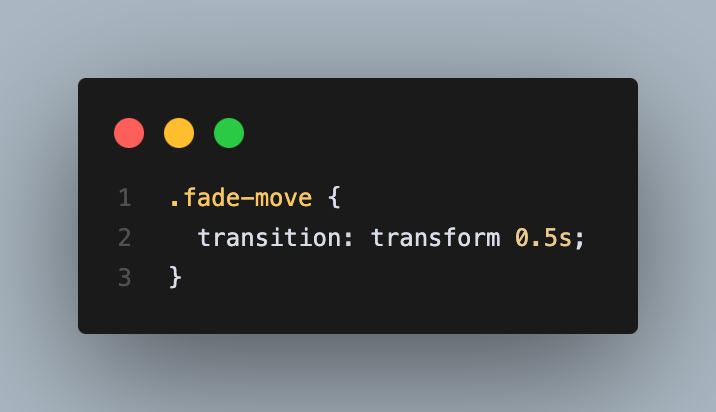

### 3. 注意事项

- 元素必须是**真实 DOM 元素**，不能是 `<component>` 或 `<keep-alive>`。
- 所有子节点都必须绑定唯一的 `key`。
- 动画冲突（特别是 `position: absolute/fixed`）要谨慎处理。
- `move` 动画只对 `transform` 和 `transition` 有效。

### 4. 示例：从列表中删除一个元素

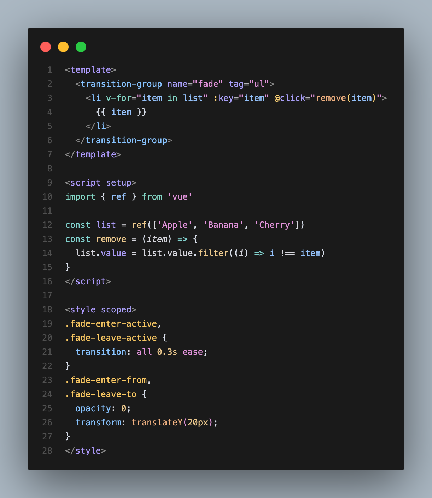

## 三、keep-alive 缓存组件

`<KeepAlive>` 是 `Vue` 内置的抽象组件，用于缓存动态组件或路由组件的状态，避免重复渲染和销毁。它常用于**性能优化**场景，尤其在**标签页切换、表单多页填写**等需要保留组件状态的场景中。

### 1. 基本语法

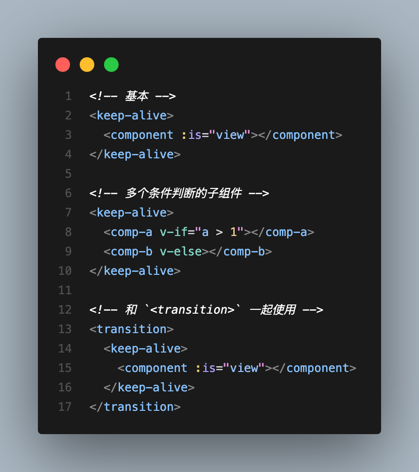

### 2. 生命周期

- `activated`：组件被 `KeepAlive` 激活（恢复）时触发。
- deactivated：组件被 `KeepAlive` 停用（切换走）时触发。

开启`keep-alive`生命周期的变化:

- 初次进入时： `onMounted> onActivated`
- 退出后触发 `deactivated`
- 再次进入：只会触发 `onActivated`
- 事件挂载的方法等，只执行一次的放在 `onMounted`中；组件每次进去执行的方法放在 `onActivated`中

### 3. `include` 和 `exclude`

```js
 <keep-alive :include="" :exclude="" :max=""></keep-alive>
```

通过 include 和 exclude 控制缓存的组件范围。二者都可以用逗号分隔字符串、正则表达式或一个数组来表示

### 4. max

限制可被缓存的最大组件实例数，如果缓存的实例数量即将超过指定的那个最大数量，则最久没有被访问的缓存实例将被销毁。

```js
<KeepAlive :max="10">
  <component :is="activeComponent" />
</KeepAlive>
```

## 四、Teleport 传送组件

`<Teleport>` 是 `Vue 3` 中提供的一个内置组件，用于将组件的子内容 **“传送”到 DOM 的其他位置**，不受当前组件层级限制。它常用于 **模态框、提示框、弹出层等场景**。

### 1.基本语法

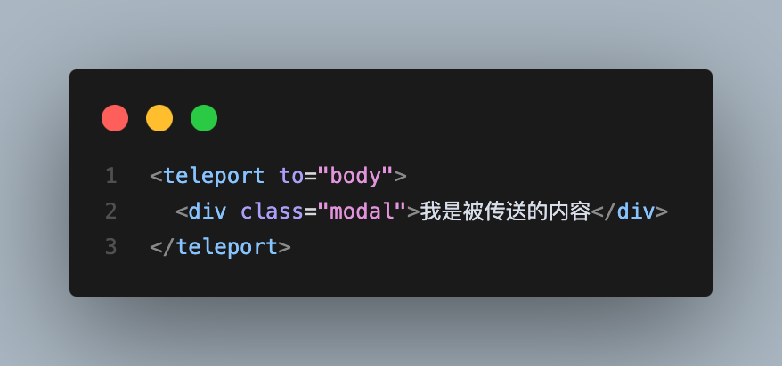

- `to`：目标选择器，表示要传送到哪个 `DOM` 节点。

### 2.应用场景

| **场景**       | **示例**                                 |
| -------------- | ---------------------------------------- |
| 弹窗           | 将模态框放到 `body`，避免被父组件限制    |
| `Tooltip`      | 避免 `tooltip` 被 `overflow:hidden` 裁切 |
| 全局 `Loading` | 将 `loading` 蒙层直接挂到 `body`         |

### 3.注意事项

1. `to` 必须是有效的选择器（如 `#app`、`.container`）。
2. 被传送的内容仍然是原组件的一部分，生命周期、响应式都保持不变。
3. 支持配合 `<transition>` 使用。

### 4.完整示例

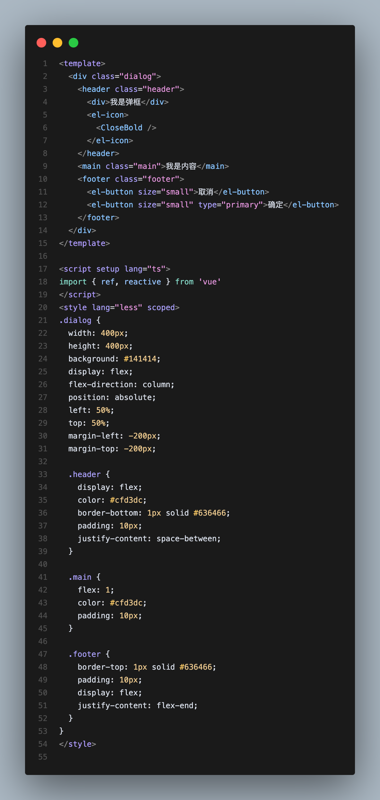

## 五、suspense 异步组件

`<Suspense>` 是 `Vue 3` 中引入的一个内置组件，用于**异步组件的加载等待处理**，让你可以在等待异步组件加载时显示一个“占位内容”（`loading UI`），类似于 `React` 的 Suspense。

### 1.基本语法

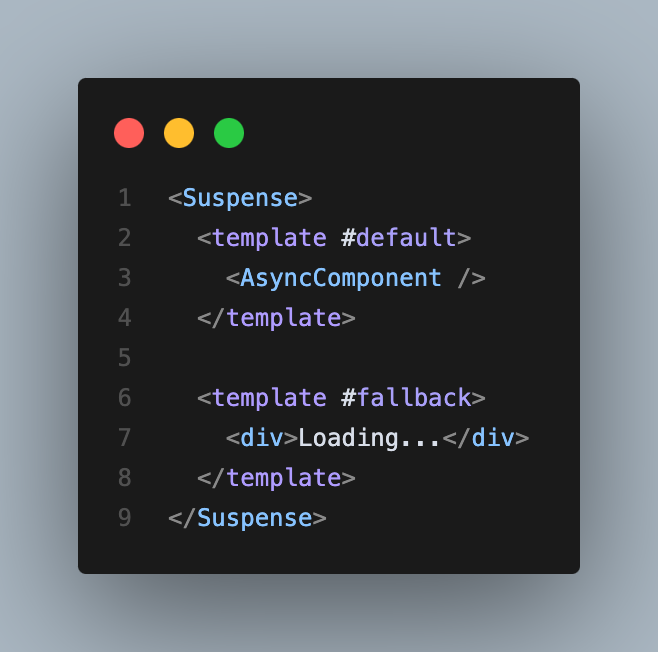

- `#default`：要渲染的异步内容。
- `#fallback`：异步内容加载期间的备用 UI。

### 2.顶层 `await`

在`setup`语法糖里面，`<script setup>` 中可以使用顶层 `await`。结果代码会被编译成 `async setup()`

```js
<script setup>
const post = await fetch(`/api/post/1`).then(r => r.json())
</script>
```

父组件引用子组件 通过`defineAsyncComponent`加载异步配合import 函数模式便可以分包

```js
<script setup lang="ts">
import { reactive, ref, markRaw, toRaw, defineAsyncComponent } from 'vue'
 
const Dialog = defineAsyncComponent(() => import('../../components/Dialog/index.vue'))
//完整写法
const AsyncComp = defineAsyncComponent({
  // 加载函数
  loader: () => import('./Foo.vue'),
 
  // 加载异步组件时使用的组件
  loadingComponent: LoadingComponent,
  // 展示加载组件前的延迟时间，默认为 200ms
  delay: 200,
 
  // 加载失败后展示的组件
  errorComponent: ErrorComponent,
  // 如果提供了一个 timeout 时间限制，并超时了
  // 也会显示这里配置的报错组件，默认值是：Infinity
  timeout: 3000
})
```

### 3.原理解析

- 当默认插槽中的异步组件尚未完成加载时，`fallback` 内容会先显示；
- 加载完成后，`default` 内容会替换掉 `fallback`；
- 支持多个异步组件，只要有一个没加载完，`fallback` 都会显示；
- 同样支持 `<script setup>` 语法下的 `<Suspense>` 使用。

