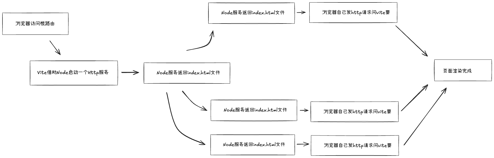

# Vite 插件使用

## 一、Vite 中的钩子

`Vite` 作为一个单纯的构建工具，根 `Webpack` 一样，其提供了很多 生命周期 钩子，这些钩子主要是在 `Vite` 从开始构建，到结束构建的过程中 提供给程序员使用的。旨在让你可以在构建中途的某个时间点，定制化一些功能。

`Vite` 是基于 `Rollup` 这个构建工具来封装的，所以 `Vite` 中的一部分钩子其实就是`Rollup` 中的钩子

Vite 的钩子主要分为两类：

- 通用钩子（也就是沿用了`Rollup`的钩子）

- 独有的钩子

在介绍这些钩子函数执行效果之前，我们先用一张图先大体介绍一下 `Vite` 的基本工作流程：



知道 Vite 是靠 Http 服务不断向浏览器发送整个项目需要的各个文件资源后，再来看它的钩子们

### 1. **通用钩子**

#### 1.1 options

[`options`](https://link.juejin.cn/?target=https%3A%2F%2Frollupjs.org%2Fplugin-development%2F%23options) 这是构建阶段的第一个钩子，通常用于插件开发中的参数阅读选项。

```ts
// 举了例子，当名为myPlugin的插件生效时，给它传递的参数便可以在该插件源码中的 options 钩子函数中获取到
myPlugin({
  name: '插件',
  age: 18,
});
```

#### 1.2 **buildStart**

[`buildStart`](https://link.juejin.cn/?target=https%3A%2F%2Frollupjs.org%2Fplugin-development%2F%23buildstart) 这是构建阶段的第二个钩子，读取到入口文件后开始构建。

- **自定义任务**：你可以在构建开始前执行自定义任务，例如清理临时文件、生成一些构建配置、执行前置操作等。
- **日志记录**：你可以在构建开始前添加一些日志记录，以记录构建过程的开始时间、项目信息等，以便后续分析和调试。
- **状态检查**：在构建开始前，你可以执行一些状态检查，确保构建所需的条件满足，如果有问题，可以提前终止构建并给出错误提示。
- **设置环境变量**：你可以在构建开始前设置一些环境变量，以影响构建过程中的行为，例如根据不同的环境配置不同的构建选项。

#### 1.3 resolveId

[`resolveId`](https://link.juejin.cn/?target=https%3A%2F%2Frollupjs.org%2Fplugin-development%2F%23resolveid) 主要用于自定义模块解析的行为。模块解析是指当你在代码中导入模块时，Vite 需要确定模块的位置和如何加载它。`resolveId` 钩子函数允许你在模块解析过程中介入，以满足特定的项目需求。

当`Vite`执行到需要解析这种模块加载的代码时，就会触发`resolveId`钩子

- **自定义模块解析规则**：你可以使用 `resolveId` 钩子函数来添加自定义的模块解析规则。例如，你可以为特定的文件扩展名或文件夹路径设置自定义解析逻辑。
- **模块别名**：通过 `resolveId` 钩子函数，你可以实现模块别名功能，将某个模块的导入路径重定向到另一个路径，以简化模块导入。
- **动态加载模块**：你可以在 `resolveId` 中执行异步操作，例如从远程服务器加载模块或根据环境条件选择不同的模块实现。
- **解析外部依赖项**：如果你的项目依赖于不同的包管理器（例如 npm、Yarn、pnpm），你可以使用 `resolveId` 钩子来处理这些不同包管理器的依赖项解析差异。
- **增强性能**：通过自定义模块解析逻辑，你可以优化模块的加载方式，以提高项目的性能。例如，你可以将某些模块预构建，以减少加载时间。

#### 1.4 load

[`load`](https://link.juejin.cn/?target=https%3A%2F%2Frollupjs.org%2Fplugin-development%2F%23load) 执行时间点：在模块加载时。

- **使用场景**：用于自定义模块加载逻辑，例如加载动态数据或从外部源加载模块

#### 1.5 transform

[`transform`](https://link.juejin.cn/?target=https%3A%2F%2Frollupjs.org%2Fplugin-development%2F%23transform) 执行时间点：在模块代码构建期间。

- **使用场景**：用于修改模块的源代码，可以在构建期间对模块进行转换和处理，例如添加额外的代码、转换特定格式的文件等。比如：`Vite` 在加载到 `Vue` 项目中的 `main.js` 后我们可以在 `transform` 钩子中对 `main.js`的代码做一些修改

#### 1.6 buildEnd

[`buildEnd`](https://link.juejin.cn/?target=https%3A%2F%2Frollupjs.org%2Fplugin-development%2F%23buildend) 作用：`buildEnd` 钩子函数在 Vite 构建结束后触发。

- **使用场景**：你可以使用 `buildEnd` 钩子来执行一些与构建结束相关的操作，例如生成构建报告、自动化部署、通知团队构建已完成等。这个钩子通常用于处理构建后的事务。

#### 1.7 closeBundle

[`closeBundle`](https://link.juejin.cn/?target=https%3A%2F%2Frollupjs.org%2Fplugin-development%2F%23closebundle) 作用：`closeBundle` 钩子函数在 Vite 打包生成 bundle 文件时触发。

- **使用场景**：你可以使用 `closeBundle` 钩子来执行一些与打包后的 bundle 文件相关的操作，例如自动化地上传 bundle 文件到 CDN、生成版本号、进行代码压缩或加密等。这个钩子通常用于处理 bundle 文件的后续处理。

### 2. **独有的钩子**

#### 2.1 config

`config`： 允许你在 Vite 配置对象被创建之前对其进行修改和扩展。这个钩子函数在 Vite 配置加载过程中的早期阶段被触发，允许你动态地修改 Vite 的配置，以满足项目的特定需求。

- **场景举例**：你可以在 `config` 钩子中添加、修改或删除 Vite 配置的属性和选项，以适应项目的需求。例如，你可以修改构建输出目录、设置自定义别名、更改开发服务器的选项等

#### 2.2 configResolved

`configResolved`： 用于在 Vite 配置对象被解析和应用后执行自定义操作。这个钩子函数在配置加载过程的较早阶段触发，允许你检查和修改已解析的 Vite 配置。

- **场景举例**：你可以在 `configResolved` 钩子函数中检查和修改 Vite 配置。这通常用于在配置加载后动态地调整配置选项，以适应不同的项目需求。

#### 2.3 configureServer

`configureServer`： 用于配置开发服务器。这个钩子函数在 Vite 开发服务器启动之前执行，允许你自定义开发服务器的行为。

- **场景举例**：你可以在 `configureServer` 中添加自定义中间件到开发服务器中。这使得你可以处理请求、修改响应、添加身份验证等。

#### 2.4 configurePreviewServer

- 与 configureServer 相同，但用于预览服务器。

#### 2.5 transformIndexHtml

- 允许你在构建过程中修改生成的 HTML 文件。这个钩子函数在生成最终的 `index.html` 文件之前执行，允许你自定义 HTML 内容或添加额外的标签、脚本等。

#### 2.4 handleHotUpdate

- 用于在模块发生热更新（Hot Module Replacement，HMR）时执行自定义逻辑。HMR 是一种开发工具，允许你在不刷新整个页面的情况下替换、添加或删除模块，以加快开发过程。
- **场景举例**： **动态加载模块**：你可以在热更新时动态加载新的模块，以实现按需加载或懒加载的效果。

## 二、**Vite 常用插件 + 钩子**的实战

---

### **1. 自动引入全局组件插件**

**钩子**：transform

**用途**：扫描 src/components 下的组件，自动注册到 Vue 应用中。

```ts
// vite.config.ts
import fs from 'fs';
import path from 'path';
import { Plugin } from 'vite';

function AutoRegisterComponents(): Plugin {
  return {
    name: 'vite:auto-register-components',
    transform(code, id) {
      // 只处理 main.ts
      if (id.endsWith('main.ts')) {
        const componentsDir = path.resolve(__dirname, 'src/components');
        const files = fs.readdirSync(componentsDir);
        const imports = files
          .map((file, i) => {
            const name = path.basename(file, '.vue');
            return `import Comp${i} from './components/${file}'
app.component('${name}', Comp${i})`;
          })
          .join('\n');

        return code.replace('app.mount("#app")', `${imports}\napp.mount("#app")`);
      }
      return code;
    },
  };
}

export default {
  plugins: [AutoRegisterComponents()],
};
```

💡 **作用**：免去在每个页面手动 import 注册组件。

### **2. Markdown 转 Vue 组件插件**

**钩子**：resolveId + load

**用途**：拦截 .md 文件请求，把它转成 Vue SFC。

```ts
import fs from 'fs';
import { marked } from 'marked';
import { Plugin } from 'vite';

function MarkdownToVue(): Plugin {
  return {
    name: 'vite:markdown-to-vue',
    resolveId(source) {
      if (source.endsWith('.md')) {
        return source;
      }
    },
    load(id) {
      if (id.endsWith('.md')) {
        const md = fs.readFileSync(id, 'utf-8');
        const html = marked(md);
        return `<template><div class="markdown">${html}</div></template>`;
      }
    },
  };
}

export default {
  plugins: [MarkdownToVue()],
};
```

💡 **作用**：让你可以直接 import xxx.md 当 Vue 组件用。

### **3. 开发环境 Mock 数据插件**

**钩子**：configureServer

**用途**：本地开发时拦截 /api/\*\* 请求，返回本地 JSON 数据。

```ts
import fs from 'fs';
import path from 'path';
import { Plugin } from 'vite';

function DevMock(): Plugin {
  return {
    name: 'vite:dev-mock',
    configureServer(server) {
      server.middlewares.use((req, res, next) => {
        if (req.url?.startsWith('/api/')) {
          const filePath = path.resolve(__dirname, 'mock', `${req.url}.json`);
          if (fs.existsSync(filePath)) {
            res.setHeader('Content-Type', 'application/json');
            res.end(fs.readFileSync(filePath));
            return;
          }
        }
        next();
      });
    },
  };
}

export default {
  plugins: [DevMock()],
};
```

💡 **作用**：后端接口没准备好时，本地 JSON 文件就能模拟 API。

### **4.虚拟模块插件（版本信息）**

**钩子**：resolveId + load

**用途**：生成 virtual:version 模块，返回版本信息。

```ts
import { Plugin } from 'vite';

function VersionVirtualModule(): Plugin {
  return {
    name: 'vite:version',
    resolveId(id) {
      if (id === 'virtual:version') {
        return '\0virtual:version';
      }
    },
    load(id) {
      if (id === '\0virtual:version') {
        return `export default { version: '${Date.now()}' }`;
      }
    },
  };
}

export default {
  plugins: [VersionVirtualModule()],
};
```

💡 **作用**：在应用里直接 import version from 'virtual:version' 获取构建时间或版本号。

### **5. 打包产物处理插件（加版本号）**

**钩子**：generateBundle

**用途**：在打包的文件名里添加构建时间，方便缓存管理。

```ts
import { Plugin } from 'vite';

function AddBuildTimestamp(): Plugin {
  return {
    name: 'vite:add-build-timestamp',
    generateBundle(_, bundle) {
      const timestamp = Date.now();
      for (const fileName in bundle) {
        const asset = bundle[fileName];
        const newName = fileName.replace(/(\.\w+)$/, `.${timestamp}$1`);
        bundle[newName] = asset;
        delete bundle[fileName];
      }
    },
  };
}

export default {
  plugins: [AddBuildTimestamp()],
};
```

💡 **作用**：防止浏览器缓存旧版本资源。
