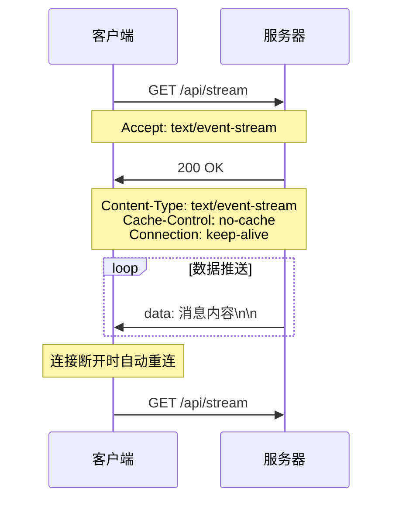

# 前端使用 SSE 实现 AI 流式输出

## 什么是 SSE

**Server-Sent Events (SSE)** 是 HTML5 中的一项技术，允许服务器主动向客户端推送数据。它基于 HTTP 协议，使用持久连接来实现实时通信。

### 核心特点

- 🚀 **单向通信**：只能从服务器向客户端发送数据
- 🔄 **自动重连**：连接断开时浏览器会自动尝试重新连接
- 📝 **文本格式**：只支持 UTF-8 编码的文本数据
- 🌐 **基于 HTTP**：使用标准的 HTTP 协议，无需特殊配置
- 💡 **简单易用**：相比 WebSocket 更简单，学习成本低

### 典型应用场景

- 📊 实时数据更新（股票价格、体育比分）
- 💬 聊天应用的消息推送
- 📰 新闻推送和通知
- 🤖 AI 文字流式生成（如 ChatGPT）
- 📈 实时监控面板

---

## SSE vs WebSocket vs 轮询

| 特性           | SSE                     | WebSocket          | 长轮询      | 短轮询      |
| -------------- | ----------------------- | ------------------ | ----------- | ----------- |
| **连接方式**   | 持久 HTTP 连接          | TCP 全双工连接     | HTTP 长连接 | HTTP 短连接 |
| **通信方向**   | 单向（服务器 → 客户端） | 双向               | 双向        | 双向        |
| **协议**       | HTTP                    | WebSocket Protocol | HTTP        | HTTP        |
| **复杂度**     | 简单                    | 中等               | 简单        | 简单        |
| **服务器压力** | 低                      | 低                 | 中等        | 高          |
| **实时性**     | 高                      | 高                 | 中等        | 低          |
| **自动重连**   | 是                      | 需手动实现         | 需手动实现  | 不需要      |
| **代理友好**   | 是                      | 部分支持           | 是          | 是          |

### 选择建议

- **选择 SSE**：单向数据推送、简单实时更新、快速原型开发
- **选择 WebSocket**：需要双向通信、高频交互、游戏应用
- **选择轮询**：简单场景、兼容性要求高、数据更新不频繁

---

## SSE 的工作原理

### 1. 连接建立过程



### 2. 数据格式规范

SSE 使用特定的文本格式传输数据：

```
data: 这是一条消息
id: 消息ID
event: 事件类型
retry: 重连间隔
: 这是注释

```

**重要**：每个字段后面必须有 `\n\n` 来表示消息结束！

### 3. 消息字段说明

- **data**: 消息内容，可以跨多行
- **id**: 消息唯一标识，用于断线重连时的位置恢复
- **event**: 自定义事件类型，客户端可以监听特定事件
- **retry**: 重连间隔时间（毫秒）
- **注释**: 以 `:` 开头的行，用于保持连接活跃

---

## 浏览器支持情况

### 支持程度

| 浏览器  | 版本支持 | 注意事项            |
| ------- | -------- | ------------------- |
| Chrome  | 6+       | 完全支持            |
| Firefox | 6+       | 完全支持            |
| Safari  | 5+       | 完全支持            |
| Edge    | 12+      | 完全支持            |
| IE      | ❌       | 不支持，需 polyfill |

### Polyfill 方案

对于不支持 SSE 的浏览器，可以使用：

- [EventSource polyfill](https://github.com/Yaffle/EventSource)
- 降级到长轮询方案

---

## 服务端实现详解

### Node.js + Express 实现

让我们深入分析项目中的服务端代码：

```javascript
const express = require('express');
const cors = require('cors');
const app = express();

// 1. 启用CORS，允许跨域请求
app.use(cors());

// 2. SSE端点实现
app.get('/api/stream', (req, res) => {
  // 设置SSE必需的响应头
  res.writeHead(200, {
    'Content-Type': 'text/event-stream', // 告诉浏览器这是SSE流
    'Cache-Control': 'no-cache', // 禁用缓存
    Connection: 'keep-alive', // 保持连接
    'Access-Control-Allow-Origin': '*', // CORS支持
    'Access-Control-Allow-Headers': 'Cache-Control',
  });

  // 3. 发送初始消息
  res.write('data: {"type": "start", "message": "开始生成文字..."}\n\n');

  // 4. 模拟数据流式传输
  let index = 0;
  const aiText = '你好！我是一个AI助手...';

  const interval = setInterval(() => {
    if (index < aiText.length) {
      const char = aiText[index];
      const data = {
        type: 'chunk',
        char: char,
        index: index,
        total: aiText.length,
      };

      // 发送数据，注意格式：data: + JSON + \n\n
      res.write(`data: ${JSON.stringify(data)}\n\n`);
      index++;
    } else {
      // 发送完成信号并关闭连接
      res.write('data: {"type": "end", "message": "完成！"}\n\n');
      clearInterval(interval);
      res.end();
    }
  }, 100);

  // 5. 处理客户端断开连接
  req.on('close', () => {
    clearInterval(interval);
    res.end();
  });
});
```

### 关键技术点解析

#### 1. 响应头设置

```javascript
'Content-Type': 'text/event-stream'  // 最重要：标识SSE流
'Cache-Control': 'no-cache'          // 防止代理缓存
'Connection': 'keep-alive'           // 保持连接不断开
```

#### 2. 数据发送格式

```javascript
// 正确格式
res.write(`data: ${JSON.stringify(data)}\n\n`);

// 错误格式 - 缺少\n\n
res.write(`data: ${JSON.stringify(data)}`);
```

#### 3. 连接清理

```javascript
// 监听客户端断开，及时清理资源
req.on('close', () => {
  clearInterval(interval); // 清理定时器
  res.end(); // 关闭响应
});
```

## 客户端实现详解

### 基础 EventSource 用法

```javascript
// 1. 创建连接
const eventSource = new EventSource('http://localhost:3000/api/stream');

// 2. 监听消息
eventSource.onmessage = function (event) {
  const data = JSON.parse(event.data);
  console.log('收到消息:', data);
};

// 3. 监听连接打开
eventSource.onopen = function (event) {
  console.log('SSE连接已建立');
};

// 4. 监听错误
eventSource.onerror = function (event) {
  console.error('SSE连接错误:', event);
};

// 5. 关闭连接
eventSource.close();
```

### Vue3 项目中的高级实现

让我们分析项目中的客户端代码：

```typescript
import { ref, computed, onUnmounted } from 'vue';

// 1. 响应式状态管理
const displayText = ref<string>('');
const isStreaming = ref<boolean>(false);
const eventSource = ref<EventSource | null>(null);
const progress = ref<number>(0);

// 2. 计算属性 - 连接状态
const statusClass = computed(() => {
  if (isStreaming.value) return 'connecting';
  if (displayText.value) return 'connected';
  return 'disconnected';
});

// 3. 启动SSE连接
const startStream = () => {
  if (isStreaming.value) return;

  // 重置状态
  isStreaming.value = true;
  displayText.value = '';
  progress.value = 0;

  // 创建EventSource
  eventSource.value = new EventSource('http://localhost:3000/api/stream');

  // 监听消息
  eventSource.value.onmessage = (event) => {
    try {
      const data = JSON.parse(event.data);

      switch (data.type) {
        case 'start':
          console.log(data.message);
          break;

        case 'chunk':
          // 逐字添加到显示文本
          displayText.value += data.char;
          // 更新进度
          progress.value = Math.round(((data.index + 1) / data.total) * 100);
          break;

        case 'end':
          console.log(data.message);
          closeConnection();
          break;
      }
    } catch (error) {
      console.error('解析SSE数据失败:', error);
    }
  };

  // 错误处理
  eventSource.value.onerror = (error) => {
    console.error('SSE连接错误:', error);
    closeConnection();
  };
};

// 4. 关闭连接
const closeConnection = () => {
  if (eventSource.value) {
    eventSource.value.close();
    eventSource.value = null;
  }
  isStreaming.value = false;
};

// 5. 组件销毁时清理
onUnmounted(() => {
  closeConnection();
});
```

### 高级特性使用

#### 1. 自定义事件监听

```javascript
// 服务端发送自定义事件
res.write('event: notification\n');
res.write('data: {"message": "新通知"}\n\n');

// 客户端监听特定事件
eventSource.addEventListener('notification', function (event) {
  const data = JSON.parse(event.data);
  showNotification(data.message);
});
```

#### 2. 断线重连与状态恢复

```javascript
// 服务端设置消息ID
res.write('id: 12345\n');
res.write('data: {"content": "消息内容"}\n\n');

// 客户端会自动在重连时发送Last-Event-ID头
// 服务端可以根据这个ID恢复数据
app.get('/api/stream', (req, res) => {
  const lastEventId = req.headers['last-event-id'];
  // 从lastEventId位置开始发送数据
});
```

#### 3. 连接状态管理

```typescript
enum ConnectionState {
  DISCONNECTED,
  CONNECTING,
  CONNECTED,
  ERROR,
}

const connectionState = ref<ConnectionState>(ConnectionState.DISCONNECTED);

eventSource.value.onopen = () => {
  connectionState.value = ConnectionState.CONNECTED;
};

eventSource.value.onerror = () => {
  connectionState.value = ConnectionState.ERROR;
};
```

---

## 实战项目：AI 打字机效果

### 项目架构

```
项目结构：
├── server.js              # Express后端
├── client/
│   ├── src/
│   │   ├── App.vue        # Vue3主组件
│   │   └── main.ts        # 应用入口
│   └── package.json       # 前端依赖
└── package.json           # 后端依赖
```

### 核心功能实现

#### 1. 后端流式数据生成

```javascript
// 模拟AI文字生成的核心逻辑
const aiText = '你好！我是一个AI助手...';
let index = 0;

const interval = setInterval(() => {
  if (index < aiText.length) {
    const char = aiText[index];
    const data = {
      type: 'chunk',
      char: char, // 当前字符
      index: index, // 当前位置
      total: aiText.length, // 总长度
    };

    res.write(`data: ${JSON.stringify(data)}\n\n`);
    index++;
  } else {
    // 发送完成信号
    res.write('data: {"type": "end"}\n\n');
    clearInterval(interval);
    res.end();
  }
}, 100); // 控制打字速度
```

#### 2. 前端打字机效果

```vue
<template>
  <div class="text-content">
    {{ displayText }}
    <span v-if="isStreaming" class="cursor">|</span>
  </div>
  <div class="progress-bar">
    <div class="progress-fill" :style="{ width: progress + '%' }"></div>
  </div>
</template>

<style>
.cursor {
  animation: blink 1s infinite;
  color: #667eea;
}

@keyframes blink {
  0%,
  50% {
    opacity: 1;
  }
  51%,
  100% {
    opacity: 0;
  }
}
</style>
```

#### 3. 实时进度显示

```typescript
// 在收到每个字符时更新进度
case 'chunk':
  displayText.value += data.char;
  currentIndex.value = data.index + 1;
  totalChars.value = data.total;
  progress.value = Math.round((currentIndex.value / totalChars.value) * 100);
  break;
```

### 项目运行效果

1. **连接建立**：显示"正在接收数据..."状态
2. **文字流入**：逐字显示，带闪烁光标
3. **进度更新**：实时进度条显示
4. **完成提示**：显示"接收完成"状态

---

## SSE 的优缺点

### ✅ 优点

1. **简单易用**

   - 基于 HTTP 协议，无需特殊服务器配置
   - 客户端 API 简单，学习成本低
   - 自动处理连接管理和重连

2. **开发友好**

   - 支持跨域请求
   - 可以通过代理服务器
   - 调试容易（可直接在浏览器中查看）

3. **可靠性高**

   - 自动重连机制
   - 支持消息 ID，可恢复断点
   - 浏览器原生支持

4. **性能良好**
   - 单向连接，服务器压力小
   - 基于 HTTP/1.1 持久连接
   - 支持 gzip 压缩

### ❌ 缺点

1. **功能限制**

   - 只支持单向通信（服务器 → 客户端）
   - 只能传输文本数据
   - 不支持二进制数据

2. **连接限制**

   - 浏览器对同域并发 SSE 连接有限制（通常 6 个）
   - 移动端可能因为网络切换导致频繁重连

3. **兼容性问题**
   - IE 浏览器不支持
   - 某些企业防火墙可能阻止

---

## 常见问题与解决方案

### 1. 连接数限制问题

**问题**：浏览器限制同域最大 6 个 SSE 连接

**解决方案**：

```javascript
// 方案1：使用不同子域名
const servers = ['http://sse1.example.com/stream', 'http://sse2.example.com/stream', 'http://sse3.example.com/stream'];

// 方案2：复用连接，多路复用
app.get('/api/stream/:channels', (req, res) => {
  const channels = req.params.channels.split(',');
  // 在同一连接中处理多个频道
});
```

### 2. 代理服务器缓存问题

**问题**：nginx 等代理可能缓存 SSE 响应

**解决方案**：

```nginx
# nginx配置
location /api/stream {
    proxy_pass http://backend;
    proxy_set_header Connection '';
    proxy_http_version 1.1;
    chunked_transfer_encoding off;
    proxy_buffering off;
    proxy_cache off;
}
```

### 3. 移动端网络切换问题

**问题**：移动端切换网络时连接断开

**解决方案**：

```javascript
// 监听网络状态变化
window.addEventListener('online', () => {
  if (!eventSource || eventSource.readyState === EventSource.CLOSED) {
    reconnectSSE();
  }
});

window.addEventListener('offline', () => {
  if (eventSource) {
    eventSource.close();
  }
});
```

### 4. 内存泄漏问题

**问题**：忘记关闭连接导致内存泄漏

**解决方案**：

```javascript
// Vue组合式API
onUnmounted(() => {
  if (eventSource.value) {
    eventSource.value.close();
    eventSource.value = null;
  }
});

// React Hooks
useEffect(() => {
  return () => {
    if (eventSourceRef.current) {
      eventSourceRef.current.close();
    }
  };
}, []);
```

### 5. 跨域问题

**问题**：CORS 配置不当导致连接失败

**解决方案**：

```javascript
// 服务端正确配置CORS
app.use(
  cors({
    origin: ['http://localhost:3000', 'https://yourdomain.com'],
    credentials: true,
  })
);

// 或在SSE端点单独配置
res.setHeader('Access-Control-Allow-Origin', '*');
res.setHeader('Access-Control-Allow-Headers', 'Cache-Control');
```

---

## 最佳实践

### 1. 服务端最佳实践

#### 连接管理

```javascript
// 维护活跃连接列表
const activeConnections = new Set();

app.get('/api/stream', (req, res) => {
  // 添加到活跃连接
  activeConnections.add(res);

  // 连接断开时清理
  req.on('close', () => {
    activeConnections.delete(res);
    // 清理相关资源
  });
});

// 广播消息到所有连接
function broadcast(message) {
  const data = `data: ${JSON.stringify(message)}\n\n`;
  activeConnections.forEach((res) => {
    try {
      res.write(data);
    } catch (err) {
      activeConnections.delete(res);
    }
  });
}
```

#### 心跳保活

```javascript
// 定期发送心跳，防止连接被代理关闭
setInterval(() => {
  activeConnections.forEach((res) => {
    try {
      res.write(': heartbeat\n\n'); // 注释行，不会触发客户端事件
    } catch (err) {
      activeConnections.delete(res);
    }
  });
}, 30000); // 每30秒发送一次
```

#### 错误处理

```javascript
app.get('/api/stream', (req, res) => {
  try {
    // SSE逻辑
  } catch (error) {
    console.error('SSE错误:', error);
    res.write(`data: ${JSON.stringify({ type: 'error', message: '服务器错误' })}\n\n`);
    res.end();
  }
});
```

### 2. 客户端最佳实践

#### 状态管理

```typescript
interface SSEState {
  status: 'disconnected' | 'connecting' | 'connected' | 'error';
  lastEventId?: string;
  retryCount: number;
  data: any[];
}

const sseState = reactive<SSEState>({
  status: 'disconnected',
  retryCount: 0,
  data: [],
});
```

#### 智能重连

```typescript
class SSEManager {
  private eventSource: EventSource | null = null;
  private retryCount = 0;
  private maxRetries = 5;
  private retryDelay = 1000;

  connect(url: string) {
    if (this.retryCount >= this.maxRetries) {
      console.error('超过最大重试次数');
      return;
    }

    this.eventSource = new EventSource(url);

    this.eventSource.onopen = () => {
      this.retryCount = 0; // 重置重试计数
    };

    this.eventSource.onerror = () => {
      this.eventSource?.close();
      this.retryCount++;

      // 指数退避重连
      setTimeout(() => {
        this.connect(url);
      }, this.retryDelay * Math.pow(2, this.retryCount));
    };
  }

  disconnect() {
    this.eventSource?.close();
    this.eventSource = null;
    this.retryCount = 0;
  }
}
```

#### 数据缓存

```typescript
// 缓存接收的数据，防止重连时丢失
const messageCache = ref<Array<{ id: string; data: any }>>([]);

eventSource.onmessage = (event) => {
  const message = {
    id: event.lastEventId || Date.now().toString(),
    data: JSON.parse(event.data),
  };

  messageCache.value.push(message);

  // 限制缓存大小
  if (messageCache.value.length > 1000) {
    messageCache.value = messageCache.value.slice(-500);
  }
};
```

### 3. 性能优化

#### 服务端优化

```javascript
// 使用流式响应，避免内存积累
const stream = require('stream');

app.get('/api/stream', (req, res) => {
  const sseStream = new stream.Readable({
    read() {},
  });

  sseStream.pipe(res);

  // 推送数据到流
  setInterval(() => {
    sseStream.push(`data: ${JSON.stringify(getData())}\n\n`);
  }, 1000);
});
```

#### 客户端优化

```typescript
// 使用Worker处理大量数据
const worker = new Worker('/sse-worker.js');

eventSource.onmessage = (event) => {
  // 将数据处理交给Worker
  worker.postMessage(event.data);
};

worker.onmessage = (event) => {
  // 接收Worker处理结果
  updateUI(event.data);
};
```

---

## 扩展应用场景

### 1. 实时监控面板

```javascript
// 服务端：推送系统指标
app.get('/api/monitor', (req, res) => {
  setSSEHeaders(res);

  const interval = setInterval(() => {
    const metrics = {
      cpu: getCPUUsage(),
      memory: getMemoryUsage(),
      disk: getDiskUsage(),
      timestamp: Date.now(),
    };

    res.write(`data: ${JSON.stringify(metrics)}\n\n`);
  }, 5000);

  req.on('close', () => clearInterval(interval));
});
```

```vue
<!-- 客户端：实时图表 -->
<template>
  <div class="monitor-dashboard">
    <div class="metric-card">
      <h3>CPU使用率</h3>
      <div class="progress-ring" :data-progress="metrics.cpu">{{ metrics.cpu }}%</div>
    </div>
    <!-- 更多指标... -->
  </div>
</template>

<script setup lang="ts">
const metrics = ref({ cpu: 0, memory: 0, disk: 0 });

const eventSource = new EventSource('/api/monitor');
eventSource.onmessage = (event) => {
  metrics.value = JSON.parse(event.data);
};
</script>
```

### 2. 实时聊天应用

```javascript
// 服务端：聊天室广播
const chatRooms = new Map(); // roomId -> Set<response>

app.get('/api/chat/:roomId', (req, res) => {
  const roomId = req.params.roomId;
  setSSEHeaders(res);

  if (!chatRooms.has(roomId)) {
    chatRooms.set(roomId, new Set());
  }

  chatRooms.get(roomId).add(res);

  req.on('close', () => {
    chatRooms.get(roomId).delete(res);
  });
});

app.post('/api/chat/:roomId/message', (req, res) => {
  const roomId = req.params.roomId;
  const message = req.body;

  // 广播到房间内所有连接
  const connections = chatRooms.get(roomId);
  if (connections) {
    const data = `data: ${JSON.stringify(message)}\n\n`;
    connections.forEach((conn) => {
      try {
        conn.write(data);
      } catch (err) {
        connections.delete(conn);
      }
    });
  }

  res.json({ success: true });
});
```

### 3. 实时通知系统

```javascript
// 通知推送服务
class NotificationService {
  constructor() {
    this.userConnections = new Map(); // userId -> response
  }

  addUser(userId, response) {
    this.userConnections.set(userId, response);
  }

  removeUser(userId) {
    this.userConnections.delete(userId);
  }

  sendNotification(userId, notification) {
    const response = this.userConnections.get(userId);
    if (response) {
      const data = {
        type: 'notification',
        title: notification.title,
        body: notification.body,
        timestamp: Date.now(),
      };

      try {
        response.write(`data: ${JSON.stringify(data)}\n\n`);
      } catch (err) {
        this.removeUser(userId);
      }
    }
  }

  broadcast(notification) {
    this.userConnections.forEach((response, userId) => {
      this.sendNotification(userId, notification);
    });
  }
}
```

### 4. AI 对话流式响应

```javascript
// AI服务集成示例
app.get('/api/ai/chat', async (req, res) => {
  const { message } = req.query;
  setSSEHeaders(res);

  try {
    // 调用AI服务（如OpenAI API）
    const aiResponse = await openai.createChatCompletion({
      model: 'gpt-3.5-turbo',
      messages: [{ role: 'user', content: message }],
      stream: true,
    });

    // 转发AI的流式响应
    aiResponse.data.on('data', (chunk) => {
      const lines = chunk.toString().split('\n');
      lines.forEach((line) => {
        if (line.startsWith('data: ')) {
          const data = line.slice(6);
          if (data !== '[DONE]') {
            try {
              const parsed = JSON.parse(data);
              const content = parsed.choices[0]?.delta?.content;
              if (content) {
                res.write(
                  `data: ${JSON.stringify({
                    type: 'chunk',
                    content: content,
                  })}\n\n`
                );
              }
            } catch (err) {
              console.error('解析AI响应错误:', err);
            }
          } else {
            res.write('data: {"type": "done"}\n\n');
            res.end();
          }
        }
      });
    });
  } catch (error) {
    res.write(
      `data: ${JSON.stringify({
        type: 'error',
        message: '服务暂时不可用',
      })}\n\n`
    );
    res.end();
  }
});
```

---

## 总结

Server-Sent Events (SSE) 是一项强大而简单的实时通信技术，特别适合需要服务器主动推送数据的场景。通过本文的学习和实战项目，你应该已经掌握了：

### 🎯 核心知识点

- SSE 的工作原理和数据格式
- 服务端和客户端的完整实现
- 与 WebSocket 等技术的对比
- 常见问题的解决方案

### 💡 实战技能

- 使用 Node.js Express 构建 SSE 服务
- 在 Vue3 中集成 SSE 客户端
- 实现 AI 打字机效果
- 性能优化和错误处理

### 🚀 扩展能力

- 实时监控面板开发
- 聊天应用构建
- 通知系统设计
- AI 对话集成

SSE 的简单性和可靠性使其成为很多实时应用的首选方案。随着现代 Web 应用对实时性要求的不断提高，掌握 SSE 技术将为你的开发技能添加重要的一笔。

开始动手实践吧！从简单的文字推送开始，逐步构建更复杂的实时应用。记住，最好的学习方式就是实际编码和不断实验。

---

_📝 本文档基于实际项目经验总结，如有疑问或建议，欢迎交流讨论！_
