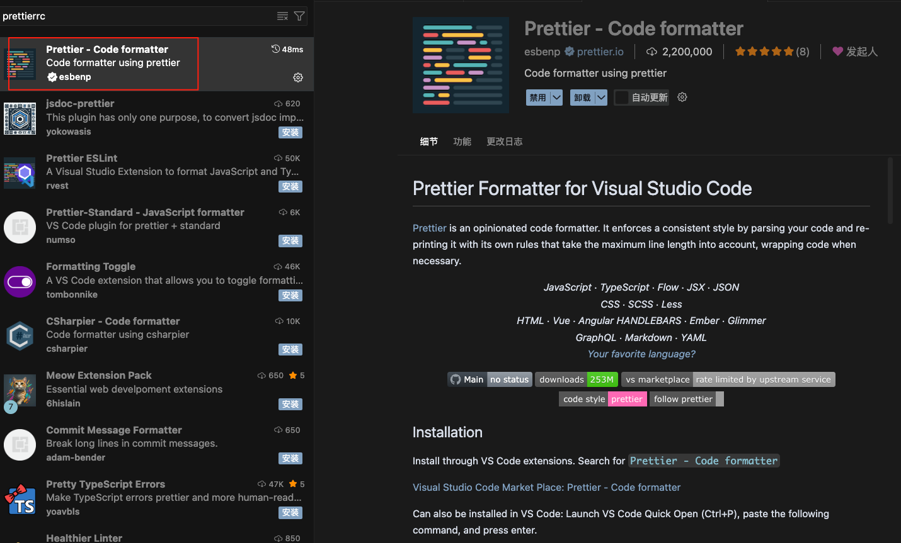
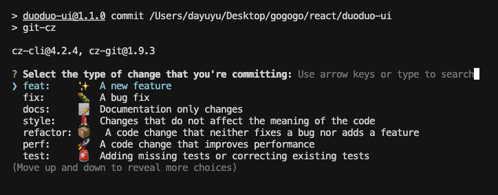
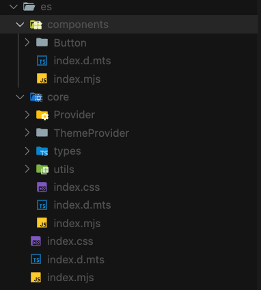

# 前端 ui 组件库搭建规范

## 一、`Monorepo`

**`Monorepo`**（单一代码仓库）是一种代码管理模式，指的是**将多个项目或包放在同一个代码仓库中进行管理**，而不是每个项目一个仓库（ **`Polyrepo`**）。

### **1. 核心概念**

- **`Mono`** = 单一
- **`Repo`** = 代码仓库
- 前端组件库结构通常是这样：

```tex
my-ui/
├── packages/
│   ├── ui/          # UI 组件库
│   ├── hooks/       # 工具库
│   └── api/         # API SDK
├── apps/
│   ├── docs/        # 组件库文档
│   └── demos/       # 组件demo
└── turbo.json       # Turborepo 配置
```

所有项目（`apps`、组件、工具库）放在一个仓库里，统一管理版本、依赖和构建。

### **2. `Monorepo` 的优点**

- **统一管理依赖**（不怕版本不一致）
- **一次提交可影响多个项目**（跨包修改方便）
- **共享代码方便**（直接 `import`）
- **代码可见性高**（所有人都能看到全部代码）
- **配合 Turborepo / Nx 可以智能构建和缓存**

### **3. `Monorepo`配置**

**创建 `pnpm-workspace.yaml` ⽂件**：显式声明所有包含⼦项⽬的⽬录路径

```json
packages:
    - 'apps/*'
    - 'packages/*'
```

## 二、规范化设计

### 1. `JS` 规范： `ESLint + Prettier`

#### 1.1 `ESLint`

**介绍**

- 一个 **JavaScript/TypeScript 代码质量和风格检查工具**
- 主要作用：
  1. 检查语法错误
  2. 统一代码风格
  3. 提供自动修复功能（`--fix`）

**安装 ESLint**

在项目根目录执行：

```shell
# npm
npm install eslint --save-dev

# pnpm
pnpm add eslint -D
```

**添加配置文件**

根目录添加`eslint.config.js`

这里还需要安装`@eslint/js`(官方内置的 JS 规则集)和`typescript-eslint`(TypeScript 的 ESLint 解析器和插件)，使用`extends`直接继承`js`和`typescrpit`相关的配置。详细配置规则查看[eslint 官网](https://eslint.org/)

```shell
pnpm add -D eslint @eslint/js typescript typescript-eslint
```

```js
import js from '@eslint/js';
import tseslint from 'typescript-eslint';

export default tseslint.config({
  // 继承自什么配置
  extends: [js.configs.recommended, ...tseslint.configs.recommended],
  // 哪些文件需要被eslint检查
  files: ['**/*.{ts,tsx,js}'],
  //哪些文件不需要被eslint检查
  ignores: ['apps/**/*/{tmp,.dumi}/**/*', '*.js', '**/*/build/**/*', '**/*/es/**/*', '**/*/dist/**/*'],
  // 自定义规则
  rules: {
    // 禁止使用console
    'no-console': 'off',
  },
  // 语言选项
  languageOptions: {
    // 解析器
    parser: tseslint.parser,
    // 解析器选项
    parserOptions: {
      // ts项目的配置文件
      project: [],
      // ts配置根目录
      tsconfigRootDir: import.meta.url,
    },
  },
});
```

**⽂件后缀名问题**

- **ES 模块问题**：当使⽤`export default`语法时，Node.js 默认会认为是`CommonJS`模块
- **解决⽅案**：
  - 将⽂件后缀改为`.mjs`，`eslint.config.mjs`
  - 在`package.json`中添加`"type": "module"`
- 这是新版本 Node.js 中常⻅的坑，需要特别注意⽂件后缀名

**验证`Eslint`**

- 在`package.json`中添加执行命令

```json
 "scripts": {
        "lint:es": "eslint \"{packages,apps}/**/*.{js,jsx,ts,tsx}\"",
  },
```

- 通过运⾏`pnpm run lint:es`命令验证配置是否⽣效

```shell
pnpm run lint:es
```

- 常⻅错误
  - 语法错误（如缺少逗号）
  - 规则名称拼写错误
  - 规则值格式不正确

#### 1.2 `prettier`

**Prettier 是什么**

- 主要做 **代码格式化**（缩进、引号、分号等）
- 不关心语法规则（那是 `ESLint` 的活）
- 它的目标是：**统一风格，不再争论代码格式**

**安装 Prettier**

```shell
# pnpm
pnpm add -D prettier
```

**创建配置文件**

根目录下新建`.prettierrc`文件

```js
export default {
  printWidth: 100, // 每行最大长度
  tabWidth: 2, // 缩进宽度
  useTabs: false, // 是否用 tab
  semi: true, // 语句末尾加分号
  singleQuote: true, // 使用单引号
  trailingComma: 'all', // 多行时末尾逗号
  bracketSpacing: true, // 对象大括号内留空格
  arrowParens: 'always', // 箭头函数参数总是加括号
};
```

**忽略不需要格式化的文件**

根目录下新建`.prettierignore`文件

```js
node_modules;
dist;
build;
coverage;
```

**使用编辑器插件**



### **2. 样式规范: `Stylelint`**

**`Stylelint` 是什么**

- `CSS/SCSS/LESS` 代码检查工具
- 类似 `ESLint`，但针对样式代码
- 功能：
  - 规范 `CSS/SCSS/LESS` 代码风格
  - 检查错误或潜在问题（如重复属性、无效颜色）
  - 支持自动修复（`--fix`）

**安装**

```shell
pnpm add -D stylelint stylelint-config-standard
```

- `stylelint` → 核心工具
- `stylelint-config-standard` → 官方推荐的基础规则集

如果使用 `SCSS/LESS`

```shell
pnpm add -D stylelint-scss stylelint-less
```

**配置 `Stylelint`**

[Stylelint 官方文档](https://stylelint.io/)

根目录下新建`stylelint.config.js`

```js
module.exports = {
  extends: ['stylelint-config-standard'],
  rules: {
    indentation: 2, // 缩进 2 个空格
    'string-quotes': 'double', // 字符串用双引号
    'color-hex-case': 'lower', // 十六进制颜色小写
    'max-empty-lines': 2, // 最大空行 2 行
  },
};
```

如果是 `SCSS`，可以加：

```js
module.exports = {
  extends: ['stylelint-config-standard', 'stylelint-config-recommended-scss'],
  plugins: ['stylelint-scss'],
  rules: {
    'scss/dollar-variable-pattern': '^foo', // SCSS 变量命名规则
  },
};
```

**验证`stylelint`**

- 在`package.json`中添加执行命令

```json
 "scripts": {
         "lint:style": "stylelint \"{packages,apps}/**/*.{css,ts}\"",
  },
```

- 通过运⾏`pnpm run lint:style`命令验证配置是否⽣效

```shell
pnpm run lint:style
```

### 3. 拼写检查:`cspell`

**cspell 是什么**

- **`Code Spell Checker`**，代码拼写检查工具
- 检查：变量名、注释、字符串等拼写错误
- 适合 `JS/TS/React/Vue` 项目，减少英文拼写 `bug`

**安装**

```shell
pnpm add -g cspell
```

**初始化配置**

在项目根目录：

```shell
npx cspell --init
```

会生成 `cspell.json`，默认配置示例：

```js
{
  "version": "0.2",
  "language": "en",
  "words": [
    "aiolimp",
    "vuex",
    "React"
  ],
  "ignoreWords": [
    "npm",
    "pnpm"
  ],
  "ignorePaths": [
    "node_modules/**",
    "dist/**"
  ]
}
```

- **`words`**：允许的自定义词（专有名词、库名等）
- **`ignoreWords`**：忽略的词
- **`ignorePaths`**：忽略目录

**检查代码**

- 在`package.json`中添加执行命令

```json
 "scripts": {
       "spellcheck": "cspell lint --dot --gitignore --color --cache --show-suggestions \"   (packages|apps)/**/*.@(html|js|cjs|mjs|ts|tsx|css|scss|md)\"",
  },
```

- 通过运⾏`pnpm run spellcheck`命令验证配置是否⽣效

```shell
pnpm run spellcheck
```

**修复**

根目录下添加`.cspell`文件夹，文件夹里添加`custom-words.txt`，可以将不需要拼写检查的单词添加到文件里。

在`cspell.json`中添加配置

```json
 "dictionaries": ["custom-words"],
    "dictionaryDefinitions": [
        {
            "name": "custom-words",
            "path": "./.cspell/custom-words.txt",
            "addWords": true
        }
    ],
```

### 4. 提交规范: `Commitlint + Husky`

**`Husky` + `Commitlint` 能做什么**

- **`Husky`**：管理 Git hooks（提交前、推送前等自动执行脚本）
- **`Commitlint`**：检查 `Git` 提交信息是否符合规范（如 `Angular` 提交规范）

比如，要求提交必须长这样：

```txt
feat(user): 新增用户登录功能
fix(api): 修复接口超时问题
```

**安装依赖**

```shell
pnpm add -D husky @commitlint/{cli,config-conventional}
```

- `husky` → 用来执行 `Git hooks`
- `@commitlint/cli` → `Commitlint` 核心工具
- `@commitlint/config-conventional` → `Angular` 风格的提交规范（主流）

**初始化 Husky**

```js
npx husky init
```

它会在项目根目录生成：

```js
.husky/
└── pre-commit
    commit-msg
```

并在 package.json 里添加：

```json
{
  "scripts": {
    "prepare": "husky"
  }
}
```

**`commit-msg`:**

- **触发时机**：在写好 `commit message` 后，**提交正式保存之前**执行，
- **作用**：
  - 校验提交信息格式（配合 `Commitlint`）
- **目的**：防止随意写 `update`、`test` 这种无意义提交

```js
#!/bin/sh
. "$(dirname "$0")/_/husky.sh"

npx --no -- commitlint --edit "$1"
```

**`pre-commit`**

- **触发时机**：运行 `git commit` 后，`Git` 会在**真正写入 `commit`**之前执行,可以配和其他类型的检查
- **作用**：
  - 检查代码格式（`ESLint`、`Prettier`）
  - 运行测试（`Jest`、`Vitest`）
  - 格式化代码（`lint-staged`）
- **目的**：防止不符合规范的代码进入仓库

```js
#!/bin/sh
. "$(dirname -- "$0")/_/husky.sh"

# pnpm lint
pnpm spellcheck && npx lint-staged

```

**配置 Commitlint**

推荐搭配**commitizen**和**cz-git**使用

- **commitizen**：让你用命令行交互式选择提交类型（替代手写 `commit message`）
- **cz-git**：`Commitizen` 的一个适配器，支持更多配置和自定义交互界面

在 package.json 中添加：

```json
"scripts": {
      "commit": "git-cz"
  },

"config": {
    "commitizen": {
        "path": "node_modules/cz-git"
    }
},
```

根目录下添加`commitlint.config.js`

```json
// Emoji
/** @type {import('cz-git').UserConfig} */
module.exports = {
    extends: ['@commitlint/config-conventional'], // extends can be nested
    parserPreset: 'conventional-changelog-conventionalcommits',
    prompt: {
        settings: {},
        messages: {
            skip: ':skip',
            max: 'upper %d chars',
            min: '%d chars at least',
            emptyWarning: 'can not be empty',
            upperLimitWarning: 'over limit',
            lowerLimitWarning: 'below limit'
        },
        types: [
            { value: 'feat', name: 'feat:     ✨  A new feature', emoji: '✨ ' },
            { value: 'fix', name: 'fix:      🐛  A bug fix', emoji: '🐛 ' },
            { value: 'docs', name: 'docs:     📝  Documentation only changes', emoji: '📝 ' },
            {
                value: 'style',
                name: 'style:    💄  Changes that do not affect the meaning of the code',
                emoji: '💄 '
            },
            {
                value: 'refactor',
                name: 'refactor: 📦️   A code change that neither fixes a bug nor adds a feature',
                emoji: '📦️ '
            },
            {
                value: 'perf',
                name: 'perf:     🚀  A code change that improves performance',
                emoji: '🚀 '
            },
            {
                value: 'test',
                name: 'test:     🚨  Adding missing tests or correcting existing tests',
                emoji: '🚨 '
            },
            {
                value: 'build',
                name: 'build:    🛠   Changes that affect the build system or external dependencies',
                emoji: '🛠 '
            },
            {
                value: 'ci',
                name: 'ci:       🎡  Changes to our CI configuration files and scripts',
                emoji: '🎡 '
            },
            {
                value: 'chore',
                name: "chore:    🔨  Other changes that don't modify src or test files",
                emoji: '🔨 '
            },
            { value: 'revert', name: 'revert:   ⏪️  Reverts a previous commit', emoji: ':rewind:' }
        ],
        useEmoji: true,
        confirmColorize: true,
        emojiAlign: 'center',
        questions: {
            scope: {
                description: 'What is the scope of this change (e.g. component or file name)'
            },
            subject: {
                description: 'Write a short, imperative tense description of the change'
            },
            body: {
                description: 'Provide a longer description of the change'
            },
            isBreaking: {
                description: 'Are there any breaking changes?'
            },
            breakingBody: {
                description: 'A BREAKING CHANGE commit requires a body. Please enter a longer description of the commit itself'
            },
            breaking: {
                description: 'Describe the breaking changes'
            },
            isIssueAffected: {
                description: 'Does this change affect any open issues?'
            },
            issuesBody: {
                description: 'If issues are closed, the commit requires a body. Please enter a longer description of the commit itself'
            },
            issues: {
                description: 'Add issue references (e.g. "fix #123", "re #123".)'
            }
        }
    }
}
```

这样执行 `pnpm commit` 时就会出现漂亮的交互式选择界面，支持中文提示和 `emoji`



**最终效果**

提交记录会像这样：

```
feat(api): ✨ 新增用户登录接口
fix(ui): 🐛 修复按钮样式错位
```

- 统一风格
- 支持 `emoji`
- 交互式选择，零记忆成本
- 自动校验，提交即规范

### 5.增量检查配置`Lint-staged`

**lint-staged 是什么**

- **作用**：只对暂存区（`git add` 后的文件）执行 lint 或格式化操作
- **优势**：
  - 不会全量检查（比直接 `eslint` . 快得多）
  - 只改你这次提交的文件
  - 适合配合 `Husky` 的 **`pre-commit hook`**

**安装**

```shell
pnpm add -D lint-staged
```

**配置 lint-staged**

在**package.json**中添加：

```js
"lint-staged": {
  "*.{js,ts,vue,tsx}": ["eslint --fix", "prettier --write"],
  "*.md": ["prettier --write"]
},
```

- `*.{js,ts,vue,tsx}`→ 匹配 `JS/TS/Vue/TSX` 文件
- `eslint --fix` → 自动修复 `ESLint` 问题
- `prettier --write` → 自动格式化
- `*.md` → 只格式化 `Markdown` 文件

**提交流程**

1. `Husky` **pre-commit hook** 触发
2. `lint-staged` 找出暂存区文件
3. 按配置执行 `ESLint / Prettier`
4. 如果有错误且无法修复，提交会被中断

## 三、工程化配置

### 1. **`tsup`**

`ui`库通常使用`tsup`进行打包构建，它是目前 TypeScript 项目里很流行的打包工具，尤其适合**库开发**。

**`tsup` 是什么**

- 一个 **零配置** 的 `TypeScript` 打包工具
- 基于 [esbuild](https://esbuild.github.io/)（超快的打包器）
- 支持生成多种格式：`esm`、`cjs`、`iife`
- 自动类型声明文件 `.d.ts`
- 内置支持：
  - `TypeScript`
  - `JSX/TSX`
  - `Tree-shaking`
  - 代码压缩
  - `Sourcemap`

**适用场景**

- 你在写一个 **`npm` 包/工具库**
- 需要打包成多种格式（方便别人引入）
- 不想手动写复杂的 `Rollup/Webpack` 配置
- 希望构建速度快

**安装**

```shell
pnpm add -D tsup typescript
```

**基本用法**

`package.json`：

```json
"scripts": {
    "dev": "tsup --watch",
    "build": "tsup",
},
```

`UI`项目根目录下添加`tsup.config.ts`

```ts
import { defineConfig } from 'tsup';

export default defineConfig({
  entry: ['src'], // 入口文件
  dts: true, // 生成dts文件
  splitting: false, // 是否拆分文件，ui库一般不需要
  sourcemap: false, // 生成sourcemap文件
  clean: true, // 清除dist目录
  outDir: 'es', // 修改打包目录
  format: ['esm'], // 设置打包格式为esm
});
```

打包后生成文件：



**CLI 参数速查**

| **参数**    | **作用**                   |
| ----------- | -------------------------- |
| --dts       | 生成 .d.ts 类型文件        |
| --format    | 输出格式（cjs、esm、iife） |
| --sourcemap | 生成 SourceMap             |
| --minify    | 压缩输出                   |
| --watch     | 监听文件变化（开发模式）   |
| --clean     | 构建前清空输出目录         |

### 2. `turbo`

**`turbo` 是什么**

- **`Vercel` 出品**的 `Monorepo` 构建工具
- 核心作用：
  - 在 `Monorepo` 里高效执行任务（构建、测试、lint 等）
  - **缓存任务结果**（本地缓存 + 远程缓存）
  - 任务依赖管理（先构建依赖包，再构建当前包）
- 对标 `Google` 的 `Bazel`，但配置更简单，学习曲线低

**核心特点**

- **本地缓存**

  相同输入（代码、依赖） → 直接复用上次的构建结果

- **远程缓存**

  多人协作时，一个人构建结果 → 其他人直接复用

- **任务依赖关系管理**

  `dependsOn` 可以定义任务执行顺序

- **输出追踪**

  `outputs` 定义哪些文件需要缓存

- **支持并行与串行执行**

**安装**

```shell
pnpm add -D turbo
```

然后创建配置文件：

```shell
npx turbo init
```

会生成：

```
turbo.json
```

**基础配置示例**

```json
{
  "$schema": "https://turbo.build/schema.json",
  "pipeline": {
    "build": {
      "dependsOn": ["^build"], // 先构建依赖包
      "outputs": ["dist/**"] // 缓存构建产物
    },
    "dev": {
      "cache": false, // 开发模式不缓存
      "persistent": true // 持续运行
    },
    "lint": {
      "outputs": []
    },
    "test": {
      "dependsOn": ["build"], // 测试前先构建
      "outputs": ["coverage/**"] // 缓存测试覆盖率
    }
  }
}
```

**常用命令**

```shell
# 构建所有包（自动按依赖顺序）
pnpm turbo run build

# 运行所有包的 dev 脚本（并行执行）
pnpm turbo run dev

# 只运行某个包
pnpm turbo run build --filter=ui

# 运行指定包及依赖包
pnpm turbo run build --filter=web^...

# 清理缓存
pnpm turbo clean
```

**和 pnpm workspace 配合**

```json
{
  "scripts": {
    "build": "turbo run build",
    "dev": "turbo run dev",
    "lint": "turbo run lint"
  }
}
```

pnpm-workspace.yaml：

```json
packages:
  - "apps/*"
  - "packages/*"
```

这样 Turbo 会自动识别依赖关系，例如：

- web 依赖 ui
- 先构建 ui → 再构建 web
