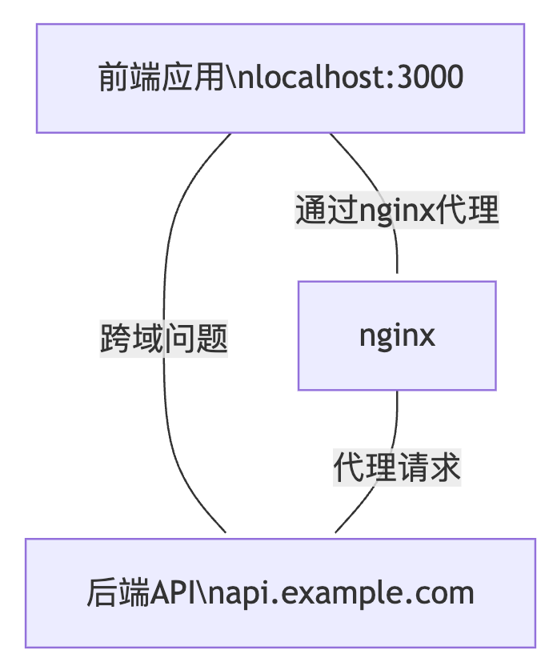
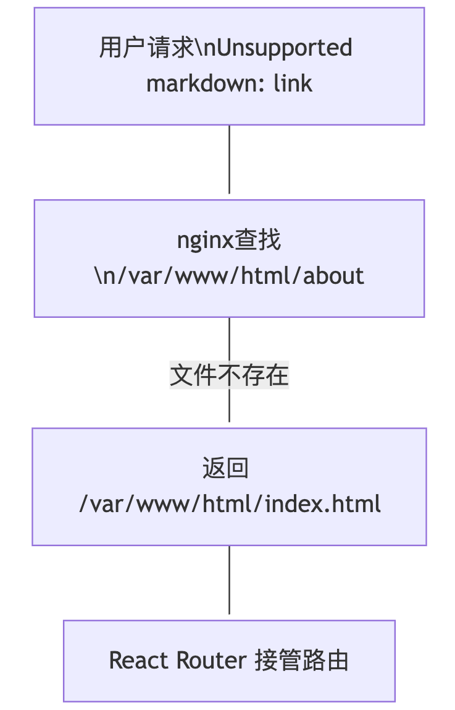
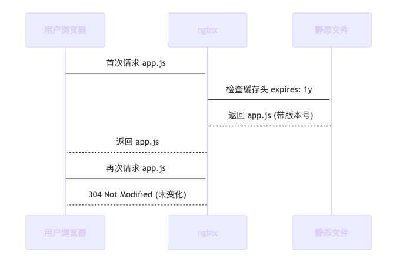
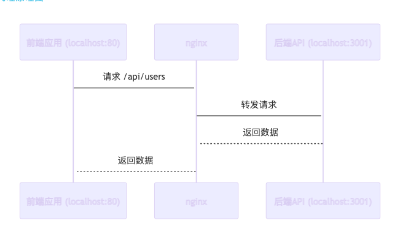
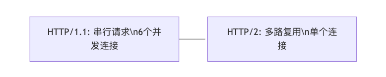
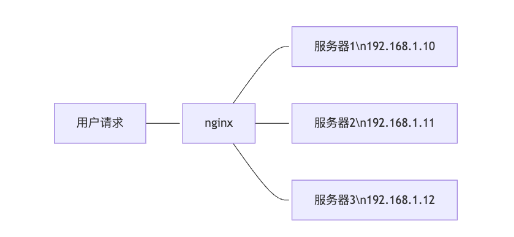

# 前端开发者都应该掌握的 nginx 技巧

在现代前端开发中，`nginx` 已经不再是后端工程师的专属技能。从静态资源部署到 `API` 代理，从性能优化到安全防护，`nginx` 在前端开发中扮演着越来越重要的角色。

想象一下，你辛辛苦苦写了一个 `React` 应用，打包后扔到服务器上，结果用户访问时发现：

- 图片加载慢得像蜗牛
- API 请求总是 404
- 刷新页面就报错
- 移动端访问各种问题

这时候，如果你懂 `nginx`，就能轻松解决这些问题，让用户体验丝滑如德芙巧克力！

## 一、nginx 是什么？为什么它这么重要？

### 1.1 nginx 的"前世今生"

`nginx`（发音：engine-x）是由俄罗斯工程师 `Igor Sysoev` 在 2004 年开发的一个高性能的 HTTP 和反向代理服务器。它的名字来源于"Engine X"，寓意着强大的引擎。


### 1.2 nginx 的核心作用

**1. 静态资源服务器**

- 直接提供 HTML、CSS、JS、图片等静态文件
- 支持 gzip 压缩，减少传输大小
- 设置缓存策略，提升加载速度

**2. 反向代理**

- 将用户请求转发到后端服务器
- 实现负载均衡，分散服务器压力
- 隐藏后端服务器真实地址，提升安全性

**3. 负载均衡**

- 将请求分发到多个服务器
- 支持多种负载均衡算法
- 实现高可用和容错

## 二、前端开发中的 nginx 应用场景

### 2.1 静态资源部署

这是前端开发者最常用的场景。你的 React/Vue 项目打包后，需要部署到服务器上供用户访问。

```
# 项目结构示例
my-react-app/
├── build/
│   ├── index.html
│   ├── static/
│   │   ├── css/
│   │   ├── js/
│   │   └── media/
│   └── favicon.ico
└── nginx.conf
```

### 2.2 API 代理

前端应用需要调用后端 API，但存在跨域问题。nginx 可以完美解决这个问题。



### 2.3 性能优化

通过 nginx 的各种配置，可以显著提升前端应用的性能。

## 三、前端开发者必掌握的 nginx 技巧

### 3.1 基础配置：让静态资源飞起来

#### 3.1.1 最简单的静态文件服务

```js
server {
    listen 80;
    server_name your-domain.com;
    root /var/www/html;
    index index.html;

    # 处理单页应用的路由
    location / {
        try_files $uri $uri/ /index.html;
    }
}
```

**原理图：**



#### 3.1.2 静态资源缓存策略

```js
server {
    listen80;
    server_name your-domain.com;
    root /var/www/html;

    # HTML 文件不缓存，确保获取最新版本
    location~* \.html$ {
        expires -1;
        add_header Cache-Control "no-cache, no-store, must-revalidate";
    }

    # CSS、JS 文件缓存 1 年
    location~* \.(css|js)$ {
        expires1y;
        add_header Cache-Control "public, immutable";
    }

    # 图片文件缓存 1 个月
    location~* \.(jpg|jpeg|png|gif|ico|svg)$ {
        expires1M;
        add_header Cache-Control "public";
    }
}
```

**缓存策略原理：**



### 3.2 跨域问题：一招解决 CORS 噩梦

#### 3.2.1 API 代理配置

```js
server {
    listen80;
    server_name your-domain.com;
    root /var/www/html;

    # 静态文件服务
    location / {
        try_files$uri$uri/ /index.html;
    }

    # API 代理
    location /api/ {
        proxy_pass http://localhost:3001/;
        proxy_set_header Host $host;
        proxy_set_header X-Real-IP $remote_addr;
        proxy_set_header X-Forwarded-For $proxy_add_x_forwarded_for;
        proxy_set_header X-Forwarded-Proto $scheme;
    }
}
```

**代理原理图：**



### 3.2 跨域问题：一招解决 CORS 噩梦

#### 3.2.1 API 代理配置

```js
server {
    listen80;
    server_name your-domain.com;
    root /var/www/html;

    # 静态文件服务
    location / {
        try_files$uri$uri/ /index.html;
    }

    # API 代理
    location /api/ {
        proxy_pass http://localhost:3001/;
        proxy_set_header Host $host;
        proxy_set_header X-Real-IP $remote_addr;
        proxy_set_header X-Forwarded-For $proxy_add_x_forwarded_for;
        proxy_set_header X-Forwarded-Proto $scheme;
    }
}
```

#### 3.2.2 解决跨域问题的多种方案

**方案一：nginx 代理（推荐）**

```js
location /api/ {
    proxy_pass http://backend-server/;
    # 其他代理配置...
}
```

**方案二：CORS 头配置**

```js
location /api/ {
    add_header Access-Control-Allow-Origin *;
    add_header Access-Control-Allow-Methods "GET, POST, PUT, DELETE, OPTIONS";
    add_header Access-Control-Allow-Headers "Content-Type, Authorization";

    if ($request_method = 'OPTIONS') {
        return 204;
    }

    proxy_pass http://backend-server/;
}
```

### 3.3 性能优化：让网站快如闪电

#### 3.3.1 Gzip 压缩

```js
# 在 http 块中启用 gzip
http {
    gzipon;
    gzip_varyon;
    gzip_min_length1024;
    gzip_proxied any;
    gzip_comp_level6;
    gzip_types
        text/plain
        text/css
        text/xml
        text/javascript
        application/json
        application/javascript
        application/xml+rss
        application/atom+xml
        image/svg+xml;
}
```

**压缩效果对比：**

```js
原始文件大小: 100KB
压缩后大小:  25KB
压缩率:      75%
加载时间减少: 60%
```

#### 3.3.2 HTTP/2 支持

```js
server {
    listen 443 ssl http2;
    server_name your-domain.com;

    ssl_certificate /path/to/cert.pem;
    ssl_certificate_key /path/to/key.pem;

    # 其他配置...
}
```

**HTTP/2 优势：**



### 3.4 安全防护：让黑客无从下手

#### 3.4.1 隐藏服务器信息

```js
server {
    # 隐藏 nginx 版本号
    server_tokens off;

    # 自定义错误页面
    error_page 404 /404.html;
    error_page 500 502 503 504 /50x.html;

    # 其他配置...
}
```

#### 3.4.2 安全头配置

```js
server {
    # 防止点击劫持
    add_header X-Frame-Options "SAMEORIGIN" always;

    # 防止 MIME 类型嗅探
    add_header X-Content-Type-Options "nosniff" always;

    # XSS 防护
    add_header X-XSS-Protection "1; mode=block" always;

    # 内容安全策略
    add_header Content-Security-Policy "default-src 'self'; script-src 'self' 'unsafe-inline' 'unsafe-eval'; style-src 'self' 'unsafe-inline';" always;

    # 其他配置...
}
```

### 3.5 负载均衡：应对高并发

#### 3.5.1 基础负载均衡配置

```js
# 定义上游服务器组
upstream backend {
    server192.168.1.10:3001;
    server192.168.1.11:3001;
    server192.168.1.12:3001;
}

server {
    listen80;
    server_name your-domain.com;

    location /api/ {
        proxy_pass http://backend;
        proxy_set_header Host $host;
        proxy_set_header X-Real-IP $remote_addr;
        proxy_set_header X-Forwarded-For $proxy_add_x_forwarded_for;
    }
}
```

**负载均衡原理图：**



#### 3.5.2 健康检查

```js
upstream backend {
    server 192.168.1.10:3001 max_fails=3 fail_timeout=30s;
    server 192.168.1.11:3001 max_fails=3 fail_timeout=30s;
    server 192.168.1.12:3001 max_fails=3 fail_timeout=30s;

    # 健康检查
    keepalive 32;
}
```

### 3.6 日志分析：了解用户行为

#### 3.6.1 自定义日志格式

```js
# 在 http 块中定义日志格式
http {
    log_format main '$remote_addr - $remote_user [$time_local] "$request" '
                    '$status $body_bytes_sent "$http_referer" '
                    '"$http_user_agent" "$http_x_forwarded_for"';

    log_format detailed '$remote_addr - $remote_user [$time_local] "$request" '
                       '$status $body_bytes_sent "$http_referer" '
                       '"$http_user_agent" "$http_x_forwarded_for" '
                       'rt=$request_time uct="$upstream_connect_time" '
                       'uht="$upstream_header_time" urt="$upstream_response_time"';
}

server {
    access_log /var/log/nginx/access.log main;
    error_log /var/log/nginx/error.log;

    # 其他配置...
}
```

## 四、实战案例：完整的前端项目 nginx 配置

### 4.1 React 单页应用配置

```js
server {
    listen80;
    server_name my-react-app.com;
    root /var/www/react-app/build;
    index index.html;

    # 启用 gzip 压缩
    gzipon;
    gzip_types text/plain text/css application/json application/javascript text/xml application/xml application/xml+rss text/javascript;

    # 静态资源缓存
    location~* \.(js|css|png|jpg|jpeg|gif|ico|svg)$ {
        expires1y;
        add_header Cache-Control "public, immutable";
    }

    # HTML 文件不缓存
    location~* \.html$ {
        expires -1;
        add_header Cache-Control "no-cache, no-store, must-revalidate";
    }

    # API 代理
    location /api/ {
        proxy_pass http://localhost:3001/;
        proxy_set_header Host $host;
        proxy_set_header X-Real-IP $remote_addr;
        proxy_set_header X-Forwarded-For $proxy_add_x_forwarded_for;
        proxy_set_header X-Forwarded-Proto $scheme;
    }

    # 单页应用路由处理
    location / {
        try_files$uri$uri/ /index.html;
    }

    # 安全头
    add_header X-Frame-Options "SAMEORIGIN" always;
    add_header X-Content-Type-Options "nosniff" always;
    add_header X-XSS-Protection "1; mode=block" always;
}
```

### 4.2 多环境配置

```js
# 开发环境
server {
    listen80;
    server_name dev.myapp.com;

    location / {
        proxy_pass http://localhost:3000;
        proxy_set_header Host $host;
        proxy_set_header X-Real-IP $remote_addr;
    }
}

# 生产环境
server {
    listen80;
    server_name www.myapp.com;

    root /var/www/production;

    location / {
        try_files$uri$uri/ /index.html;
    }

    location /api/ {
        proxy_pass http://backend-servers;
    }
}
```

## 五、常见问题与解决方案

### 5.1 502 Bad Gateway

**问题原因：** 后端服务器无响应
**解决方案：**

```js
location /api/ {
    proxy_pass http://backend;
    proxy_connect_timeout 5s;
    proxy_send_timeout 10s;
    proxy_read_timeout 10s;
}
```

### 5.2 静态资源 404

**问题原因：** 文件路径配置错误
**解决方案：**

```js
location /static/ {
    alias /var/www/static/;
    # 或者使用 root
    # root /var/www;
}
```

### 5.3 跨域问题

**问题原因：** 缺少 CORS 头
**解决方案：**

```js
location /api/ {
    add_header Access-Control-Allow-Origin *;
    add_header Access-Control-Allow-Methods "GET, POST, PUT, DELETE, OPTIONS";
    add_header Access-Control-Allow-Headers "Content-Type, Authorization";

    if ($request_method = 'OPTIONS') {
        return 204;
    }

    proxy_pass http://backend;
}
```
