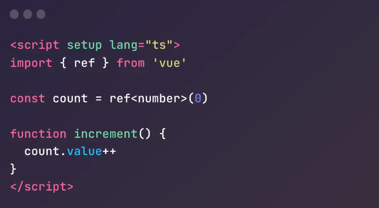

# Vue3 备忘清单

## 一、入门

Vue 是一套用于构建用户界面的渐进式框架

- [Vue 3.x 官方文档](https://cn.vuejs.org/)

**新建项目**


## 二、模板语法

- **文本插值**

```html
<span>Message: {{ msg }}</span>
```

使用的是 `Mustache` 语法 (即双大括号)，每次 `msg` 属性更改时它也会同步更新

- **原始 HTML**

```html
<p>Using v-html directive: <span v-html="rawHtml"></span></p>
```

双大括号会将数据解释为纯文本，使用 `v-html` 指令，将插入 HTML

- **Attribute 绑定**

```html
<div v-bind:id="dynamicId"></div>
<div :id="dynamicId"></div>
// 简写 <button :disabled="isButtonDisabled">Button</button> // 布尔型 Attribute
```

- **动态绑定多个值**

通过不带参数的 `v-bind`，你可以将它们绑定到单个元素上

```html
<script setup>
  import comp from './Comp.vue';
  import { ref } from 'vue';
  const a = ref('hello');
  const b = ref('world');
</script>

<template>
  <comp v-bind="{a, b}"></comp>
</template>
```

如果你是使用的 `setup` 语法糖。需要使用 `defineprops` 声名（可以直接使用`a`/`b`）

```js
const props = defineProps({
  a: String,
  b: String,
});
```

- **使用 JavaScript 表达式**

```html
{{ number + 1 }} {{ ok ? 'YES' : 'NO' }} {{ message.split('').reverse().join('') }}

<div :id="`list-${id}`"></div>
```

仅支持表达式(例子都是无效)

```html
<!-- 这是一个语句，而非表达式 -->
{{ var a = 1 }}
<!-- 条件控制也不支持，请使用三元表达式 -->
{{ if (ok) { return message } }}
```

- **调用函数**

```html
<span :title="toTitleDate(date)"> {{ formatDate(date) }} </span>
```

- **指令 Directives**

```html
<p v-if="seen">Now you see me</p>
```

- **绑定事件**

```html
<a v-on:click="doSomething"> ... </a>
<!-- 简写 -->
<a @click="doSomething"> ... </a>
```

- **动态参数**

```html
<a v-bind:[attributeName]="url"> ... </a>
<!-- 简写 -->
<a :[attributeName]="url"> ... </a>
```

这里的 `attributeName` 会作为一个 JS 表达式被动态执行

- **动态的事件名称**

```html
<a v-on:[eventName]="doSomething"> ... </a>
<!-- 简写 -->
<a @[eventName]="doSomething"></a>
```

- **修饰符 Modifiers**

```html
<form @submit.prevent="onSubmit">...</form>
```

`.prevent` 修饰符会告知 `v-on` 指令对触发的事件调用 `event.preventDefault()`

- **指令语法**

```bash
v-on:submit.prevent="onSubmit"
──┬─ ─┬──── ─┬─────  ─┬──────
  ┆   ┆      ┆        ╰─ Value 解释为JS表达式
  ┆   ┆      ╰─ Modifiers 由前导点表示
  ┆   ╰─ Argument 跟随冒号或速记符号
  ╰─ Name 以 v- 开头使用速记时可以省略
```

## 三、组合式 API

### 1.setup

`setup()` 是 Vue 3 中组合式 API（Composition API）的核心函数，在组件创建之前执行，是响应式逻辑的起点。

**作用：**

- 初始化组合式逻辑
- 替代 `data`、`methods`、`computed` 等选项式 API
- 执行时机：在组件创建前（`beforeCreate` 之前）执行

**基本使用：**

在最新的 `Composition API` 中引入 `<script setup>`，其设计理念是去除不必要的包装器和其他旧的组件选项，这样就能更简单、更集中地编写组件。你可以认为 `<script setup>` 是 `setup()` 的语法糖，比如：


使用 `<script setup>` 语法糖，我们可以更简洁地编写组件逻辑。不再需要写多余的 `return` 语句：



### 2.响应式: 核心

#### 2.1 ref()

- **作用**：创建一个基础类型或对象的响应式引用。

- **特点**：
  - 基础类型：值存储在 .value 中。
  - 对象类型：推荐使用 reactive，但 ref 也可以。

```js
const count = ref(0);
count.value++; // 修改值
console.log(count.value); // 读取值
```

#### 2.2 reactive()

- **作用**：将对象变成响应式的。
- **特点**：
  - 只能用于对象、数组等引用类型。
  - 会递归转换内部属性为响应式。

```js
const state = reactive({ count: 0 });
state.count++; // 自动追踪依赖
```

#### 2.3 computed()

- **作用**：创建具有缓存的响应式计算属性。
- **特点**：
  - 依赖变化时才重新计算。
  - 支持只读或带 getter/setter。

```js
const count = ref(1);
const double = computed(() => count.value * 2);
```

#### 2.4 **readonly()**

- **作用**：创建一个只读的响应式代理。

```js
const original = reactive({ count: 1 });
const ro = readonly(original);
ro.count++; // 警告！无法修改
```

#### 2.5 **watch()**

- **作用**：观察响应式数据的变化，并执行回调。

```js
watch(count, (newVal, oldVal) => {
  console.log(`count 从 ${oldVal} 变为 ${newVal}`);
});
```

#### 2.6 **watchEffect**()

- **作用**：立即运行传入的副作用函数，并自动追踪其依赖。
- **特点**：
  - 依赖变了就重新执行。
  - 无需手动指定依赖。

```js
watchEffect(() => {
  console.log(count.value);
});
```

#### 2.7 watchPostEffect()与 watchSyncEffect()

- **区别在于执行时机**：
  - watchPostEffect：DOM 更新之后运行。
  - watchSyncEffect：DOM 更新前同步运行。

```js
watchPostEffect(() => {
  console.log('DOM 已更新');
});

watchSyncEffect(() => {
  console.log('同步运行，DOM 可能尚未更新');
});
```

#### 2.8 **onWatcherCleanup()**

- **作用**：在 watchEffect 中注册清理函数。
- **场景**：例如取消上一次的 API 请求。

```js
watchEffect((onCleanup) => {
  const timer = setInterval(() => {
    console.log('定时任务');
  }, 1000);
  onCleanup(() => clearInterval(timer)); // 响应式依赖变更后清理
});
```

### 3.响应式: 工具

#### 3.1 ref 相关

- **isRef(value)**

判断一个值是否是由 ref() 创建的响应式引用。常用于处理可能是 ref 或普通值的参数。

```js
import { isRef, ref } from 'vue';

const foo = ref(1);
console.log(isRef(foo)); // true
console.log(isRef(123)); // false
```

- **unref()**

自动解包 ref 的 .value，如果不是 ref 则返回原值。适合泛型处理。

```js
import { ref, unref } from 'vue';

const foo = ref(100);
console.log(unref(foo)); // 100
console.log(unref(200)); // 200
```

- **toRef()**

将响应式对象的某个属性转换成 ref，保持响应性（原对象变了，ref 也变）。

```js
import { reactive, toRef } from 'vue';

const state = reactive({ count: 0 });
const countRef = toRef(state, 'count');
countRef.value++; // state.count 也会变
```

- **toValue()**

Vue 3.3 引入，自动解包 ref 和 getter（如 computed）。处理复杂泛型时更统一。

```js
import { toValue, ref } from 'vue';

const foo = ref('bar');
console.log(toValue(foo)); // 'bar'
console.log(toValue('baz')); // 'baz'
```

- **toRefs()**

将一个响应式对象的所有属性转换成 ref，常用于 setup 返回对象时保持响应性。

```js
import { reactive, toRefs } from 'vue';

const state = reactive({ name: 'Tom', age: 18 });
const { name, age } = toRefs(state);
```

#### 3.2 is 相关

- **isProxy()**

判断一个对象是否是由 reactive() 或 readonly() 包裹的响应式代理。

```js
import { reactive, readonly, isProxy } from 'vue';

console.log(isProxy(reactive({}))); // true
console.log(isProxy(readonly({}))); // true
console.log(isProxy({})); // false
```

- **isReactive()**

判断一个对象是否是 reactive 创建的响应式对象。

```js
import { reactive, isReactive } from 'vue';

const obj = reactive({});
console.log(isReactive(obj)); // true
```

- **isReadonly()**

判断一个对象是否是只读的（由 readonly() 创建）。

```js
import { readonly, isReadonly } from 'vue';

const ro = readonly({ foo: 1 });
console.log(isReadonly(ro)); // true
```

### 4.响应式: 进阶

#### 4.1 响应式

- **shallowRef()**

创建**浅层**响应式的 ref，仅追踪 .value 的引用变化，内部对象不会变成响应式。

```js
import { shallowRef } from 'vue';

const obj = shallowRef({ a: 1 });
obj.value.a = 2; // 不会触发视图更新
obj.value = { a: 3 }; // 会触发视图更新
```

- **triggerRef()**

手动触发 shallowRef 的依赖更新，通常与 shallowRef 一起使用。

```js
triggerRef(obj); // 强制更新依赖 obj 的视图
```

- **customRef()**

- 创建一个**自定义控制依赖追踪和触发更新**行为的 ref，常用于实现防抖、节流等。

```js
import { customRef } from 'vue';

function useDebouncedRef(value, delay) {
  let timeout;
  return customRef((track, trigger) => ({
    get() {
      track();
      return value;
    },
    set(newVal) {
      clearTimeout(timeout);
      timeout = setTimeout(() => {
        value = newVal;
        trigger();
      }, delay);
    },
  }));
}
```

- **shallowReactive()**

创建一个浅层响应式对象，仅第一层属性是响应式的。

```js
const state = shallowReactive({ user: { name: 'Tom' } });
state.user.name = 'Jack'; // 不会触发响应式更新
```

#### 4.2 只读

- **shallowReadonly()**

浅层只读，第一层属性为只读，深层对象可更改。

```js
const config = shallowReadonly({ theme: { color: 'red' } });
config.theme.color = 'blue'; // ✅ 允许
config.theme = {}; // ❌ 报错
```

#### 4.3 raw

- **toRaw()**

将一个响应式对象还原为原始对象，适用于调试或避免代理干扰的操作。

```js
const raw = toRaw(state);
```

- **markRaw()**

标记某个对象为**非响应式**，Vue 不会对它进行代理。

```js
const rawObj = markRaw({ foo: 'bar' });
```

#### 4.4 scope

- **effectScope()**

用于**组合副作用**（watch、computed 等），使其统一销毁。

```js
import { effectScope, ref, watch } from 'vue';

const scope = effectScope();
scope.run(() => {
  const count = ref(0);
  watch(count, (val) => console.log(val));
});
scope.stop(); // 清理所有副作用
```

- **getCurrentScope()**

返回当前活跃的 effectScope，可用于注册作用域内的清理操作。

```js
import { getCurrentScope, onScopeDispose } from 'vue';

if (getCurrentScope()) {
  onScopeDispose(() => {
    // 清理逻辑
  });
}
```

- **onScopeDispose()**

注册当前作用域的清理函数，适合插件或 hook 内部使用。

```js
onScopeDispose(() => {
  console.log('清理副作用或资源');
});
```

### 5.生命周期钩子

#### 5.1 **onMounted()**

- **作用**：注册一个回调函数，在组件挂载完成后执行
- **场景**：这个钩子常用于执行需要访问组件所渲染的`DOM`树相关的副作用，或是【在服务端渲染应用中】用于确保`DOM`相关代码仅在客户端执行

#### 5.2 **onUpdated()**

- **作用**：注册一个回调函数，调用时刻：在组件因为响应式状态【变更而更新】其`DOM`树之后
- 这个钩子会在组件的任意 `DOM` 更新后被调用，这些更新可能是由不同的状态变更导致的。
- 如果你只是需要在某个特定的状态更改后访问更新后的 `DOM`，那么请使用 `nextTick()` 作为替代。
- **注意**：
  - 不要在`updated`钩子里面，去更改组件的状态，这可能会导致无限的更新循环！

#### 5.3 **onUnmounted()**

- **作用**：注册一个回调函数，在组件实例被卸载之后调用。

- **场景**：其所有子组件都已经被卸载所有相关的"响应式作用"都已经停止（① 渲染作用；②`setup()`时创建的计算属性和侦听器）

- **注意事项**：

  - 组件被卸载时，可以在这个钩子里面手动清理掉一些副作用，比如：① 计时器；②`DOM`事件监听器；③ 服务器的连接等等。

  - 这个钩子在“服务器渲染期间“不会被调用

#### 5.4 **onBeforeUpdate()**

- **作用**：当组件即将“因为响应式状态变更而更新其`DOM`树"之前调用
- **注意事项**：
  - 用来在 vue 更新`DOM`之前先访问`DOM`状态
  - 这个钩子在“服务器端渲染期间“不会被调用

#### 5.5 **onBeforeUnmount**()

- **作用**：在组件实例“被卸载之前“调用
- **注意事项**：
  - 当这个钩子被调用时，组件实例依然还保有全部的功能
  - 这个钩子在“服务器端渲染期间“不会被调用

#### 5.6 **onErrorCaptured**()

- **作用**：注册一个钩子，在捕获了"后代组件传递的错误时候"调用它
- **错误捕获的来源**：
  - 组件渲染
  - 事件处理器
  - 生命周期钩子
  - `setup()` 函数
  - 侦听器
  - 自定义指令钩子
  - 过渡钩子
- **钩子携带的参数**：
  - 错误对象
  - 触发该错误的组件实例
  - 说明错误来源类型的信息宇符串
- **错误传递规则**：
  - 所有错误都会通过`app.config.errorHandler`（前提是它已经被定义）
  - 如果组件的“继承链“或者“组件链”上存在多个`errorCaptured`钩子，且它们所针对的是同一个错误，那么它们将会按从底向上的顺序进行以一一调用。这个过程被称为“向上传递”，类似于原生 DOM 事件。
  - `errorCaptured`可以通过返回 false 来阻止错误继续向上传递

#### 5.7 **onRenderTracked**()

- **作用**：注册一个“调试钩子”，当组件在渲染过程中【追踪到响应式依赖时】调用
- **注意**：这个钩子仅在【开发模式】下调用，且在服务器端渲染期间不会被调用

#### 5.8 **onRenderTriggered**()

- **作用**：注册一个“调试钩子’，当【响应式依赖的变更触发了组件被渲染时】调用
- **注意**：这个钩子仅在【开发模式】下调用，且在服务器端渲染期间不会被调用

#### 5.9 **onActivated**()

- **作用**：注册一个回调函数，若组件实例是`<KeepAlive>`缓存树的一部分时，那么当组件被插入到 DOM 中时调用
- **注意**：这个钩子在"服务器渲染期间"不会被调用

#### 5.10 **onDeactivated**()

- **作用**：注册一个回调函数，若组件实例是`<KeepAlive>`级存树的一部分时，那么当组件从 DOM 中被移除时时调用
- **注意**：这个钩子在“服务器渲染期间“不会被调用

#### 5.11 onServerPrefetch()

- **作用**：注册一个"异步函数”，当组件实例在服务器上被渲染之前调用
- **注意**：
  - 当钩子返回的是一个 Promise 时，服务端将会等待该 Promise 完成后，再渲染该组件。
  - 这个钩子仅在【**服务端渲染**】中执行，可以用于执行一些【仅存在于服务端的数据抓取】。

### 6.依赖注入

在 Vue 3 中，`provide()` 和 `inject()` 是一对用于 **依赖注入（`Dependency Injection`）** 的 API，适用于祖先组件与后代组件之间传递数据，**跳过中间层级**，避免层层 `props` 传递。

#### 6.1 provide(key, value)

- **作用**：在“**祖先组件**”中使用，用来提供可供后代组件注入的数据。

```js
import { provide } from 'vue'

setup() {
  provide('theme', 'dark')
}
```

- **参数**：
  - key 可以是字符串或 Symbol，推荐使用 Symbol 避免命名冲突。
  - value 可以是任意数据（原始值、响应式对象、函数等）。

#### 6.2 **inject(key, defaultValue?)**

- **作用**：在“**后代组件**”中使用，用来注入祖先组件 provide 的数据。

```js
import { inject } from 'vue'

setup() {
  const theme = inject('theme', 'light')  // 如果祖先没提供，返回默认值 light
}
```

- **参数**：
  - 注入的`key`，如果未能通过`key`匹配到具体的值，那么将返回`undefined`，除非赋予了初始值。
  - 可选值，可以是没有匹配到`key`时使用的默认值。第二个参数也可以是一个工厂函数，用来返回某些创建起来比较复杂的值。在这种情况下，你必须将 `true` 作为第三个参数传入，表明这个函数将作为工厂函数使用，而非值本身。

## 四、内置内容

### 1. 指令

**显示相关指令：**

- **v-text**：设置元素的文本内容，等同于 {{ msg }}，会覆盖原内容。
- **v-html**：设置元素的 innerHTML，可以解析 HTML（⚠️ 有 XSS 风险）。
- **v-show**：根据条件切换 display:none 样式（元素始终存在）。
- **v-if**：根据条件渲染或销毁 DOM（更高性能开销）。
- **v-else / v-else-if**：配合 v-if 使用，控制多个条件分支。

**列表渲染指令：**

- **v-for**：用于遍历数组或对象，如：v-for="(item, index) in list"。

**事件 & 绑定指令：**

- **v-on**：绑定事件监听器，如：v-on:click="handleClick" 可简写为 @click。
- **v-bind**：绑定属性值，如：v-bind:href="url" 可简写为 :href="url"。

**表单绑定指令：**

- **v-model**：实现双向数据绑定，常用于 input、select 等表单元素。

**插槽 & 组件：**

- **v-slot**：用于命名插槽的语法糖，作用于 slot 插槽的内容传递。

**控制编译行为：**

- **v-pre**：跳过当前元素及子元素的编译，用于原样输出。
- **v-once**：只渲染一次，后续数据更新不会影响 DOM。
- **v-memo**（Vue 3.2+）：用于静态内容缓存优化，避免不必要的重新渲染。
- **v-cloak**：配合 CSS 隐藏未编译的模板，防止“{{ xxx }}”闪现。

### 2. 组件

#### 2.1 Transition

用于给**单个元素或组件**添加进入/离开动画。

- **使用场景**：控制元素显示/隐藏时的过渡效果，如 v-if 控制的 DOM。
- **动画原理**：Vue 会在元素进入/离开时添加不同的 class（如 v-enter-active）。
- **可配置属性**：
  - name：类名前缀
  - appear：初始渲染时是否应用动画
  - mode：定义切换模式（in-out 或 out-in）

#### 2.2 TransitionGroup

用于多个元素的列表动画（常配合 v-for 使用）。

- **关键区别**：渲染多个元素，必须显式指定 tag（比如 `<ul>`）
- **特性**：
  - 支持 **列表中元素的移动动画**（通过 CSS 的 transform 实现）
  - 子元素需设置 key

#### 2.3 KeepAlive

缓存组件实例，防止重新渲染，常用于**切换视图时保持状态**（如页面 Tab 切换）。

- **使用场景**：在 `<router-view>` 中包裹组件，缓存已访问的路由。
- **常用属性**：
  - include：指定需要缓存的组件名
  - exclude：不缓存哪些组件
  - max：最多缓存多少组件实例

#### 2.4 Teleport

将子元素渲染到**DOM 的其他位置**（不是当前组件的父级）。

- **典型用途**：模态框、弹窗等需要脱离原 DOM 层级的位置。
- **关键属性**：
  - to：目标容器选择器（如 body）
  - disabled：是否禁用 Teleport，启用时元素仍在原地渲染

#### 2.5 Suspense

用于**异步组件的加载占位控制**。

- **功能**：
  - 显示一个 fallback 插槽内容，直到异步组件加载完成。
- **场景**：SSR、懒加载组件等。
- **用法**：

```js
<Suspense>
  <template #default>
    <AsyncComponent />
  </template>
  <template #fallback>
    <div>加载中...</div>
  </template>
</Suspense>
```

## 五、单文件组件

### 1.SFC 语法定义

#### 1.1 总览

- 一个`vue`单文件组件`（SFC）`，通常用.vue 作为文件扩展名
- 每个`.vue`文件由【三种顶层语言块】和【其他自定义语言块】构成

#### 1.2 相应语言块

- 顶层语言块
  - `<template>`
  - `<script>`
  - `<script setup>`
  - `<style>`
- 自定义语言块
  - `Gridsome : <page-query>`
  - `vite-plugin-vue-gal : <gal>`
  - `vue-il8n : <il8n>`

#### 1.3 自动名称推导

- `SFC`在某些场景下，会根据【文件名】来自动推导其【组件名】

#### 1.4 预处理器

- 代码块可以使用 `lang` 这个 `sttribute` 来声明预处理器语言
- 常见场景
  - `< template lang="pug" />`
  - `<script lang="ts" />`
  - `<style lang="scss" />`

#### 1.5 src 导入

- 如果你喜欢将`*.vue` 组件分散到【多个文件】中，那么可以使用`src`这个`attribute`来帮助一个语块导入外部文件
- `src`导入和`JS`模块导入遵循相同的路径解析规则

#### 1.6 注释

- 注释语法为：`<！-- comment contents here-->`

### 2.单文件组件 script setup

#### **2.1 defineProps()**

- 用于接收父组件传递的 `props`，语法糖形式。

```js
const props = defineProps<{ title: string }>()
```

#### 2.2 **defineEmits()**

- 用于定义组件发出的事件，同样是组合式语法糖。

```js
const emit = defineEmits<{
  (event: 'submit', payload: string): void
}>()
```

#### 2.3 **defineModel()**

- `Vue 3.4+` 的语法糖，用于支持 v-model，代替 `props + emits` 写法。

```js
const model = defineModel<string>()  // 默认 key 是 `modelValue`
```

#### 2.4 **defineExpose()**

- 用于向父组件暴露当前组件的内部方法或属性（在 `<script setup>` 中）。

```js
defineExpose({ focus });
```

### 2.5 **defineOptions()**

用于设置组件选项，如 name，可写在 `<script setup>` 中。

```js
defineOptions({
  name: 'MyComponent',
});
```

### 3.css 功能

#### 3.1 组件作用域 `CSS`

- Vue 中通过 scoped 关键字实现**组件样式的作用域隔离**。使用方式：

```js
<style scoped>
.button {
  color: red;
}
</style>
```

**原理：**

`Vue` 会为 `HTML` 元素和 `CSS` 选择器自动添加唯一的 `data-v-xxxxxx` 属性，确保样式只作用于当前组件的 `DOM`。

#### 3.2 `CSS Modules`

- 一种**基于类名哈希化的样式隔离方案**，在 `Vue` 中可直接通过 `<style module>` 启用：

```js
<template>
  <div :class="$style.title">Hello</div>
</template>

<style module>
.title {
  color: blue;
}
</style>
```

**特点：**

- `$style` 是自动注入的对象，键是原始类名，值是哈希后的类名。
- 可用 module="xxx" 来自定义模块名。

#### 3.3 `CSS` 中的 `v-bind()`

- `Vue` 支持在 `<style>` 中通过 v-bind() 动态绑定 `JS` 中的 `CSS` 变量：

```js
<template>
  <div class="box"></div>
</template>

<script setup>
const color = 'tomato'
</script>

<style scoped>
.box {
  background-color: v-bind(color);
}
</style>
```

**注意事项：**

- 会被编译为 `CSS` 变量：`--v-color`。
- 要在 `scoped` 样式下才生效（或配合变量名手动设置）。
